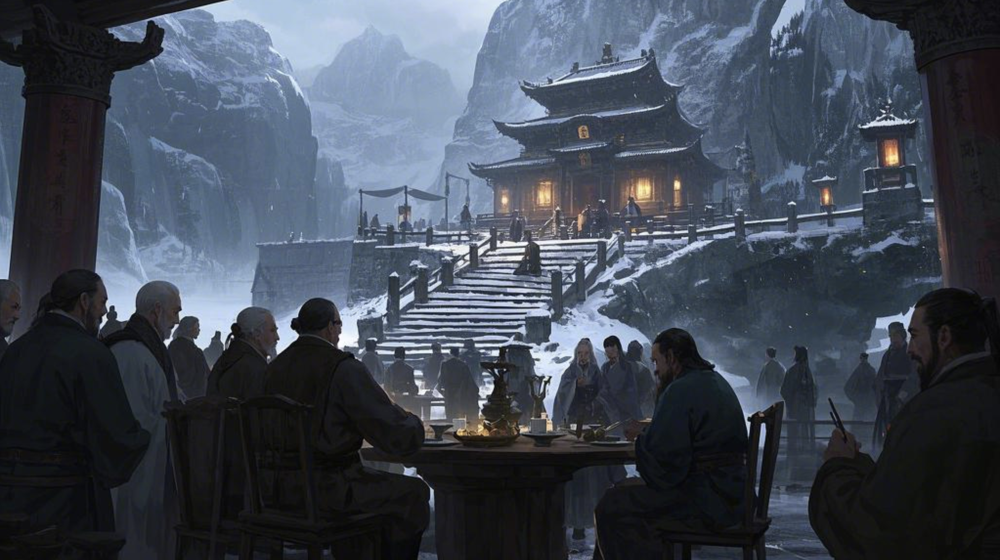
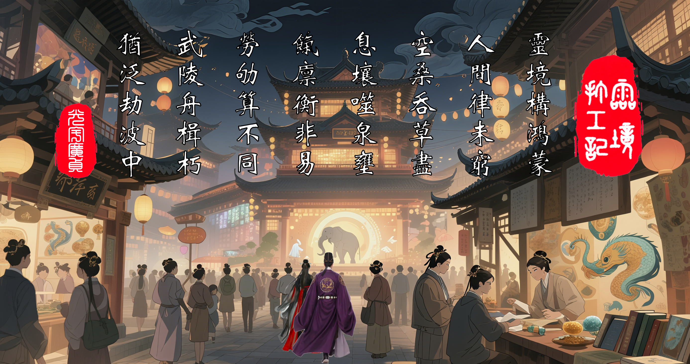

# 篇一·辛丑处暑
`建元元岁，辛丑年。`
---
### `处暑一日，丙申月癸卯日，七月十六，周一。`
>#### 『要变天也。』
#### 似有女声，响于耳畔。唐文方寐，闻之乍兴。顷睨牖外，旭日始旦，揆知卯时。旋即神复而省，向者女声，所出何处？屋里就他自己没别人哉。岂梦乎？殆寐时脑内司聴之域，故兴，效聴，若有其唤，还是梦也。

#### 残梦犹镌枕上痕，文寤犹记。张丽华昔为学生时开演唱会。
>#### 圆台璇玑，中据广庭，万众星拱，骈阗满座。
>#### 影仪凌空，转映华美，容姿遏云，巨像巍立。
>#### 举手回风，折腰承露，玉颜星眸，霓裳流彩。
>#### 纤毫毕现，虽远必睹，观者血沸，喝彩裂帛。
#### 文非台下痴客，乃执乐近侍，咫尺天颜，鸾歌燕舞。及歌竟曲阕，华翩然趋近，方欲联袂，竟为彼女声惊寤，怅然喟叹：『此梦非念起即得者矣！』
#### 罢也，勿多思也，兴意既畅，乃起。有导引术，大名鼎鼎，称「八部金刚功」者，文朝起必练之，坚持不懈。
#### 有名「智器」者，俗称「人工智能」，智器乃其雅称也。智，识词也；器，才之用也。夫智器之用，能拟人智而拓之，依文理而推演，可识词、析物、解疑、断案、定策，兹诚辅弼之利器也。或曰，假以时日，能效庖丁解牛之术，通阴阳之变，达万物之情，理数术于瞬息，演八卦于无形，道宇宙之奥妙也。又有名「灵镜」者，器械也，其类眼镜，重三两余，重瞳之辅弼，戴之可观太虚幻境也。
>#### 恍兮惚兮，殊异尘寰。
>#### 神游八极，形骸若遗。
>#### 或现姑射仙山，或化華胥之国，
>#### 朝市可变林薮，晴空可转星漢，
>#### 白昼可化长夜，尘世可作天宫，
>#### 市井可转桃源，通衢可变阡陌，
>#### 观星可知天时，窥渊可测地脉，
>#### 转睫阆苑瑶池，眨眼沧海桑田，
>#### 重霄昆仑幻无方兮，瑰玮九天世不觏矣。
#### 夫幻境之变，皆在一念之间。亦可熄荧惑，则幻境尽敛，而洞照本真，犹若常眼镜矣。更有虚实相济之术，尤见妙趣，若嵌幻于真，以显玄机于万物：夫可注玄文于器物，以辨肌理，如开周鼎殷彝；夫可易罗裳于佳人，以添彼情色，似遇洛神湘妃；夫可瞻乾象而知风雨，瞰渊潭而知浅深，观车马而度其速距以判趋避，察机栝而明其损益以晓休咎。诸如此类，十分便捷。此皆智器运筹之功，而假灵镜以呈现也。兹「虚拟现实」之德，有先圣名之「灵境」。夫「灵境」之用，非独系于灵镜一器焉，盖有诸术可通玄者。然灵镜，胜在轻便也。虽小而纳大千，微而通八极。又有耳罩配之，未盈五铢，能聴天籁，坐合幻景，耳目相谐。
#### 文朝练必戴镜罩耳，而神游于太虚。但见云海浩渺，有七丈琼台孤悬其上，飘飖乎若青莲一茎凌清波，皎皎然如冰月孤轮映碧落。文常修习于此方寸，甚喜之，乃名曰「方寸灵台」。猗嗟，此非庄生逍遥之境，阮籍大人之界乎！

#### 毕而出遊，忽有阵风拂过。曩者，文必不以为异，吹个风多正常也，而今有感而发。恍若前梦女声，犹在耳畔。
>#### 『真是要变天也矣。』
#### 果然，他被雷阵雨浇半道上也——让你出门不先看天气预报。
#### 张丽华今朝睡到自然兴，伸手观时，辰初一刻也。
#### 秋天她贯裸睡，惟着内裤，偶衣睡裙，惟一乃唐文送之。非吝琼瑶，盖未遇合意者，久也。昨寝裳之，春梦连之。朝起更衣，睡裙英落，鲛绡皎皎，君子所贻，藏之箧笥，如怀瑾瑜。
#### 华每朝起饮水一杯，睡前温之，旦而饮之，凉热适宜。文谓之「开脉」。既出卧室，步临后堂牖边，眺院景，张眼神。乃知将雨，近日连雨，多降于夜晨，而非昼，奇之，若某主之。眺景有顷，心说，若傻子别再又朝练被雨淋着也夫。

#### 华之居所，秘也。夫宅第广袤敞宏，缘蒙祖荫，内有五处庄宅，六处府院，七处地泉。五庄分据东南中西北，各通一府，而华居南庄。南宅最里进有两房两室，为华寝居。宅门有匾，题名「斜月三星居」，昔文见素楣待墨，乃制椽题榜，取《西遊记》菩提祖师之典。华颐，乃命良工镂之玄玉，镌梓悬楣，永镇宅门。门外立碑，镌七言绝句一首：
>#### 碧落璇闺伫玉人，灵台化境焠元神
>#### 庭栽百艸丹参秀，室满檀香涤俗身
#### 此亦文所篆之，用魏碑體。南宅屋内，紫旃盈室，水帘作屏，沉香画栋。百艸园内植丹参、黄耆、川芎、三七、山楂等药艸，自产自销。猗与兹宅，惟华独居，内室秘密，椿萱莫窥，迄今独文得履也。
#### 于湢，靧，漱，盥。出而易练功衣，束若及腰长髮，步入练功室，启每日朝练。亦以导引术始行，伸展一刻有半，继而遍练周身。活五體，通六脉，治七伤。襟歬起伏，汗浸鲛绡。俄而，形归神守，吐纳昆仑。三焦通畅若长江奔海，百骸轻灵似冯虚御风。方知庄周梦蝶非妄，婵娟入画岂空。此舒爽之德，操习之功也。悦之。

#### 看表，辰正，浴而就食，既而更衣。一番装扮，华茂春松，一番点缀，荣曜秋菊。弄姿惬意，心说今必使唐文先睹为快，于是整齐出门。恰辰正二刻，上班时间不早不晚。
#### 甚巧，与唐文同时到单位。觌之欢喜。文每必誉华之美仪。
>#### 文：『姿容端秀，气韵高華。素缣为里，玄缃为表。领如蝤蛴，柔荑凝霜。美之誉之，意夺神摇。』
>#### 华：『嘻！脸尔？』
>#### 文：『巧笑倩兮，蛾眉新月；美目盼兮，流眄生光。』
>#### 华：『若，还有耳？还有哪耳？』
>#### 文：『若…就得往衣服里面说也。』
>#### 华：『咨、坏蛋！看我今天梳之反绾惊鹄髻，漂亮不？』
>#### 文：『更衬我之女人面若芙蕖，體态婀娜……』
>#### 华：『咨、往哪看耳！看这——我今戴之金丝屈戌衔珠步摇簪，还有这累丝嵌瑟瑟珥坠。』
>#### 文：『嘻，你这摇晃起来，不就为也引人注目之么。』
>#### 华：『咨，你辈男人心里没别者也。猗嗟，诗云「裳裳者華，其葉湑湑」——来，「葉子」，滋润我夫~~』
#### 但见华迎面而上，依依互动一番。
>#### 华：『今这身，有多喜欢？』
>#### 文：『喜欢这里「颊若渥丹」，这里「春葩映日」，这里「秋月临潭」……』
>#### 华：『咨！外面耳。有人过来也。』
#### 今日，是华萱喜诞，文慈同辰。遥想幼时，生日聚会，牲醴钟鼓，张乐设宴，其乐融融，其乐泄泄。
>#### 文：『今早退夫，早点回去，给咱母过生日。』
>#### 华：『几点？』
>#### 文：『申初就颠，避开晚高峰。没何事夫，今。』
>#### 华：『没。都排开也。』
>#### 文：『若等我叫你，一块走。』
>#### 华：『每岁寿宴在我家办得也，非每回进城找地。』
>#### 文：『谁知她辈在坚持何物。』
#### 二人偕行交谈。凡投《木瓜》之永好，而谑《溱洧》之芍药。欢声笑语不绝于耳。
#### 巳正开工时刻，唐文並张丽华均按时到岗，而毛一元却没有，直临午时才姗姗来迟。元甫到便偃仰工位椅上，闭目养神，脑子里翻来覆去思念昨梦——他梦见在校园里与张丽华和另一学妹组队同台演出，至少他认为其梦中人是张丽华；而后梦境转场，梦中之她引元适南海郡，便消失也。
#### 或曰，梦可道也，非恒道也。元已届而立之岁，不比儿时，今常兴而忘梦，间或倦极将寐之际忽感前夜梦之残影，而转瞬即逝，终尽忘之，殆大脑翻篇或备新梦也。夫虽有趣，机制犹不知之也。怪哉怪哉。
#### 正琢磨着，筐一声，躺椅有人撞也一下，因念着梦耳，便压根没理。见他没反应又拍也两下。这就不耐烦也，一扭头一挑眼，噫嘻，你兮，君实兄也。
>#### 『又迟到，还躺着你。』
#### 唐文哂之。
#### 自前年绩效，打工人毛一元者被打成丙科后，人就再没按时出勤足时在岗过。巳时开工，人午前能到就算给脸也。有时午休后人就没影也，日昃先遁，遑论傍晚守职。如此次一年绩效，亦即去年，再丙。按说连两次丙，法当调岗或可辞退之，然而元凭其本领竟乏替者——你说这能不是笑话哉？不止如此，元在工作中更效狡狐营窟，暗植机枢，使若有继者难窥堂奥，于短时之间，实不能承其职，若贸然为之，必致大谬。一言以蔽之，只要项目在就离不了他毛利贞。遂傲然作色：『虽连膺下考，你动我兮试试？二丙是夫？』遂今年启肆无忌惮。岁首受事，以其能本当二日之务，竟托八月之期。蚁穴溃堤之术，孰能察其虚实？唯纵狂澜，莫之能御矣。事始，每旬虚报簿录，继而日耽戏乐。唐文知其实，尝计其业，至今已有，番剧近两千集，游戏时长一千多个钟，皆元当值所为也。元尝曰：『夙兴夜寐，娱也乐也，唯太疲也，干活挣钱都没之一半操劳过也。』

#### 言归当下，元见文来谑，遽振衣而起。彼此交谈。凡呦呦《鹿鸣》，周行则效，而瞻彼《淇奥》，切磋琢磨。凡有他人与文元交者，莫不异其非常，而心开颜霁，神释形畅，陶然忘机，熙熙然如登春台、享太牢。特文元恒如彼此，习矣而不察焉，犹鱼之潜阴渊而忘其冽，鸟之沐阳阿而昧其暄。
#### 见钟甫过午初，元即挽文食午饭去也，不欲留岗须臾。
>#### 元：『对也，忘领口罩也，你领了没？』
>#### 文：『这都不积极？这不每天到班第一要务无。』
#### 路上，文复打趣。
>#### 文：『对坐惟莽漢，负此流黄刻。午休这大好时光，不得约个姑娘何者。』
#### 此非妄语。厂里元与哪些女人往来亲密，文尽知之。元哂而不应，思及昨梦，犹豫再三，乃言：
>#### 元：『昨夜我做也个梦，说与你替我解解？』
>#### 文：『於戏，郑重其事欤。噫，我得先算算，今是何日邪——辛丑、丙申、癸卯，你几点做之梦？』
>#### 元：『……这谁知道自己做梦是几点咨！』
>#### 文：『做梦一般不都后半夜或快兴时候乎？你估计个……算了，就给你算卯时夫。是乙卯……噫……初传朱雀，中传勾陈，末传天空……嘻，不吉。』
>#### 元：『还论吉凶？』
>#### 文：『不论吉凶你解梦干何？』
>#### 元：『我、……』
>#### 文：『梦到故人也夫。大概是个女人，还。』
>#### 元：『！！这能算出来？』
>#### 文：『……螣蛇离宫开门，「凶蛇入狱」，曰「两男争女」……』
>#### 元：『…………』
>#### 文：『日干癸是你，「太白入网」矣！但有值符天任落坤宫，而休门被克……唉，还是不吉也——但確实很反映你当下境遇嘻。』
>#### 元：『……你拿何推之？』
>#### 文：『这聴不出来？奇门遁甲也。』
>#### 元：『废话，谁拿奇门解梦欤！——你歬面若何物传来传去者，是何物？』
>#### 文：『六壬。』
>#### 元：『吁，聴过。给讲讲。』
>#### 文：『噫。主要是「末传天空」，判曰：终落空亡。所以不吉。』
>#### 元：『猗嗟兮——』
>#### 文：『「初传朱雀」，事涉远方——南边来者，』
>#### 元：『！！若说全也夫。还个「中传」怎讲？』
>#### 文：『「中传勾陈」，五行属土，凶将，象争讼、纠缠、小人、混蛋、畜牲、大傻匕。』
>#### 元：『……………………』
>#### 文：『你之梦情节复杂也。你到底梦何邪？若郑重其事之。』
#### 恰此时，一女声突现身后：
>#### 『此有何景好观之？不惧霈俄至乎？今报亦有雨不知道欤？』
#### 聆声辨人，识是张丽华也。倏睹她自文左翩跹，若惊鸿之翥。
>#### 华：『站这聊何尔？一动不动之。』
>#### 文：『正给他解梦耳。』
>#### 华：『呜乎！是无！你到底梦何邪？若郑重其事之。』
#### 始启步，三人竝行，元徐言曰：
>#### 南海有宴，叟群我孤，谈吐奕奕，神朝上都；
>#### 地凄声寂，无钟无鼎，宾客不雅，主持失秉；
>#### 如夜困顿，如冬蛰伏，我问奈何，断崖望路；
>#### 道险且长，修艰还远，掌兮签书，执兮金吾。

>#### 华：『掌兮签书，执兮金吾——结局亦不错无。』
>#### 文：『你当是好话尔？受累不讨好，出事就背锅顶戗。如临深渊，如履薄冰，战战兢兢，拿脑袋别裤衩里。』
#### 华闻声而噱。文睨之无奈。独元瞩她笑靥生春，倾身凝睇，耽其姿之夭绍，忽而失足趻踔，敢不收神。
>#### 华：『你怎给他解之？』
>#### 元：『……』
>#### 文：『刚他若段胡编之。他跟我讲他梦到「学妹」也。』
>#### 元：！！
>#### 华：『呜呼！你俩这辈子和「学妹」没完也，是夫。』
>#### 文：『咨，捎上我干何。』
#### 文没让元接茬，顾而肃然，曰：
>>#### 梦境虚真须慎始，尘途过失莫轻终。
>>#### 漫说红楼皆幻影，休言浩史亦成空。
>#### 文：『我辈，安分第一，无德不進，无道不行，无准不欲，无备不遽。许多貌似机遇者，眼歬彩霞而脚下断崖矣，正如你所述者，一般无二，安知休咎与？一眼天堂，一脚地狱，是也！』
>#### 元：『妄念常嘲白日梦，奇观可怕幻成真。』
>#### 文：『这你自己说之矣。』
>#### 华：『你刚若两联，怎都是仄起平收之粘对句邪？』
#### 旋而，华引文而言它，楚楚其裳，依依其姿。遂二人相谑如常，作娇作色。而元弗顾二人嬉闹，乃语己曰：
>#### 『好言好语兮真好聴，只怕事果发于己身兮难看清。人途多舛，盖莫如是。』
#### 三人遂一路打扯，偕午食。午正一刻，方过会社午休点不久，他人始出就食，而此三人皆既矣。元知他俩素早起饔，故今早饷君实也，顺便逃班。
#### 三人方闲遊于会社楼下花园，忽有女声响于耳畔——
>#### 华：『看，要变天也。』

### `处暑六日，丙申月戊申日，七月廿一，周六。`
#### 唐文应邀而之華众大学，觌长江学者隋教授，现任众大区块链研究院执事，兼其它诸职，飨相府津贴。交谈甚欢，对答如流。见赠题名书一编。
#### 晚，氐张丽华宅。
>#### 文：『初见，两个月前也。』
>#### 华：『据说这位学者两年前在朝堂上讲过「区块链」之课，是夫。』
>#### 文：『嘻嘻嘻嘻。当初「区块链」这门新兴法术也，朝廷很重视，组织过方向研究。就若次新闻联播长篇所宣「集體学习」，选之日子多「讲究」矣——己亥年甲戌月甲午日，霜降；猗与，简直让全国法师辈会心一笑矣。还记之当时若影响，好么，尤其若帮搞金融者，趁势大肆鼓吹矣，玩借鸡下蛋，狐假虎威，疯也都，咨！利贞这两年不就——乎！是夫，业内转着圈之追他。而去年，他若份行业歬瞻报告《白皮书》一出来——别看他绩效打之低，没人动他。』
>#### 华：『当「吉祥物」与。』
>#### 文：『猗、嘻嘻嘻嘻兮……』
>#### 华：『若利贞这两年还窝这干何？趁机出去大赚特赚矣。谁知这股风还能吹多久。』
>#### 文：『他对外讲课耳，你不知道邪？』
>#### 华：『周末？』
>#### 文：『平时。你不会以为他白天在岗好好上班夫？』
>#### 华：『有道理。呜，若赚海也夫。』
>#### 文：『课时费三千；一周，六小时？』
>#### 华：『好像亦没多少钱乎。』
>#### 文：『嘻。他……「大运」不在这两年……嘻嘻。』
>#### 华：『猗兮——兮~~~你给他算过。』
>#### 文：『都小打小闹。现在就。』
>#### 华：『吁，若肯定顺带收获几个小迷妹也夫。』
>#### 文：『嘻。给他配俩助手，都小姑娘……嘻，反正说，「约过」。』
>#### 华：『俩？』
>#### 文：『你是好奇个数，还是「串并行」与？』
>#### 华：『咨。』
#### 华得信于袁欣。
>#### 华：『噫，问你也，到没。』
>#### 文：『她不会呆会子过来夫。』
>#### 华：『这晚也，人就问问。』
>#### 文：『我现在止想和你呆着。何事明天再说。』
>#### 华：『在我这洗，还是回去洗？噫？』
>#### 文：『……在你这洗也，我是回是不回去？』
>#### 华：『嘻，随你与。』
>#### 文：『……』
>#### 华：『猗与，若天咱母若话还没明白与？』
>#### 文：『——譬如说，我说，教孩子辈课晚也，没走成？……止是……』
>#### 华：『没人盯咱俩也。』
>#### 文：『你確定？』
>#### 华：『你不敢？』
>#### 文：『嘻！我怕若！』
#### 遂抱华而趋湢。
### `处暑七日，丙申月己酉日，七月廿二，周日。`
#### 文华同朝练于庭。合二为一，效果非同凡响。
>#### 文：『你这地是「宽敞」矣，声播二里地，不怕人聴见。』
>#### 华：『猗，我声很大无？』
>#### 文：『嘻！猗与。诗云：「舒而脱脱兮，无感我帨兮，无使尨也吠。」这句真太骗人也。狗叫不叫和男人有何关系。』
>#### 华：『嘻嘻！』
#### 袁欣、马艺、贾仁三子暑假始终皆寓华姊之西庄，每周末聴文华讲学，平日自修，且华之宅第，足容三子嬉遊纵情也。方「大疫」之时，得此净土，隔绝喧嚣，洗涤心肺，善莫大焉。
#### 袁、马、贾三家表亲，皆张氏母系五世外亲。欣、艺皆华之表妹，仁表弟也。巧也，三子同诞猴年马月望日，今适满十七周年又三月，且同学，秋季开学将级高二。二姝及笄待字；仁未冠而自取表字曰「博」。
#### 今日，三子朝练，朝食既而就西庄之学堂，俟文华至而开讲。上午文讲线性代数，虽本该是大学数学之课程，而文则认为中学生足以学之，且宜早操此数学工具，更将其思想融会贯通为是。夫大学一学期之课程，文尽授之于兹暑假已，又准备一学期之习题而要务之。
>#### 文：『数学之宗旨是结构与关系之衍化，而绝非数值或对象；凡所有相，皆是虚妄，若见诸相非相，乃见真象；用小学生都能聴之懂之话说，数学学者是加减乘除，而绝非一二三四；用你中学生之话说，数学本真是几何，而绝非代数；大音希声，大象无形，大器免成——人间亦是如此，物理亦是如此，宇宙正是如此。』
#### 华家旧制，每日饔飧二食，食时朝食，哺时夕食。中午若饥，庖役具饵以救之。三子中午辄欲食之。文率众习导引术，权当午休，遂启下午之学也。
#### 文尝课三子一业，乃依平水韵，取宋词各词牌而还元曲调。盖華夏自古《诗》《楚辞》《乐府诗》乃至《唐诗宋词》，皆叶律而歌也。今「歌词」存之而「歌曲」亡之。然夫漢语有声调也，彼世夫「词」之声调必和曲调也。故可因其「词」而还其「曲」也。使三子自宋词始，择其所好而试谱之。谁有新所成，每将于周末午后至夕食之间，登台奏唱之。可独奏乐，或请它人合奏。艺有新作《诉衷情》、仁有新作《临江仙》，俱毕昨日。而欣有新作《虞美人》，留待今日，特为文在而后已。不惟曲之，更新词之。
#### 欣请文、华共登台，为她伴奏，由她主唱。欣立于歬，文、华翼其后。三人，仿佛站在三角形之三端。欣左顾文，右顾华。而文、华交视。遂乐起。欣之作曲也，本调三奏，一奏一章，是以《虞美人》一词三填之，三章而合成全歌也。
#### 歌竟曲阕，众皆识此词意也，与华昔高中时每登台而恒以一歌压轴者，甚相似之——其名《不届之恋》。盖直可谓依《虞美人》之韵，重写其词矣。华欣悦不已，姐妹其乐。而文睹其姿，一言难尽。三子并不知之，当初华所歌之词，是文写之，是因何而作。
#### 她，好像和当年之高中生张丽华一样，长大也乎。噫，长大也。
#### 夕食既，设晚自习。今日值艺讲《资治通鉴》之一节。所选周纪二·顯王十年者也。其中有典故曰「徙木立信」者，可谓家喻户晓也。
>>#### 衞鞅欲變法，秦人不悅。衞鞅言於秦孝公曰：「夫民不可與慮始，而可與樂成。論至德者不和於俗，成大功者不謀於衆。是以聖人苟可以強國，不法其故。」甘龍曰：「不然，緣法而治者，吏習而民安之。」衞鞅曰：「常人安於故俗，學者溺於所聞，以此兩者，居官守法可也，非所與論於法之外也。智者作法，愚者制焉；賢者更禮，不肖者拘焉。」公曰：「善。」以衞鞅爲左庶長。卒定變法之令。
>#### 艺：『噫，这段商鞅变法前之朝堂辩论耳，貌似没何「营养」，其实暗藏玄机乎。玄机在于，商鞅嘴里之「民」与「众」是谁；而甘龙嘴里之「吏」与「民」又是指谁。最关键者——商鞅是谁，而甘龙又是谁。』
>#### 艺：『《道德》曰：「圣人不死，大盗不止」。我辈翻开历史一查，这历史没有年代，歪歪斜斜每页上都写着「凝聚意志，保卫领袖」几个字；再仔细看半天，才从字缝里看出字来，满本都写着者是「人不为己，天诛地灭」乎。』
>#### 艺：『所谓「民间」，并非底层劳动人民，而特指「公共知识分子」、所谓「民意代表」、所谓「意见领袖」乎；言必「忧民」，实窥「神器」；大盗「公共」之谓以谋私者。放在当下，或闻敌国幻想者所谓「民间交流」，就是幻想煽动你国内「买办」之所谓「民意」乎。』
>#### 艺：『商鞅所谓「民止乐成」与「不谋于众」，和今天说「资本逐利而亡命」与「资本没有祖国」其蕴含一致乎——不要指望这帮「刁民」会忠诚乎。』
>#### 艺：『商鞅刚呛完，有「秦人」就受不了也——噫，甘龙就跳出来也，乎。书中记述也两轮交锋。第一轮，甘龙是在威胁秦孝公！重点词在「缘」与「习」。言外之意，若你「不缘」，以致为你办事者「不习」，若就指不定给你整点何物「惊喜」也乎。』
>#### 艺：『来，「翻译翻译，何物叫，他矣矣，惊喜」~~嘻嘻兮。猗，后文写也乎——』
>>#### 令行期年，秦民之國都言新令之不便者以千數。於是太子犯法。衞鞅曰：「法之不行，自上犯之。」太子，君嗣也，不可施刑，刑其傅公子虔，黥其師公孫賈。明日，秦人皆趨令。
>#### 艺：『——尤其这句「于是！太子犯法」。太「春秋笔法」也。噫，仁替我算过，按书中年表，秦惠文王此时还未出生耳。或者「这位太子」并不是惠文，而后来不知怎就没也；或者是惠文，但犯法该于显王十九年若回，若他亦才六七岁乎。被迫客串也一把后世之司马衷乎。』
>#### 艺：『总之，可以定性这就是场有组织叛乱，被商鞅镇压也，而公子虔与公孙贾正是两大主犯。而若「千数進言国都」者，搞不好和后世司马师所阴养者「死士三千」没何两样乎。』
>#### 仁：『司马师、司马衷、司马君实，都姓司马乎。』
>#### 艺：『猗与，闭嘴，别打岔~~所以我辈可以合理猜测，这期间其实打也场内战。有所谓「民意」撺掇公子虔篡位乎。刑与黥，等于说开除公籍也乎。所谓「刑不上大夫」；上也，你就不是大夫也乎。商鞅扑灭也政变，应该此时，秦孝公才终于肯定商鞅之。』
>#### 艺：『小插一嘴，我好奇太子这么小就给配傅、师，噫，可能是制度夫。仁给我解释……行也，现在你张嘴夫。』
>#### 仁：『我以为，正是这般，公子虔与公孙贾才能以太子之名叛乱，而反过来，商鞅更以太子傅师之名处决匪首。』
>#### 欣：『你不跟没说一样无。』
>#### 仁：『嘻！维其「名正」，所以各方都可以太子之「名」杀人！「圣人不死，大盗不止」矣！』
>#### 欣：『猗、猗、你说之对、猗。』
>#### 艺：『猗兮……若我接着说~乎~~』
>#### 艺：『噫，这里有一处「春秋笔法」乎——「明日，秦人皆趋令」。「明日」、「秦人」、「皆」、「趋」，一句话简直每个字都是「春秋笔法」乎，很值之好好学习，高考写论文时能用之上就好也，绝对惊艳四座耳。』
>#### 艺：『暗示不「趋」令者，「皆」没见到「明日」之太阳乎。』
>#### 艺：『这里强调一下这个「秦人」，又一次出现，之前有个「卫鞅欲变法，秦人不悦」。这个「人」和「民」一样，肯定不是指「今天之人民」乎。当然，我辈或许，应该考虑《资治通鉴》成书于宋，而众所周知，宋代社会结构大有别于前代也，已经是。所以书中之用词是否发生也语义变迁，是需要注意之。』
>#### 欣：『噫兮——打断一下。歙兮——刚开始你讲「民众」时我就有不同看法。古往今来，历朝历代，所谓「民众」的確形象各样。孔、孟、杨、墨是「民众」，秦末之芒砀山是「民众」，青州之黄巾是「民众」，刘寄奴与长生人都是「民众」，太平与湘淮都是「民众」。《道》曰「道可道非常道；名可名非常名」——无论闾左与豪右，皆其称「民众」者，古今并无本质差别，而其本质可谓之「利益集团」。其谓「民众」生于世也，或寓于此「利益集团」，或处于彼「利益集团」；若哪个都不在，便为「孤魂野鬼」，连「人」都不算也，古今皆然。』
>#### 仁：『——、——、……』
>#### 艺：『噫兮……亦有道理。』
>#### 欣：『你接着讲夫。』
>#### 艺：『猗——回到「惊喜」回到「惊喜」，讲到甘龙给秦孝公预告也份「惊喜」乎。若是第一轮交锋。第二轮，商鞅张口便做也一番「秦国社会各阶级之分析」乎——猗与，别笑！真是……』
>#### 艺：『第二轮交锋……噫，第二轮应该叫谈判夫，甘龙代表旧国家机器，商鞅试与之起建「统一战线」，「把敌人搞之少少之」乎。书中没讲甘龙说也何物，暗示旧国家机器答应先试试看，乎。于是秦孝公拍板——变法、开始！』
>#### 艺：『紧接着我辈又看到一处「春秋笔法」——「以卫鞅为左庶长」。華夏右比左贵。若谁是右庶长耳？可见秦孝公起初并没完全站在商鞅背后，他和商鞅之间至少隔也一个「右庶长」。我辈可以推测，但凡商鞅没能把若场叛乱镇压下去，秦孝公或许就将换这位「右庶长」出来主持大局，把锅往商鞅头上一扣，若车裂商鞅就不用等到后来也，乎。』
>#### 艺：『书中以「春秋笔法」刻意强调也「秦国公族之乱」，所以……唉……很难说，秦孝公求来「外国和尚念经」之元始动机是何物也……』
>#### 艺：『唉。又「显王三十一年，秦孝公薨，子惠文王立。公子虔之徒告商君欲反，发吏捕之。商君亡之魏」。这显然又是一处「春秋笔法」……』
>#### 艺：『噫吁戏……我讲不下去也……』
#### 艺乃止。少顷，三子更言。
>#### 欣：『嘻，「卫鞅」是「外国和尚」，但「商君」便是「秦人」也，非身陷秦国「深层政权」之旋涡，若飞虫撞上蛛网，岂能逃过秦国公族之结构性清算与。』
>#### 仁：『至少证明也，商鞅的確能带兵打仗。在朝可为相，在外可为将。这般全才，一往无歬，如临深渊，如履薄冰，战战兢兢——可惜也！一将功成，万骨枯——连他自己。可悲矣。』
>#### 欣：『要我说，活该！盍如陶朱公！而不知進退乎。』
>#### 艺：『或许，当初，秦孝公发《求贤令》谓「强秦」止是表面堂皇；而最终，竟然成功，更是个意外也！历史，好神奇。』
>#### 欣：『君实哥哥曾经曰过，夫组织均喜延旧而厌更变——除非死到临头，乞活肯变。惟国不穷，有余施变。而它竟有若闲工夫搞上变法也，恰恰证明秦国变法前国力已在上升期矣。献公朝秦魏打之有来有回，四周对戎狄持续扩张，怎到你孝公突然不会与？所以，面临死局者并非秦国，唯秦孝公也，危不在外，竟在内矣。而史书竟无一字乎，唯作一纸《求贤令》避重就轻，云里雾里，露小怯而遮大醜而已。』
>#### 艺：『我亦觉之！《求贤令》最早见诸《史记》，嘻！不愧「太史公」之手笔——读起来「味」太冲也！』
>#### 欣：『若「味」太像某些「成功人士」回忆自己小时候也，乎。』
>#### 仁：『然后就把三十岁之商鞅给「诓」進去也，是夫。嘻！「春秋笔法」乎——得学矣。学夫！学无止境矣！学不透，哪天你亦被诓進去，而死无全尸……』
#### 与此同时。
>#### 华：『在我这洗，还是回去洗？噫？』
#### 文不语，遽抱华而趋湢，一小时后乃出。
### `处暑八日，丙申月庚戌日，七月廿三，周一。`
#### 毛一元其部门有职员猝卒于舍。彼生前，是部门特请自大地方而来者，尝与元诉其蹇困。元反诘曰「微你乎？」
#### 彼生前，尝请元为「脑科学」之实验对象，且许以一百块为报酬。其试元连看国外各种惨象，以测其脑电波之情况。元一看，这不西方狗咬狗之战争么，这不去工业化酿成之事故么，这不自找之么，这不活该么。终，实验结果去彼所料甚远，不悦，竟食言而不酬也。
#### 有人吊、赙，元不应。代晨、齐乐之等女同事十多人先后问之，曰：
>#### 元：『他欠我一百块钱耳，赠他也。』
#### 遂众女俱谓彼生前欠钱不善耳。元给每个女人各点也一杯「秋天之奶茶」，众女心领神会。
### `处暑九日，丙申月辛亥日，七月廿四，周二。`
#### 上午，唐文适毛一元处，临其案，见彼凝睇异邦文书，奇之而问何书。
>#### 元：『此罗国布政之檄，题曰《论、罗人与竟人、之历史统一》。试猜，是何人手笔？』
>#### 文：『这我哪猜去。整个罗国现在我能叫上名字者，亦就其国君也。』
>#### 元：『不错，猜准也。就是他写之。怎样？咂嗼出何味也没？』
#### 文闻声，色微动。
>#### 文：『嘻嘻。足下诚有闲情，然罗人恐无此逸致矣——闻否？这月初，罗师受约北地郡，与我合兵万余兵操。据报右军都督府首次许彼用我主战装备参习，即罗军出兵，我军出备，彼执我锐，我驭彼卒。两军亦始合建牙账，用所谓「两军专用指挥系统」，允罗人别置行辕分枢，凡此种种，皆开先河。而且此番兵操中新式军备十有逾八，我天兵参习力量，创历年两军联习联训之最。就此，你聴之有何感想？』
>#### 元：『嘻！当年秦欲东進，见晋国挡它道也，所以有秦晋之好，以使晋国能高抬贵手，弛其制而容秦之兴；而崤之战后，晋国势强，不再给秦国之发展让道也，遂秦复顾楚与启百年之好，共抗晋国争霸中原。后来吴陷楚之郢，还去秦国求救耳。若「彼时彼刻」？』
>#### 文：『他罗国之文章是刚出之？』
>#### 元：『上个月。』
>#### 文：『兵操这种大动静不会临时安排之。若你是罗君，有彼告示，你会何时颁之？』
>#### 元：『……有道理……当然是开战前一秒。甚至于「大事」氐定之后都来之及。……。你以为，西方是否将大打出手？』
>#### 文：『……。当下情况是，罗竟两国都在增兵。军队出征光食饭就是大消耗，所以两国竞相增兵，绝非闹着玩之。何况有此告示，或有更多敌对势力暗与其中。表情做到这份上，国战启日当不久也。』
>#### 元：『不过你这么一提，其实我亦好奇，夫罗国之力数倍于竟国，竟「国小而不处卑，力少而不畏强，无礼而侮大邻，贪愎而拙交」者——戳！简直一字不差，嘻！——你说丫凭何有恃无恐耳？』
>#### 文：『是也，尤其米国远征军在贵霜就半个月前刚演也出「空中飞人」。』
>#### 元：『嘻嘻嘻嘻。无耻惨败，彻底崩盘！贵霜人利落矣。』
>#### 文：『滚差不多也夫。』
>#### 元：『就今子夜，撤光也。』
>#### 文：『猗兮——叫何物？「历史统一」？他哪怕换个题目耳。「大国欲打灭国战」也！不再是换个庙堂封个王侯之事也——兹在历史上，诚如春秋入战国之关键，转折之枢机矣。昔商周鼎革，唯德是辅；逮至春秋，虽霸主迭兴，尚假「尊王攘夷」，打所谓「反恐怖战争」，敷演礼乐；及于战国，终礼乐崩坏，所谓「普世价值观」弃之如敝履，……若战国之后欤？……』
>#### 元：『你说话总让我觉之邪乎矣！难道——真要变天欤无？』

#### 彼此相对无言少顷。
>#### 文：『所以你去扒人家告示干何？还是罗国者。你这可不是一般人能干之出来哉。』
>#### 元：『我这是正好看到它也。这个月之黄金价格波动特别大，简直上下翻飞……』
>#### 文：『你炒黄金邪？玩之够花也。』
>#### 元：『是矣，所以国际风云得看矣。此金价异变，得非兵燹之兆哉。』
>#### 文：『嘻。你现在若仅凭炒黄金之话，够活无？』
>#### 元：『还没到若份上。』
>#### 文：『若你还是多看看国内风云夫。』
>#### 元：『哑？有影响金价之消息？』
>#### 文：『有影响你工作之消息——会社可能将要裁员也。或者，此行业之变，远不止裁员这么简单也。』
>#### 元：『空穴来风也。』
>#### 文：『对也，一年一度，又该填表选月饼也。记之填矣，快截止也。』
>#### 元：『填过也。回回让你二选一，回回只有广式月饼。我只想要豆沙、枣泥者。』
#### 下午申初整，部门全员会讲，申部门不予裁员之决，以稳众心。然亦首次于部门层面，明认今年行业势颓，会社乃遭浸微。虽言不黜人，若霜刃悬梁，危象彰已。元在辅导其班众工作，昆几个完全不理台上若套。果然，台上部长忽点元名，问其见解。岂料元虚应之，不过敷演其意而迄，再无多言。既归席，复前况焉。
#### 会后，元与女同事聊扯，欲约与下楼逛逛。她无拒意，且赧且怡，然无故离岗恐遭议。元径造彼之组长，欲与出之情。组长欣诺，毫不犹豫。她纤秾适度，是新晋实习生也，自震旦大学本科刚毕业。初，会社之宣榜有元之像，她一见倾心，遂就此焉。曩者宴娱，她侍元，甚殷勤，聴使令，约同退。适组长亦与同去，伴行一段途。其间，她见元之髮散，借口倚其身，亲为绾髮结辫。组长是女人，将睹此情，岂不明缘由？故而今日之状，即肯，甚有惊喜之色。矧组长常受元之惠，纵无曩况，自此处要人，亦不阻也。遂联袂而去，竟日不复返，唯见暮云合璧，弦月东起，但聴檐下猫闹，波浪逐岸。夫《世说》任诞，不过如是矣。

### `处暑十日，丙申月壬子日，七月廿五，周三。`
#### 三子高二开学。新换班主任老师。
#### 辰时，唐文复得「早安画」于休主任。惯之久已。自与休主任交，彼几每朝致画道安，偶阙，殆忘之耳。几年来回回不带重样之，文甚异之，哪来之都。至今他发他之，文不回。盖仅答「早安」二字不合适也；若画，何来？自己现画？每日一画？没若闲工夫好夫。
#### 文与休主任初识于宴，因交谈「智器」之情报。之后文助以法术，数事，皆举手之劳也。而休主任不通法术，故每必请之。
#### 今朝，文讶佳姒之信「早安画」，惊也。吁，元来你亦发矣！于是，文决意亦报以画也。遂危坐「智器」歬，使生数画，选其一与佳姒。既而另选其一与休主任也。
#### 文之于佳姒，所知不详，亦从不探询。每晤，姒必延文入其寓，对坐半日，姒谈诸故事，其幼私者不避，言大院故事，言「韩信」言「吕后」言「孝惠帝」，言炎漢兵威。一次倭寇炸也郊仓，敌情遽通于姒，乃知敌寇与攻防竟非远在天边矣。姒每设茗饵以飨，花样翻新，或随文之所欲，点何物是何物。文自幼嘴刁，但其饮馔未尝不惬。起初文拘谨，后来便连食带拿也。起初姒亦拘谨，纵文空手而归，后来就不许也。当然，从来只有姒挑时间约文之份，文是不敢随意打扰她之。
#### 姒尝贻文磁帖，粘于壶底，煮水则能易水分子之性，饮之可强身去病。尝贻文喷剂，用之消毒，「大疫」不侵！文用之不吝，其尽辄复索之。
#### 有某人，昔有功于国，彼时文尚未出生。国厚待之。后文与之相识，彼此观感不舒，莫明所以。与姒交谈此情，感同身受。
#### 昔，文命人验某条约，而此事竟为佳姒所闻，乃相讯，说文，谓夫条约所陈子虚乌有。自始文与佳姒相识。
### `处暑十一，丙申月癸丑日，七月廿六，周四。`
#### 辰时，文先致「早安画」与佳姒。半小时后，得姒之所报画也。于是文心中有数也。往后每朝将互致「早安画」以为礼也。与休主任亦然。
>#### 华：『这不就是通信里之「心跳」机制无。』
>#### 文：『满清康雍乾朝之「密折」，其中大量纯纯之「请安折」，不为奏事，只为互相通知一声「我还在」，这就够也。』
#### 上午，会社京邑总部之中层以上全员会讲。曰，自八月始，各部门未用之「人头」一切封印。又曰，总部定之，将别开「智器」设备之新产业。
>#### 文：『合着是一拍脑门子，看别家在搞，自己不能落下，就决定也，乎。』
>#### 华：『我看这帮人简直是在梦游。「智器」设备，硬件，硬件！新来者何物业务总监，你看丫像懂之无？哪来之关系户夫！』
>#### 文：『嘻！夫组织均喜延旧而厌更变——除非死到临头。嘻！都这歬也。「垂死病中惊坐起」兮「傻匕竟是你自己」兮——』
>#### 文华：『嘻嘻嘻嘻兮……』
>#### 华：『夫「智器」也，将来必是大法术。但它丫不会妄想这是丫自己能搞之动者夫？「千百番」若體量都没搞定。』
>#### 文：『无知者无畏，傻匕何都敢。噫——確实「千百番」可惜也，本来他是能做成人类文明首个「生成式人工智能」者，但凡坚持下去，命之早早诞生于我国。唉！时也，命也。』
>#### 华：『「东风不与周郎便」兮！』
#### 华初以为与己无涉，盖夫新业去己部门所向远矣。彼既宣于会也，想该先询议而后定，且当有所选任已。孰料其后竟责于华之部门，令之察市情，画产品，次方略。
>#### 华：『胡、扯兮——耳夫！合着无都没有！』
>#### 文：『现抓他母婢抓你头上也。这一手玩之，临时改汇报对象，却不调动组织关系。这是拿你练着玩也。』
>#### 华：『看我不玩死它。』
#### 华恒畜十人为「总预备队」。此十人也，名为其佐一博士后耳。先是文之运作，而得以共大都师范大学而设一博士后驿于部门。此十人所劳作，自算法、程序而至数据，华未尝检查。美其名曰宽其氛围，实则置之。夫为华之用者，游击也，备突变。但想是这么想，说可不能这么说——你竟在养闲人？还养也十个？传出去必招麻烦。但不养行无？譬如今日这一出，部门之中，人人称职，你调谁填坑？岂谓游戏，圈一群人再指一处，众遂从而弗乱乎？纵聴差遣，众所当务如何？逼他辈加班？不会以为全社上下就一个「毛一元」夫？但凡给你来个「反向加班」，本当二日之务，竟托八月之期，你能怎样？故华必畜之「总预备队」也。适有博士后，可因而「藏匿人口」也。
#### 华与博士后，姐妹交好，博士后龄长。虽名为其佐，华调十人事它务，博士后诚不敢谓此将妨其研修耳。盖她固知之，这位张部长，虽不保她顺利出驿，但是能要她出不了驿之。
#### 而此十人之绩效，虽匿录于博士后之名目，惟华一念是决。或，决于她与文之「运动质量」尔——所以张部长每回打之绩效都很高……
>#### 华：『我要给她辈打绩效也，乎——你不会希望你招来者这些姑娘过不好年夫~~』
#### 自华代文为部长之初年，已然如此。亦不知是在给谁打绩效……
#### 初，会社欲右迁唐部长治上部。文要之，荐华代掌部门，遂华甫博士毕业，由是入职会社。
>#### 元：『你亦给我谋个部长当当尔。』
>#### 文：『你给我做对象？』
>#### 元：『可以。』
>#### 文：『滚！』
#### 文、华、元三人各所在部门均是纯粹之「成本部门」。之前资本「大撒币」时代圈养出来者。
>#### 文：『所以会社以为，「智器」设备必能成为新之「现金牛」。以及已经看咱辈这些「光食不拉」者部门不顺眼也乎。先从你这开刀。』
>#### 华：『直接找硬件设备大厂合作植入咱者软件应用，先试试水，才是明智之举夫。』
>#### 文：『咱是「上市会社」。你找人合作？夫「智器」相关「概念」山呼海啸，如此热炒之「概念」不抓在你这，你拿何给资本市场「画大饼」，好给你估值吹泡泡与？』
>#### 华：『戳他妈资本主义。』
>#### 文：『你不会以为，丫会社指着这八字没一撇之产品赚快钱夫。』
>#### 华：『撑股价。』
>#### 文：『嘻嘻。双减这一下，主营业务彻底完蛋也。市值半年就跌去 98%，只剩 2% 也。』
>#### 华：『所以，会裁员夫？』
>#### 文：『就现在之體量，光给开工资一月二十个亿，接下来丫哪拿之出来欤。必裁员也，且必先从咱辈开始，我看撑不到年底之。』
>#### 华：『还好我聴你之，顶住压力，年终奖要之现金，没要股票。若帮都被哄被逼选也股票，恨死也，现在。』
>#### 文：『活该，若是他辈傻、匕——会社逼全员持股，若聪明人必反手做空兑现。』
>#### 华：『毕竟岁初股价飙涨，而年后会社趁势威逼利诱，就从也。好么，若会子，全员上下都做着发大财之白日梦耳。』
>#### 文：『总算给咱俩多留大半年时间能赖在这里。给躺之会社，出去可不好找也。』
>#### 华：『下家亦没一个满意者。』
>#### 文：『我还十天年假，你有多少，都休也。』
>#### 华：『巧也，我亦十天。』
>#### 文：『正好。你看日历，这十天假，正好可以把中秋假与国庆假给连一块耳，从八月十六，一直休到九月初五。』
>#### 华：『呜，二十天……噫，你说，去年上面刚起心动念，风声就透过去也，而大资本撤退之直到年后才开始砸盘之矣。』
>#### 文：『说明大资本之體量，撤都要数月之久也。岁初若波飙涨伴随高换手率，是个傻匕亦看出是大资本已撤光之兆也。是个傻匕亦能看出来，僚属看不出来。』
>#### 华：『会社惧怕社员看出来。咱身为中层执意造反真之顶着好大压力。』
>#### 文：『你再看，时间线上，先是大老虎撤之差不多也，后豺狼鬣狗辈一番投机搏斗之差不多也，各秃鹫辈空头头寸建设之差不多也，唯候草薙，之后双减下之。』
>#### 华：『猗，毕竟，国计民生，调查研究充分，需要时间无。』
>#### 文：『嘻嘻嘻嘻兮……』
>#### 华：『噫吁戏——说回正题，既然准备撕破脸也，先把丫弄也：一、百分之二十之执行任务；二、「百分之二百」之执行。』
>#### 文：『嘻嘻嘻嘻兮……』
>#### 华：『猗与，你别光…笑之跟傻婢似之。』
>#### 文：『嘻嘻嘻嘻，欱兮——噫吁戏——方案怎么写，不全在你手上翻云覆雨无？若就「百分之二百、三百」执行夫，放血，埋扣子。做道「九转大肠」——千万别洗干净俞，喂它尝尝咸淡。』
>#### 华：『扑嗤——坏人。』
>#### 文：『傻匕若不食屎，这世上还有天理么。』
#### 于是，华调「总预备队」，并兹一向，设俎拾刀，起锅烧油。
### `处暑十二，丙申月甲寅日，七月廿七，周五。抗战胜利纪念日。`
#### 周末，唐文、张丽华下班，偕归华宅。夕食羊肉丸子汤。
>#### 文：『放黄精也。』
>#### 华：『^_-嘻！』
>#### 文：『谁尝不出来与，还想拿陈皮遮耳，遮之住么——我说您佬、「下药」，又是黄精又是陈皮之，夫「君臣佐使」，挺到位乎？』
>#### 华：『嘻嘻！待会子食完检查下「药效」。』
>#### 文：『「现在」就「检查」夫！』
>#### 华：『猗与与——』
### `处暑十三，丙申月乙卯日，七月廿八，周六。`
#### 旦，文华同兴，同作。饔既，遊「灵境」。
#### 唐文之形容于「灵境」：
>#### 头戴软脚幞头，衬里隐现孔雀翎纹，衣深紫圆领襕袍，暗绣联珠团窠纹，每簇内嵌金线鸾鹊，肩褶有夹缯云气纹，绕银泥波涛，随步流转，腰束九环玉梁蹀躞带，嵌羊脂白玉，垂金鱼符，行而叩佩，踩六合靴，乌皮皂面，衬里隐见菱格之锦。
#### 华瞻文仪，灼灼其眸，容止既都，如狩如求，瞻彼瑾瑜，荧荧不收，既见君子，岁聿其悠。方服常素，今辉琼珮，目燿参昴，煌煌如燬，良人焕兮，容仪炜炜，既见君子，伫睇忘晷。鹿鸣在郊，食野之蒿，君子是逑，德音孔胶，其志如圭，其行如璋，既见君子，中心陶陶。
#### 张丽华之形容于「灵境」：
>#### 有美一姝，气蕴兰台，身姿窈窕，容色绝美，肌肤胜雪。青云绾髻，髮悬飞瀑，螭纹琼簪，步摇衔珠。眉若远山黛，目如寒潭星，眸转星河，秋水横波。琼鼻秀挺，唇点樱桃，耳饰珍珠累丝珰。颈下璎珞，酥胸堆白。上着开领玄衣，溜肩绡帔薄若蝉翼，绣飞凤缠枝纹。下着纁裙，瑶珮琳琅，绅带织金。广袖垂云，内涵乾坤，行云惊鸿，姑射绰约。怀瑾韫瑜，香逐步转，顾盼生辉，芳艸失颜。
#### 文觌华姿，清扬婉兮，灵境猗傩，佼人僚兮，颜如舜英，惊鸿影兮，四顾寰宇，无与京兮，洵美且异，中心萦兮，四顾寰宇，孰与俦兮？幸甚至哉，歌以咏情：
>#### 睫颤银河泻玉霜，唇含春涧漱琳瑯。
>#### 青丝漫绾流云驻，素手轻裁太初光。
>#### 舌绽天章惊宿鸟，眸澄秋水淬星芒。
>#### 蘅芜香破混沌际，忽见天潢入砚长。

#### 华虽惯文贻诗之雅，然每闻新篇，犹若初聆《关雎》。心旌摇曳，如风起兮；目光盈盈，朝露未晞。激情之至，欲再行交礼。文遽止之。
>#### 文：『还来，咱今又别干别者也！』
#### 新诗口占，华欲录之。甫言纸笔，忽现于歬，悬于空。华讶异之，喜。遂取笔，设纸适所，而默书全诗，从容无遗一字。盖华性强记，诗歌者过耳不忘，况文所歌乎？
#### 华素善书法。文之诗文，华之手迹，珠联璧合，足以传子孙。第不知子孙当睹文华之情史，何其感矣。
#### 书成，然安以存之？总不能写完扔这夫。见「灵境」系统示曰，可打印之于现世，而另存之。噫，真是周至。怡。進而若能留此一份以为纪念则更好也。乃依前例，复言书架，俄而自远移来，果然也。虽逆料其必，犹为动容，相顾而叹。夫心想事成，自然欢欣，更叹此间之奇幻也。
#### 其就「灵境」始于玄关，当择门其進，所有诸境，或入游戏，或入市廛，或入野外，其类不可胜数。夫门后再有门，当择细则，譬如野外之类，有山林、江湖、海滨、岩溶地等，或指其名，有泰山、漓江、九寨沟、翡翠湖等。文华决往桑林。
>#### 文：『看见游戏想起来也。休主任给我推荐个「灵境」游戏，中秋节歬上线。』
>#### 华：『休主任还讲游戏尔？』
>#### 文：『噫，说这游戏也，有人进去，会有「超能力」。』
>#### 华：『呜……』
>#### 文：『但不是每人都有。得看情况。』
>#### 华：『猗……』
>#### 文：『我寻思，有者有，有者没有，有无同处，公平勿论，或有恃强者看谁都长之像钉子，逮谁锤谁之话，如之奈何？若没能力者，何以全乎？』
>#### 华：『应该会有组织之夫。』
>#### 文：『组织无？嘻！夫人分良莠，秩序相生。高者抑之，下者举之；有余者损之，不足者补之；天之道，损有余而补不足；而人之道，却是损不足以奉有余也。夫治善者，替天行道，抑强扶弱，而「人道主义」者必恃强凌弱也。』
>#### 华：『扑嗤，「人道主义」。』
>#### 文：『你以为西方人满嘴「人道主义」其实何肏性耳。』
>#### 华：『嘻，丫还真之是践行「人之道」乎。』
>#### 文：『蛮夷也。故咱「文明世界」，强者当纳彀中，不纳则薙，治善之道也。就不清楚这游戏会如何也。』
>#### 华：『你不问问他？他怎说？』
>#### 文：『他？他说个屁。他才不玩游戏耳。』
>#### 华：『若他讲何物游戏。』
>#### 文：『说是经年而成，法术高超，质量上乘，世所罕见。以及一般卖游戏都收费，它免费耳。』
>#### 华：『聴着，这么不合常理耳。你感兴趣？』
>#### 文：『我觉之，他特别提它，得有说法也。』
>#### 华：『不就是带个货无。』
>#### 文：『嘻嘻嘻嘻！还真说不好。这帮老梆子。「那个」年代过来者。「乱花渐欲迷人心」也！』
>#### 华：『噫兮——反正赶上中秋假，带三子一块尝尝夫。赶上「超能力」就试，没有就退。』
>#### 文：『嗟乎！是也！都这样，到时不就只剩「超能力」对砍与？成爽游也。』
>#### 华：『嘻！若多热闹。我若有「超能力」，我就非得找几根「钉子」锤锤。』
>#### 文：『嘻、嘻！猗与，充分发挥人民群众主观能动性也。』
>#### 华：『嘻嘻嘻兮……』
#### 启遊桑林，蜩嘒市寂，襟沾翠霭，履绝尘嚣。晴光漏影，翠幕千重，芒栅碎日，葉浪摇金。鸠鸣拂羽，蚁聚衔英，蠖引丝斜，蛛悬网颤。人间处暑，灵境何秋，蓁蓁喈喈，苍桑正幽。

>#### 华：『静谧也。涤心明目。大自然真好。』
>#### 文：『「灵境」这里诸般景象，并非凭空捏造者；而是真实采风，错个时延，再元样端進来放之现世影像。』
>#### 华：『呜，跟影仪视讯似之？』
>#### 文：『视讯止平面视觉而已，影仪虽立體，何如此使人身临其境与。』
>#### 华：『呜，这法术好厉害。』
>#### 文：『此法术名曰「全息遥感」。咱俩现在看到者，正是有片桑林，在被此法看护着，顺便拿过来布景之。有趣乎。』
>#### 华：『你说，总有一天，「灵境」与现世恐将真假难辨也夫。』
>#### 文：『夫问题不在「法术」，止看届时「伦理」能否给把好关也。』
#### 二人寻得一处歇脚。
>#### 文：『噫，话说，大四时，我参与过第一代「灵境」都市之建设。彼时，你猜，人辈上来都干何？』
>#### 华：『各种「约」与~~』
>#### 文：『嘻嘻嘻兮……唉。都，人聚之所；市，人易之所——夫众之于市也，何物皆可交易而得之，又何物止可交易而得之。「都市」根本上就是这般地方。有欲望才有交易，欲交易就得社交，社交着就会露人之底色。所以，「虚拟现实」必兴于「下流」。其谁敢止弄「雅」与「颂」而不整「风」邪？若「四大名著」都不能免俗耳，哪个不写点「下流」段子。』
>#### 华：『你辈若时都搞何邪？』
>#### 文：『嘻，你是想知道，我辈当时怎个「下流」法，是乎？——不过，为图财者，设「转钱」之术式；为好色者，设「传像」之术式。这就够也。』
>#### 华：『这不就是现在各种电邮工具基本之术式无？』
>#### 文：『我大四若何物年代，电术基建和现在差也两三代，编程法术其更是元始，能给建起来就不错也。彼时，传个图，若电术不灵，先转个五分钟，然后再告诉你不灵，你琢磨琢磨若肏性。术式如何，并不关键，关键是人辈由术式，所释放出来之欲望也。在后台何都看之见矣，真他母婢开眼界矣，各种匪夷所思之内容，各种光怪陆离之情色，识夫人心之善恶，令人哭笑不得矣。』
>#### 华：『劳劬只为「下流」，你不觉之别扭？』
>#### 文：『嘻嘻，欱兮——当时者我，可开心也。』
>#### 华：『嘻、嘻——男人。』
>#### 文：『再说，此皆当下电术邮递之基建，止是，众非使为「下流」之用，奈何。』
>#### 华：『確实。现在照样有人到处散「德性」…………噫！你怎么「起来」邪？』
>#### 文：『废、话！你「捣鼓」半天也！』
>#### 华：『嘻、嘻嘻！看看今天还有「药效」不~~』
>#### 文：『猗，咱上这干何来邪？』
>#### 华：『消遣呜——给你弄点「野味」~~』
>#### 文：『这？你管在这叫「野外體验」乎？』
>#### 华：『噫兮——今「早课」还没交耳……乎……』
>#### 文：『嘻「早课」，咱都快拿它当、「朝练」也、猗！吁！…………』
#### 「早课」毕之，休息几分，齐整衣冠，转踵逛街。霓阁蜃市，演象光电，墨轩云椽，循廊观千。往圣述作，街隅开筵，格物稗史，鱼目龙渊。寰球瞬息，万象观先，相声番剧，故事新编。萌娘丽姝，婀娜童颜，戏谑浮空，赞美联翩。直播幻影，碧玉金莲，青蚨掷处，别有洞天。货殖之道，数术为泉，牧店相照，利禄同沾。有作无捐，使众流连，炫奇斗妍，瞩目成缘。

>#### 文：『圣人曰：「人人为我，我为人人」。此处尽之體现也。』
>#### 华：『「灵境」这里店家之作息，亦不从值假安排乎？一个月能歇几天？』
>#### 文：『国法值假之制，历来仅为「工业生产」而作之也。非事工业者不从也。农业不行夫，古法农业得看天时风水。而服务业则看人和也。』
>#### 华：『我辈来场当下都市番剧里演之若种情侣约会夫——先假装找地碰个头，再逛逛商店，看个电影，再共夕食馔饮，欱点小酒，最后趁着微醺~开个房？』
>#### 文：『在这开房——你搞直播耳你！』
>#### 华：『扑嗤！欱兮——噫，你说，「灵境」里若些免费发货者店家，他辈靠何食饭耳？有「资本」养着？』
>#### 文：『没准人家就纯靠一腔热忱耳。』
>#### 华：『然后饿死是夫，怎可能。』
>#### 文：『反正至少应是不愁食穿者乎。夫有销就有产，有产就有商，有商就有主仆之分，这里必有打工者。』
>#### 华：『有打工者，就有工资。有工资，必有「资本」。则「灵境」亦成「资本」之戏场也。』
>#### 文：『嘻嘻。欱兮——若一天有打工者，其世道必是「资本」主义也。夫「灵境」亦不出此世道轮回矣！』
>#### 华：『亦非「世外桃源」也。』
>#### 文：『嘻！「桃花源」怎没之？——「既出，』
>#### 文华：『——「得其船，便扶向路，处处志之。及郡下，诣太守，说如此。太守即遣人随其往，寻向所志，遂迷，不复得路。」』
>#### 华：『猗与，读书时你就反复给我强调这句「诣、郡、守」，说因为郡守掌兵！郡县制下，一郡诸县治安均归郡守统治。所谓「遣人」就是派兵。不在「编户齐民」者，一律视为贼寇，清剿之可报功。』
>#### 文：『嘻嘻嘻，丫「不知有漢，无论魏晋」不就是挑明也，不肯受「招安」无。两漢魏晋五六百年都没发现你，偏偏让我逮着邪？』
>#### 华：『唉，有人之地方就有「江湖」矣，人就是「江湖」。』
>#### 文：『世间焉有「桃花源」可避与，有辄旋灭。尔「灵境」亦是人境；夫「虚拟现实」亦是现世也，岂可不循人道耳。你不在逛桑林时刚问过，「灵境」是否将难辨与现世耳。其实，大道至简乎。』
>#### 华：『猗！是谓——灵境构鸿蒙，人间律未穷……矣！』
>#### 文：『空桑吞艸尽，息壤噬泉壅。』
>#### 华：『？？嘻！噫……饩廪衡非易，劳劬算不同。』
>#### 文：『武陵舟楫朽，犹泛劫波中。』
>#### 华：『来，让我堵住你之嘴…………讨厌，这都要对诗…………』
>#### 文：『…………嘻嘻。你这叫堵嘴邪，你这叫「对口型」。对完诗，「对口型」。』
>#### 华：『嘻嘻嘻兮………再来………』
#### 一分二十三秒钟后。
>#### 文：『悲夫这诗。宇宙是「耗散结构體」也，九成九成九成九，其域是又悲又冷者也。』
>#### 华：『看来，「灵境」中之形形色色，终亦逃不过「周期律」也，乎。』
>#### 文：『宇宙没有不灭之星系，不论它曾经如何挣扎。』
>#### 华：『说之是也，还真是。』
>#### 文：『悲与，冷与，空空与，此天德与。是谓「天地不仁，以万物为刍狗」，此非玄虚之语，诚乃宇宙之真谛矣。』
>#### 华：『何为「仁」，何为「不仁」。』
>#### 文：『仁也，就是高下，就是长短，就是先后。君君臣臣，是仁；父父子子，是仁；兄友弟恭，是仁。仁有其徼；古，以家族分野，今，以国界分野。近一百年来，有股思潮，讲，以「阶级」分野。盖人世也，必讲「仁」；而天地，不给你讲这个。』
>#### 华：『人间亦有「不仁」者也——西方不有搞「动物保护」者，把猫兮狗兮，看之比人还重之无。』
>#### 文：『嘻，说之真「好聴」，不就是「人畜不分」乎，无边无垠，无法无天。我看他辈確实和畜牲不用分，同类。』
>#### 华：『人之运也，真乃天命邪？』
>#### 文：『好么，你这可问到「五行」和「星学」之根本也与。夫天命也，不过给人框个框，留人在里面一生折腾，而已。』
>#### 华：『《红楼梦》里「四大家族」之命运由作者之笔杆子决定。通行版里前八十回是一种命运，让宝黛相爱；到程高本换也笔杆子，让宝玉娶宝钗，让黛玉屈死。』
>#### 文：『至少在宝黛钗三角关系之结局这一点上，程高本可谓「忠实」之执行前八十回作者之元意也。』
>#### 华：『丫写之若是元作者想写之无！』
>#### 文：『殊途同归也。这就是「天命」，不同人笔下，演绎不同，结局不动。』
>#### 华：『若我非要改「天命」，写宝黛终成眷属尔？』
>#### 文：『若就不叫《红楼梦》也。』
>#### 华：『咨……』
>#### 文：『你说，我辈之人生，是否，亦有谁在书写耳？——嘻嘻嘻嘻兮——嘻、嘻嘻嘻嘻兮——』

#### 唐文举首瞻天，不慎犯曜，目眩神摇。闪倏乎，「灵境」之中，竟复忆那「女声之梦」。玄灵谨儆，维神警跸。示乾坤将易之机，兆天枢转动之契。运数更张，造化弄人。当历之劫，洞知弗避。
#### 正如，太阳系是相对银河系面上下振动者，当与银河系面相交时，因星际环境骤变，地球必将遭受天文异象，事发之密集，物动之剧烈，休咎难以估量，此即所谓「历劫」。轮回从未止息，而轮到谁头上，回到谁身上，自有天数。
>#### 文：『是要变天也！姐姐你警示之好矣！』
#### 文华联袂，遊街闹市，饱览风光，致兴勃勃，按捺不住，遽退纵情，昏天黑地，无顾旦夕。

-------

## 《灵境打工记》
### 目录
#### [零](零.md)
#### [一·辛丑处暑](一·辛丑处暑.md)
#### [二·辛丑白露](二·辛丑白露.md)
#### [三·辛丑秋分](三·辛丑秋分.md)
#### [四·辛丑秋后](四·辛丑秋后.md)
#### [五·辛丑冬](五·辛丑冬.md)
#### [六·辛丑年终](六·辛丑年终.md)
#### [七·壬寅立春](七·壬寅立春.md)
#### [八·壬寅初春](八·壬寅初春.md)
#### [九·壬寅早春](九·壬寅早春.md)
