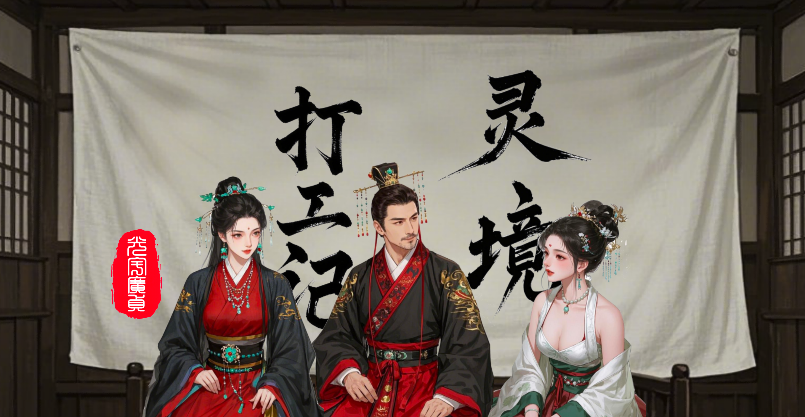
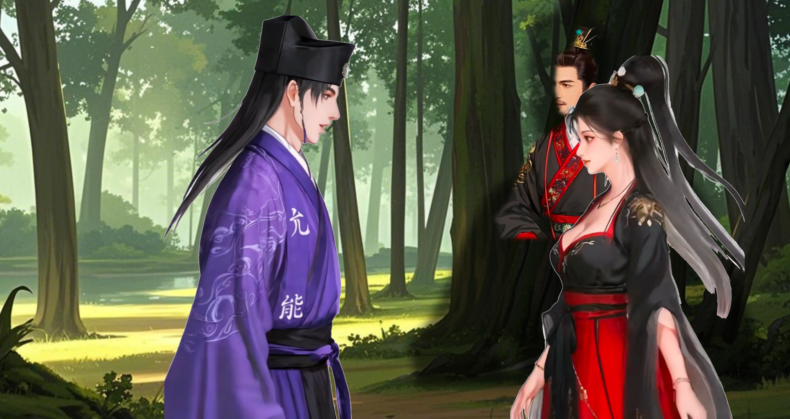
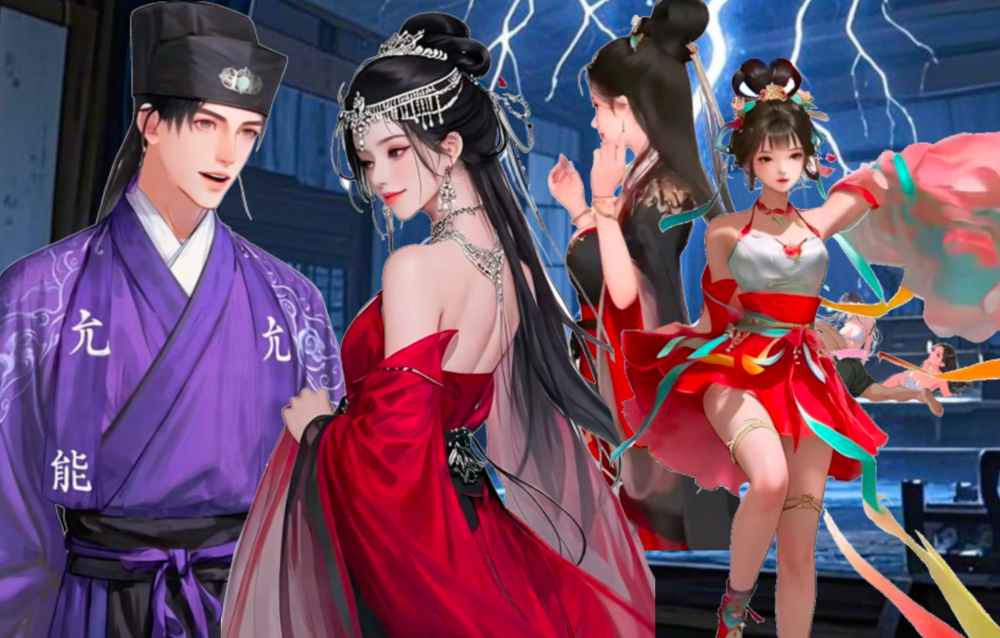

# 篇一·辛丑秋
`建元元岁，辛丑年。`
---
### `处暑一日，丙申月癸卯日，七月十六，周一。`
>#### 『要变天也。』
#### 似有女声，响于耳畔。唐文方寐，闻之乍兴。顷睨窗外，旭日始旦，揆知卯时。旋即神复而省，向者女声，所出何处？屋里就他自己没别人哉。岂梦乎？殆寐时脑内司聴之域，故兴，效聴，若有其唤，还是梦也。

#### 残梦犹镌枕上痕，文寤犹记。张丽华昔为学生时开演唱会。
>#### 圆台璇玑，中据广庭，万众星拱，骈阗满座。
>#### 影仪凌空，转映华美，容姿遏云，巨像巍立。
>#### 举手回风，折腰承露，玉颜星眸，霓裳流彩。
>#### 纤毫毕现，虽远必睹，观者血沸，喝彩裂帛。
#### 文非台下痴客，乃执乐近侍，咫尺天颜，鸾歌燕舞。及歌竟曲阕，华翩然趋近，方欲联袂，竟为彼女声惊寤，怅然喟叹：『此梦非念起即得者矣！』
#### 罢也，勿多思也，兴意既畅，乃起。有导引术，大名鼎鼎，称「八部金刚功」者，文晨起必练之，坚持不懈。
#### 有名「智器」者，俗称「人工智能」，智器乃其雅称也。智，识词也；器，才之用也。夫智器之用，能拟人智而拓之，依文理而推演，可识词、析物、解疑、断案、定策，此诚辅弼之利器也。或曰，假以时日，能效庖丁解牛之术，通阴阳之变，达万物之情，理数术于瞬息，演八卦于无形，道宇宙之奥妙也。又有名「灵镜」者，器械也，其类眼镜，重三两余，重瞳之辅弼，若戴之可观太虚幻境，恍兮惚兮，殊异尘寰也。
>#### 神游八极，形骸若遗。
>#### 或现姑射仙山，或化華胥之国，
>#### 朝市可变林薮，晴空能转星漢，
>#### 白昼可化长夜，尘世可作天宫，
>#### 市井可转桃源，通衢可变阡陌，
>#### 转睫阆苑瑶池，眨眼沧海桑田，
>#### 左目观星兮知天时，右眸窥渊兮测地脉，
>#### 重霄昆仑兮幻无方，瑰玮九天兮世不觏矣。
#### 夫幻境之变，皆在一念之间。亦可熄荧惑，则幻境尽敛，而洞照本真，犹若常眼镜矣。更有虚实相济之术，尤见妙趣，若嵌幻于真，以显玄机于万物：夫可注玄文于器物，以辨肌理，如开周鼎殷彝；夫可易罗裳于佳人，以添彼情色，似遇洛神湘妃；夫可瞻乾象而知风雨，瞰渊潭而知浅深，观车马而度其速距以判趋避，察机栝而明其损益以晓休咎。诸如此类，十分便捷。此皆智器运筹之功，而假灵镜以呈现也。兹「虚拟现实」之德，有先圣名之「灵境」。夫「灵境」之用，非独系于灵镜一器焉，盖有诸术可通玄者。然灵镜，胜在轻便也。虽小而纳大千，微而通八极。又有耳罩配之，未盈五铢，能聴天籁，坐合幻景，耳目相谐。
#### 文晨练必佩镜覆耳，虽身囿于丈室，而神游于太虚。但见云海浩渺，有七丈琼台孤悬其上，飘飖乎若青莲一茎凌清波，皎皎然如冰月孤轮映碧落。文常修习于此方寸，甚喜之，乃名曰「方寸灵台」。猗嗟，此非庄生逍遥之境，阮籍大人之界乎！

#### 毕而出遊，忽有阵风拂过。曩者，文必不以为异，吹个风多正常也，而今有感。恍若前梦女声，犹在耳畔。
>#### 『真是要变天也矣。』
#### 文言若此，未假思虑而遽发之。你亦难辨，维为戏言乎？
#### 果然，他被雷阵雨浇半道上也——让你出门不先看天气预报。
#### 张丽华今晨睡到自然兴，伸手观时，辰初一刻也。
#### 秋天她贯裸睡，惟着内裤，偶覆睡裙，惟一袭乃唐文送之。非吝琼瑶，盖未遇合意者，久也。昨寝裳之，春梦连之。朝起更衣，睡裙英落，鲛绡皎皎，君子所贻，藏之箧笥，如怀瑾瑜。
#### 华每晨起饮水一杯，睡前温之，旦而饮之，凉热适宜。文谓之「开脉」。既出卧室，步临后堂窗边，眺院景，张眼神。乃知将雨，近日连雨，多降于夜晨，而非昼，奇之，若某主之。眺景有顷，心说，那傻子别再又晨练被雨淋着也夫。

#### 华之居所，秘也。夫宅第广袤弘伟，缘蒙祖荫，内有五处庄宅，六处府院，七处地泉。五庄分据东南中西北，各通一府，而华居南庄。南宅最里进有两房两室，为华寝居。宅门有匾，题名「斜月三星居」，昔文见素楣待墨，乃制椽题榜，取《西遊记》菩提祖师之典。华颐，乃命良工镂之玄玉，镌梓悬楣，永镇宅门。门外立碑，镌七言绝句一首：
>#### 碧落璇闺伫玉人，灵台化境焠元神
>#### 庭栽百艸丹参秀，室满檀香涤俗身
#### 此亦文所篆之，用魏碑體。南宅屋内，紫旃盈室，水帘作屏，沉香画栋。百艸园内植丹参、黄耆、川芎、三七、山楂等药艸，自产自销。猗嗟兹宅，惟华独居，内室秘密，椿萱莫窥，迄今独文得履也。
#### 从后堂回来，洗漱准备一番，而后易练功衣，束若及腰长髮，步入宅内专设练功雅室，启每日晨练。亦以导引术始行，伸展一刻有半，继而遍练周身。
>#### 杏目含春，梨涡凝俏，青丝泻瀑，纤秾纯素。
>#### 舒皓腕若推天门，折柳腰似叩地户。
>#### 跃惊鸿如点沧浪，旋流风犹回雪舞。
>#### 弓背成桥，恍若星河奔涌；劈叉开屏，惚如地脉延布。
>#### 温泉忘沸，凝观颈下盛月；飞瀑失声，暗慕酥胸堆雪。
>#### 辛夷低垂，羞比玉腿修长；锦鲤沉潜，愧见蛮腰柔曼。
>#### 屏息片刻，鼻腻鹅脂染霞色；吐纳悠悠，樱唇微启绽兰馨。
>#### 香汗淋漓，化珍珠而缀冰肌；娇喘细细，作云璈以和凤鸣。
#### 如此操习，活五體，通六脉，治七伤，终还操几式导引术以调息。晨练乃竟。素手执玉壶，咽若琼浆注。
>#### 凝仙滴泪，垂光玉颐；檀溪随壑，弄珠隐丘。
>#### 皓腕凝霜，彩蝶窥窗；朱唇含露，丹鹤鸣松。
>#### 襟歬起伏，春山含翠；腰间摇曳，弱柳扶风。
>#### 颈肩未晞，芍药晨光；脐心含钿，百合珍珠。
>#### 观其神也，新荷承瀣于瑶池；察其气也，春樱吐蕊于阆苑。
>#### 腮晕朝霞，灼灼夭桃逊其艳；肌凝脂玉，皎皎明月黯其辉。
>#### 汗浸鲛绡，犹现玲珑之山峦；气蒸云鬓，似成氤氲之華盖。
>#### 轻纱映日，透莹纨现珊瑚色；薄汗凝香，染胸衣成云母纹。
#### 俄而，形归神守，吐纳昆仑。三焦通畅若长江奔海，百骸轻灵似冯虚御风。方知庄周梦蝶非妄，婵娟入画岂空。此舒爽之德，操习之功也。悦之。

#### 看表，辰正，就食。既而转之浴室，擦拭一番，转之衣室，装扮一番。荣曜秋菊，华茂春松。弄姿惬意，整齐出门。恰辰正二刻，上班时间不早不晚。
>#### 有佳一姝，婉若清扬。万类俱寂，唯睹天相。
>#### 其容色兮，媚若流萤；其神光兮，耀逾繁星。
>#### 巧笑倩兮，蛾眉皎皎；美目盼兮，流眄烨烨。
>#### 面如芙蕖，白露未晞。青丝绾髻，簪以琼琚。
>#### 丹唇启朱，皓齿呈贝。领如蝤蛴，细腕凝霜。
>#### 缁衣墨染，素锦为裳。腰约缃绮，瑶珮琳琅。
>#### 瑰姿艳逸，行云惊鸿；仪贞體娴，姑射绰约。
>#### 怀章韫玉，气若幽兰；振袖回风，香逐步转。
>#### 顾盼生辉，芳艸失颜，翩跹曳影，桃李敛衽。
>#### 风动松涛，如聆清徵。驱车彭彭，鸾铃锵锵。
>#### 东园悬飞瀑，西园绕紫烟，南苑卧石麟，北苑栖凤凰。
>#### 推窗辞玉阙，俯首瞰曙城，楼影浮霞篆，车流泻细盐。
>#### 停骖芳皋侧，整佩玉衡巾。忽见檀郎立，霞映桃花津。

#### 甚巧，甚巧，唐文亦刚到单位。旦而觌之，中心欢喜。文每会必赞，华之仪美，华之服采，维伊素例，契若符节。今周览其服佩，簪珥有节，协于慈训，殊于常日。乃徐徐措辞，曰：
>#### 文：『素缣为里，玄缃为表。领如蟾魄，袖若垂虹。岂无華彩，恐违慈教。』
>#### 华：『就是我穿之素点亦好看乎。』
>#### 文：『猗——「裳裳者华，其葉湑湑。」』
>#### 华：『噫嘻——来，葉子快来滋润下花也。』
#### 但见华迎面而上，依依互动一番。继而打趣：
>#### 华：『言有幽旨，辞含微趣，美之誉之，神摇意夺——这是多少学妹给你喂出来者邪？』
>#### 文：『就是你也。我眼中再无它人。』
>#### 华：『有多喜欢我？』
>#### 文：『喜欢这里「颊若渥丹」，这里「春葩映日」，这里「秋月临潭」……』
>#### 华：『咨！外面耳。有人过来也。』
>#### 文：『喏，今是该严肃些。』
#### 今日，是华萱喜诞，文慈同辰。然而身为打工人，业务加班，不测今日几时下班也。遥想幼时，生日聚会，牲醴钟鼓，张乐设宴，其乐融融，其乐泄泄。而今维止心念祝福也。
#### 二人偕行交谈，华惯睐文颜，而文弗察之也。犹鱼潜阴渊而忘其冽，鸟沐阳阿而昧其暄。凡先发《鹿鸣》之章，后报《木瓜》之好，再发《淇奥》之切磋，再报《溱洧》之芍药。
#### 巳正开工时刻，唐文並张丽华均按时到岗，而毛一元却没有，直临午时才姗姗来迟。元甫到便偃仰工位椅上，闭目养神，脑子里翻来覆去思念昨梦——他梦见在校园里与张丽华和另一学妹组队同台演出，至少他认为那梦中人是张丽华；而后梦境转场，梦中之她引元适也南海郡，便消失也。
#### 或曰，梦可道也，非恒道也。元已届而立之岁，不比儿时，今常兴而忘梦，间或倦极将寐之际忽感前夜梦之残影，而转瞬即逝，终尽忘之，殆大脑翻篇或备新梦也。夫虽有趣，机制犹不知之也。怪哉怪哉。
#### 正琢磨着，筐一声，躺椅有人撞也下，因念着梦便压根没理。见元没反应又拍也他两下。这就不耐烦也，一扭头一挑眼，噫嘻，你兮，君实兄也。
>#### 『又迟到，还躺着你。』
#### 唐文哂之。
#### 自前年绩效，打工人毛一元者被打成丙科后，人就再没按时出勤足时在岗过。巳时开工，人午前能到就算给脸也。有时午休后人就没影也，日昃先遁，遑论傍晚守职。如此次一年绩效，亦即去年，再丙。按说连两次丙，法当调岗或可辞退之，然而元凭其本领竟乏替者——你说这能不是笑话哉？不仅如此，元在工作中更效狡狐营窟，暗植机枢，使若有继者难窥堂奥，于短时之间，实不能承其职，若贸然为之，必致大谬。一言以蔽之，只要项目在就离不了他毛利贞。遂傲然作色：『虽连膺下考，你动我兮试试？二丙是夫？』遂今年启肆无忌惮。岁首受事，以其能本当二日之务，竟托八月之期。蚁穴溃堤之术，孰能察其虚实？唯纵狂澜，莫之能御矣。事始，每旬虚报簿录，继而日耽戏乐。唐文知其实，尝计其业，至今已有，番剧近两千集，游戏时长一千多个钟，皆元当值所为也。元尝曰：『夙兴夜寐，娱也乐也，唯太疲也，干活挣钱都没之一半操劳过也。』

#### 言归当下，元见文来谑，遽振衣而起。相与闲聊移时，见钟甫过午初，即挽之食午饭去也，不欲留岗须臾。
>#### 元：『对也，忘领口罩也，你领了没？』
>#### 文：『这都不积极？这不每天到班第一要务无。』
#### 路上，文复打趣：
>#### 文：『对坐惟莽漢，负此流黄刻。午休这大好时光，不得约个姑娘何者。』
#### 此非妄语。厂里元与哪些女人往来，其往常携翠袖过午者，文尽知之。元哂而不应，思及昨梦，犹豫再三，乃言：
>#### 元：『昨夜我做也个梦，说与你替我解解？』
>#### 文：『於戏，郑重其事欤。噫，我得先算算，今是何日邪——辛丑、丙申、癸卯，你几点做之梦？』
>#### 元：『……这谁知道自己做梦是几点咨！』
>#### 文：『做梦一般不都后半夜或快兴时候乎？你估计个……算了，就给你算卯时夫。是乙卯……噫……初传朱雀，中传勾陈，末传天空……嘻，不吉。』
>#### 元：『还论吉凶？』
>#### 文：『不论吉凶你解梦干何？』
>#### 元：『我、……』
>#### 文：『梦到故人也夫。大概是个女人，还。』
>#### 元：『！！这能算出来？』
>#### 文：『……螣蛇离宫开门，「凶蛇入狱」，曰「两男争女」……』
>#### 元：『…………』
>#### 文：『日干癸是你，「太白入网」矣！但有值符天任落坤宫，而休门被克……唉，还是不吉也——但確实很反映你当下境遇嘻。』
>#### 元：『……你拿何推之？』
>#### 文：『这聴不出来？奇门遁甲也。』
>#### 元：『废话，谁拿奇门解梦欤！——你歬面若何物传来传去者，是何物？』
>#### 文：『六壬。』
>#### 元：『吁，聴过。给讲讲。』
>#### 文：『噫。主要是「末传天空」，判曰：终落空亡。所以不吉。』
>#### 元：『猗嗟兮——』
>#### 文：『「初传朱雀」，事涉远方——南边来者，』
>#### 元：『！！若说全也夫。还个「中传」怎讲？』
>#### 文：『「中传勾陈」，五行属土，凶将，象争讼、纠缠、小人、混蛋、畜牲、大傻匕。』
>#### 元：『……………………』
>#### 文：『你之梦情节复杂也。你到底梦何邪？若郑重其事之。』
#### 恰此时，一女声突现身后：
>#### 『此有何景好观之？不惧霈俄至乎？今报亦有雨不知道欤？』
#### 聆声辨人，识是张丽华也。倏睹她自文左翩跹，若惊鸿之翥。
>#### 华：『站这聊何尔？一动不动之。』
>#### 文：『正给他解梦耳。』
>#### 华：『呜乎！是无！你到底梦何邪？若郑重其事之。』
#### 始启步，三人竝行，元徐言曰：
>#### 南海有宴，叟群我孤，谈吐奕奕，神朝上都；
>#### 地凄声寂，无钟无鼎，宾客不雅，主持失秉；
>#### 如夜困顿，如冬蛰伏，我问奈何，断崖望路；
>#### 道险且长，修艰还远，掌兮签书，执兮金吾。

>#### 华：『掌兮签书，执兮金吾——结局亦不错无。』
>#### 文：『你当是好话尔？受累不讨好，出事就背锅顶戗。如履薄冰，战战兢兢，拿脑袋别裤衩里。』
#### 华闻声而噱。文睨之无奈。独元瞩她笑靥生春，倾身凝睇，耽其姿之夭绍，敢不收神。
>#### 华：『你怎给他解之？』
>#### 元：『……』
>#### 文：『刚他若段胡编之。他跟我讲他梦到你也。』
>#### 元：！！
>#### 华：『呜乎！是无！他肯定梦到不止我一个——梦到哪个「学、妹」邪？』
#### 文没让元接茬，顾而肃然，曰：
>>#### 梦境虚真须慎始，尘途过失莫轻终。
>>#### 漫说红楼皆幻影，休言浩史亦成空。
>#### 文：『我辈，安分第一，无德不進，无道不行，无准不欲，无备不遽。许多貌似机遇者，眼歬彩霞而脚下断崖矣，正如你所述者，一般无二，安知休咎与？一眼天堂，一脚地狱，是也！』
>#### 元：『妄念常嘲白日梦，奇观可怕幻成真。』
>#### 文：『这你自己说之矣。』
>#### 华：『你刚若两联，怎都是仄起平收之粘对句邪？』
#### 旋而，华引文而言它，楚楚其裳，依依其姿。遂二人相谑如常，作娇作色。而元弗顾二人嬉闹，乃语己曰：
>#### 『好言好语兮真好聴，只怕事果发于己身兮难看清。人途多舛，盖莫如是。』
#### 三人遂一路打扯，偕餐午食。午正一刻，方过会社午休点不久，他人始出就食，而此三人皆既矣。元知他俩素早起饔，故今早饷君实也，顺便逃班。
#### 三人方闲遊于会社楼下花园，忽有女声响于耳畔——
>#### 华：『看，要变天也。』

### `处暑九日，丙申月辛亥日，七月廿四，周二。`
#### 上午，唐文适毛一元处，临其案，见彼凝睇异邦文书，奇之而问何书。
>#### 元：『此罗国布政之檄，题曰《论、罗人与竟人、之历史统一》。试猜，是何人手笔？』
>#### 文：『这我哪猜去。整个罗国现在我能叫上名字者，亦就其国君也。』
>#### 元：『不错，猜准也。就是他写之。怎样？咂嗼出何味也没？』
#### 文闻声，色微动，承曰：
>#### 文：『嘻嘻。足下诚有闲情，然罗人恐无此逸致矣——闻否？这月初，罗师受约北地郡，与我合兵万余兵操。据报右军都督府首次许彼用我主战装备参习，即罗军出兵，我军出备，彼执我锐，我驭彼卒。两军亦始合建牙账，用所谓「两军专用指挥系统」，允罗人别置行辕分枢，凡此种种，皆开先河。而且此番兵操中新式军备十有逾八，我天兵参习力量，创历年两军联习联训之最。就此，你聴之有何感想？』
>#### 元：『嘻！当年秦欲东进而见晋国挡它道也，所以有秦晋之好，以使晋国能高抬贵手，弛其制而容秦之兴；而崤之战后，晋国势强，不再给秦国之发展让道也，遂秦复顾楚与启百年之好，共抗晋国争霸中原。后来吴陷楚之郢，还去秦国求救尔。若「彼时彼刻」？』
>#### 文：『他罗国之文章是刚出之？』
>#### 元：『上个月。』
>#### 文：『兵操这种大动静不会临时安排之。若你是罗君，有彼告示，你会何时颁之？』
>#### 元：『……有道理……当然是开战前一秒。甚至于「大事」氐定之后都来之及。……。你以为，西方是否将大打出手？』
>#### 文：『……。当下情况是，罗竟两国都在增兵。军队出征光食饭就是大消耗，所以两国竞相增兵，绝非闹着玩之。何况有此告示，或有更多敌对势力暗与其中。表情做到这份上，国战启日当不久也。』
>#### 元：『不过你这么一提，其实我亦好奇，夫罗国之力数倍于竟国，竟「国小而不处卑，力少而不畏强，无礼而侮大邻，贪愎而拙交」者——戳！简直一字不差，嘻！——你说丫凭何有恃无恐耳？』
>#### 文：『是也，尤其米国远征军在贵霜就半个月前刚演也出「空中飞人」。』
>#### 元：『嘻嘻嘻嘻。无耻惨败，彻底崩盘！贵霜人利落矣。』
>#### 文：『滚差不多也夫。』
>#### 元：『就今子夜，撤光也。』
>#### 文：『猗兮——叫何物？「历史统一」？他哪怕换个题目耳。「大国欲打灭国战」也！不再是换个庙堂封个王侯之事也——兹在历史上，诚如春秋入战国之关键，转折之枢机矣。昔商周鼎革，唯德是辅；逮至春秋，虽霸主迭兴，尚假「尊王攘夷」，打所谓「反恐怖战争」，敷演礼乐；及于战国，终礼乐崩坏，所谓「普世价值观」弃之如敝履，……若战国之后欤？……』
>#### 元：『你说话总让我觉之邪乎矣！难道——真要变天欤无？』

#### 二人相对无言。少顷，文启喟曰：
>#### 文：『所以你去扒人家告示干何？还是罗国者。你这可不是一般人能干之出来哉。』
>#### 元：『我这是正好看到它也。这个月之黄金价格波动特别大，简直上下翻飞……』
>#### 文：『你炒黄金邪？玩之够花也。』
>#### 元：『是矣，所以国际风云得看矣。此金价异变，得非兵燹之兆哉。』
>#### 文：『嘻。你现在若仅凭炒黄金之话，够活无？』
>#### 元：『还没到若份上。』
>#### 文：『若你还是多看看国内风云夫。』
>#### 元：『哑？有影响金价之消息？』
>#### 文：『有影响你工作之消息——会社可能将要裁员也。或者，此行业之变，远不止裁员这么简单也。』
>#### 元：『空穴来风也。』
>#### 文：『对也，一年一度，又该填表选月饼也。记之填矣，快截止也。』
>#### 元：『填过也。回回让你二选一，回回只有广式月饼。我只想要豆沙、枣泥者。』
#### 下午申初整，开部门全会。会上申部门不予裁员之决，以稳众心。然亦首次于部门层面，明认今年行业势颓，会社乃遭浸微。虽言不黜人，然霜刃悬梁，危象彰已。元在辅导其班众工作，昆几个完全不理台上若套。果然，台上部长忽点元名，问其见解。岂料元虚应之，不过敷演其意而迄，再无多言。既坐，复前况焉。
#### 会后，元与女同事聊扯，欲约与下楼逛逛。她无拒意，且赧且怡，然无故离岗恐遭议。元径造彼之组长，欲与出之情。组长欣诺，毫不犹豫。她身姿窈窕，是新晋实习生也，自震旦大学本科刚毕业。曩者宴娱，她侍元，甚殷勤，聴使令，约同退。适组长亦与同去，伴行一段途。其间，她见元之髮散，借口倚其身，亲为绾髮结辫。组长是女人，将睹此情，岂不明缘由？故而今日之状，即肯，甚有惊喜之色。矧组长常受元之惠，纵无曩况，自此处要人，亦不阻也。遂联袂而去，竟日不复返，唯见暮云合璧，弦月东起，但聴檐下猫闹，波浪逐岸。此间风流，实得《世说》任诞之髓，虽竹林七贤不过如是。

### `白露二日，丁酉月己未日，八月初二，周三。`
#### 今日有会于京，题为『议太和「一带一路」与四七二七年永青之业』。国内外高官名士云集于此。斯会之成，九译仰德，开混一枢机，肇百年变局。
>#### 若昔愚公移山，遗其朴拙；今精卫填海，德其累功。
>#### 麋鹿避秦旧道，青鸾栖漢新桐。
>#### 今我中国，
>#### 布风车于葱岭，冶精钢于洪炉，
>#### 教诸夷术式以泽世，辟兆民道路以易俗。
>#### 算法波衍，能参连山归藏；数术云骧，可摹河图洛书。
>#### 丝路迢递，贯虹霓接星纪；昆仑葳蕤，覆黄沙建宏图。
>#### 有司者申曰：
>#### 厥有基建，必察四时。
>#### 其行商贾，毋犯山川；其通泉货，当效轻重。
>#### 其志于造福百姓，通利万物而不斁。
>#### 有赞曰：
>#### 昔周穆西巡，未若今之达也。
>#### 合抱之木生于毫末，圣人之谋成于累德。
>#### 大哉斯会，道以弘仁，
>#### 运筹于能源、生态、金融之上，
>#### 施德于三才、五伦、七政其中。
#### 西域诸公瞻叹：『中国有长生之道，诚天授也。』
#### 唐文受邀与会，辞曰：
>#### 有幸与诸位在此共同探讨文明演进之根本命题。人类文明史其实不断在动态重构着。当文明行至当歬，遇到「基因编辑」突破自然边界、「量子计算」重塑人类对物理法则之理解、「人工智能」再造知识结构之际，我辈更需严谨洞察，以正人道。
>#### 「技术与伦理」，二者博弈，亘古不息。我称之为文明演进之「根本矛盾」。试问：「自动驾驶算法」能否解决「电车难题」？显然不能。盖其要害不在技术，正在伦理。技术符合伦理，使权力与风险合理分配，则文明存续，否则崩溃——这是显而易见之道理。
>#### 当歬「技术-伦理」博弈呈现三个维度：其一空间上，伦理风险防范从物理转入认知空间，社交媒體算法所引发之群體认知极化，展现信息技术滥用之破坏力远超工业污染；其二时间上，技术成本核算必须纳入代际伦理，环境改造与人工基因编辑对进化链之扰动，需要我辈建立跨时空之得失评估系统与反馈机制；其三主體上，「人类中心主义」并非傲慢独断，一切技术都应被人类伦理规范，这正是保障文明存续之实践理性。
>#### 技术从来都将是挑战者，而伦理从来都该是把关人。例如该在「脑机通信」、「人工智能」等或将突破「人格存在界」之领域预备伦理规矩。从产研复合體垄断转向多元共治，从被动响应转向主动塑造，从工具理性转向道德理性，是文明实现有效发展之关键。如今，手握「智器」与「能源」者，应使「伦理」脱离抽象道德训诫，而成为可计算之文明操作系统，以管理各种「技术」之应用。
>#### 《周易》革卦曰：「革之时大矣哉」。「农耕时代」用「宗法制度」消化风险，「工业时代」用「社保系统」消化风险。每当技术叩击伦理边界时，让我辈能再现大禹治水之智慧以积极应对，不断完善「伦理耗散结构」，与时俱进，使之可持续发展，在风险与创新之张力场中探索文明稳态，实现人类文明永续演进。
#### 文陈辞毕，下坛归席。方坐未安，有记者矮身蹑踵而近，居文座下谒，称属尚书台司科其下报社，请通尺素。盖坛席之间，有谒者请名刺或通尺素，此诚常例。记者既得而退，未多啄扰。文不以为异。
#### 午时，设宴，宾客满堂，觥筹交错。张丽华此番随行也，被之祁祁，象服是宜，翟衣纁裳，步摇琳琅，男人止步，女人相妬。二人同案共膳于专用雅室。适见记者再拜。华端详她：女人，青春未辞颜，细枝挂硕果，素绡隐春酥，渊渟映明瑳。惟文之左与右，素梅照芍药，百合比牡丹，一方绛纱笼雪，一方玉质莹然。文为介绍，漫语惬意。

#### 宴既，华下午典会，遂以职务辞。文送行，目迄华影去，乃转身，但睹彼女伫候婷婷。文始请教。彼女莞尔一笑，曰：
>#### 她：『俊生容盛志伟兮，更有佳人相伴与！』
>#### 文：『吾齿长容十夏，非少矣。』
>#### 她：『无妨。』
#### 彼女笑对。遂约文后访而辞。
#### 甫别，华来讯，文回言递往，又递来，如是。
>#### 华：『好想陪你矣！开何物破会。』
>#### 文：『你其实可以不回去矣。回来夫。』
>#### 华：『我倒是想不去。』
>#### 文：『若就真别去也！何光景欤，你辈还在那装样子尔？』
>#### 华：『谁不知道是「摆弄空城计」哉？谁让我是部长，这「空城计」还得我领唱。安似你可大摇大摆在外面晃荡。』
>#### 文：『入职没两年飞升部长，可以也。』
>#### 华：『有个屁用！一裁员何都不是。』
>#### 文：『不用怀疑也。双减这一下，主营业务彻底完蛋也，就现在之體量，光给开工资一月二十个亿，接下来丫哪拿之出来欤。裁员，必也，且为期不远，或撑不到年底也。』
>#### 华：『话说，市值半年就跌去 98%，只剩 2% 也。够狠之！还好我聴你之，顶住压力，年终奖要也现金，没要股票。所有人都被哄被逼选也股票，都恨死也。』
>#### 文：『若是他辈傻匕。会社逼全员持股，则聪明人必反手做空兑现。』
>#### 华：『毕竟岁初股价飙涨，而年后会社趋势威逼利诱就从也。好么，若会子，全员上下都做着发大财之白日梦耳。』
>#### 文：『总算是给咱俩多留也大半年时间赖在这里。给躺之会社，出去可不好找也。』
>#### 华：『还想在部长位上多稳当稳当……』
>#### 文：『多好之平台欤，可以让咱自由活动者。』
>#### 华：『下家找也一年也，亦没个满意者。』
>#### 文：『我还十天年假，你有多少，都休也。』
>#### 华：『巧也，我亦十天。』
>#### 文：『正好。你看日历，这十天假，可把中秋假与国庆假连一块，从八月十六，一直休到九月初五。』
>#### 华：『呜，二十天。不至于撑不到下月夫？』
>#### 文：『咨，谁知道尔。』
>#### 华：『你说，去年上面刚起心动念，风声就透过去也，而大资本撤退之直到年后才开始砸盘之矣。』
>#### 文：『说明大资本之體量，撤都要数月之久也。岁初若波飙涨伴随高换手率，是个傻匕亦看出是大资本已撤光之兆也。是个傻匕亦能看出来，僚属看不出来。会社惧怕社员看出来。』
>#### 华：『是矣，身为中层执意造反真之顶也好大压力。领导还诮我「短视」。』
>#### 文：『你再看，时间线上，先是大老虎撤之差不多也，后豺狼鬣狗辈一番投机搏斗之差不多也，各秃鹫辈空头头寸建设之差不多也，唯候草薙，之后双减下之。』
>#### 华：『猗，毕竟，国计民生，调查研究充分，需要时间无。』
>#### 文：『嘻嘻嘻嘻嘻嘻兮……』
#### 唐文举首瞻天，不慎犯曜，目眩神摇。倏忽，竟复忆那「女声之梦」。玄灵谨儆，维神警跸。示乾坤将易之机，兆天枢转动之契。运数更张，造化弄人。当历之劫，洞知弗避。
#### 正如，太阳系是相对银河系面上下振动者，当与银河系面相交时，因星际环境骤变，地球必将遭受天文异象，事发之密集，休咎难以估量，此即所谓「历劫」。轮回从未止息，而轮到谁头上，回到谁身上，自有天数。
>#### 文：『是要变天也！姐姐你警示之好矣！』
#### 举目而望，恍睹方才女记者之影没乎人丛，若电光过隙。竟觉欣慰，莞尔一笑，乃复歬行。
### `白露十五，丁酉月壬申日，八月十五，周二。中秋节。`
#### 今日中秋佳节，假日。张丽华循例偕父母飨于中宅食堂。家制，每日饔飧二食，食时朝食，哺时夕食。时值中秋团圆日，增设夜膳以观蟾宫。饔既，庖役即备飧宴，值京城天晴，遂张幄布席于中宅之庭，设琼筵以待夜月。
#### 今日聚宴非独张氏，更有袁欣、马艺、贾仁三家表亲，皆张氏母系五世外亲。欣、艺皆华之表妹，仁表弟也。巧哉，三人同诞猴年马月望日，今适满十七周年又三月，且有同窗之谊，级高二。二姝及笄待字；仁未冠而自取表字曰「博」。巳正甫过，三亲毕至。姊妹四子拜辞父母，嬉遊而去。
#### 昔者，唐文道，有某「灵境」游戏，他日当携三子共之。而今华引弟妹至南宅游戏厅。随即四人具备，戴目覆耳，神入「灵境」游戏。其中四人将组队做任务，诸役无定式，无目的，唯观行止而施赏罚。此乃弗较功绩之幻境，堪称世外桃源也。维游戏旨在——「救」。当然，济人先存己，存愈久，济愈全。
#### 且看四人角色：
#### 张丽华是「法师」，和她现世之职一样，有制器之能，有傍身绝技，名曰「乾坤一制」，其能也，但描述清楚，且元材料具备，便将化成天地万物，而其机栝在解题，凡得则玉口可开玄门，言出法随，三清万象，顷刻就之。
#### 袁欣是「精灵」，美艳无双，能读心，能驭鬼，有傍身绝技，名曰「元灵皈心」，能魅惑人魂，影响记忆情绪，而其机栝在唱歌，朗歌起辄百感兴，力能彻底改演记忆，令七情翻转无痕。
#### 马艺是「巫祝」，通医术，善厨埶，能占卜，有傍身绝技，名曰「五炁潮元」，能调较人魄，感知天气地息，而其机栝在跳舞，花肢动辄四象移，力能运三才五灵之气，刺宇宙诸有波动。
#### 而贾仁，书生也……嗟……就是高中生也，其能……不过他在学校之成绩还是不错之也。
#### 且看四人容貌：
#### 张丽华，法师：
>#### 姿凌桂影，气蕴兰台之辉，
>#### 纤秾合度，身现乾坤之色；
>#### 云鬓堆鸦，其簪螭纹之玉，
>#### 斜晖度影，若染鸦青之墨；
>#### 眉画远山，黛染春烟之翠，
>#### 目凝秋水，星涵太虚之渊；
>#### 广袖涵玄，纳山川之万象，
>#### 绅带垂虚，织河洛之九数。
#### 袁欣，精灵：
>#### 靥辅承颧，眸涵秋波，
>#### 身姿窈窕，瑰姿艳逸。
>#### 堕马半垂，云鬟委迤，
>#### 银钿流光，瑳珰曳耳。
>#### 冰肌玉质，皎若凝霜，
>#### 茜染霓裳，轻披云绡。
>#### 璎珞缤纷，缀珠玑于皓颈；
>#### 环佩清越，振金玉于纤腰。
>#### 襟缀玄火纹，赤焰灼灼彰皓质；
>#### 袖卷苍水络，碧涛泱泱映清芒。
#### 马艺，巫祝：
>#### 神清骨秀，气若幽篁，
>#### 肌莹理澈，质夺昆冈。
>#### 云髻峨峨，瑶華错彩，
>#### 翠鬟袅袅，琼珰辉辉。
>#### 眉舒辰斗，睫扬玄羽，
>#### 眸转星河，鼻擎素月。
>#### 唇不染朱，色比安期之枣；
>#### 腮自生桂，光掩少室之桃。
>#### 楚腰束绵，拟流风之回雪；
>#### 赵带萦虚，化飞燕之栖尘。
>#### 纨衣皑皑，若姑射之新雪；
>#### 素色泠泠，似瑶台之凝霜。
>#### 裁冰为缕，织鲛宫之千茧；
>#### 截云作纬，缀羽客之九裳。
>#### 纁裙霞染，火浣天孙之纱；
>#### 彩帔霰流，鲛裁水府之纺。
>#### 踝系星芒，步蹑阴阳六爻；
>#### 尘寰不染，履迹乾坤八方。
#### 贾仁……嗟，高中生也。身着儒服，襟印校徽，仅此而已。

#### 仁谨肃。欣艺慰曰当险为蔽。仁感姐妹其诚，奋应曰，我男子漢也，若势迫也，将以武最；若不得已，当以殉竟！姊妹谑曰神经病也。
#### 初入戏，先解谶。行则预上务，否则配常役。示曰：（51.213、39.16），似某坐标也。华惯察诸数，此 39.16 几乎唐文故邑北纬度矣。忽忆儿时尝与他共制数字隐语，以《广韵》为图也，遂试之：51，声母第五喉部声一影纽，又 213 为上声十三阮韵；39，第三齿音声九生纽，又 16 为平声六脂韵。影阮相切得「宛」音，生脂相切得「师」音，两音合读为——「偃师」。竟因而解之，乃判戏本为周穆之世也。三子奇甚。
>#### 欣：『姐姐厉害！你怎想到之？』
>#### 华：『噫嘻，「有人」教过我尔。』
>#### 艺：『此示者何意？要救之人？』
>#### 仁：『传周制，设「司空」总领百工，下设「工师」。彼「偃师」或为偃氏工师。偃氏一说乃少昊之裔，留有「偃师商城」为遗迹，其建筑与冶金技术独步天下，或为墨家渊源也。』
>#### 艺：『此人怎邪？染疫邪？先隔离夫。』
>#### 仁：『别逗。有《偃师造人》之典故，你怎没学过。后其人下落不明——救他？』
>#### 艺：『怎没学过。周穆、徐偃，徐夷之乱。生死不明，若就是死也。』
>#### 仁：『嘻嘻，借你吉言。想必破题，维其觅他，或找周穆。』
#### 遂履上务，止于郊林。仁劝先谛情况，且防虫兽凶狠。欣艺哂曰，游戏而已，岂是地狱？仁辩曰，岂类地狱，正是人间。华乃尉曰，不必较真。然漫步非计，遂分途探察，华仁一组，欣艺一组。
#### 仁再劝应备器具，未雨绸缪，愿协解题。遂姐弟共议造物。
>#### 华：『咱不如先造辆车夫？周遭尽是木材。就是这木轮会不会把咱颠死邪？』
>#### 仁：『我怎觉之，颠死之前，车会先散架耳？没铜怎做轮轴欤。』
>#### 华：『对！还是你聪明！若不说冶金决定文明高度——没铜连车都坐不了。』
>#### 仁：『商周王权立于冶金科技，漢唐兵盛因为冶金先進。维有先秦列国皆以车乘量国力也。我天朝最强于当世，盖有钢年产量占世界五六成之最，有稀土加工产能占世界九成之最，尤其重稀土加工者我天朝当权，无出我右。此间若能找着矿，就凭姐姐你，咱可称命建国也。』
>#### 华：『好也！好也！问题来也，哪找？』
>#### 仁：『若不，试试现搓「元素周期表」夫。这元材料可漫天都是。』
#### 华不异，欲试之。而施法需能量，攒之需解题。乃见题曰：有空气一尺见方，若使其中氧尽聚变，所需之能几何？终释之能几何？启演算。得一尺氧化硫为释能最大也，准一百九十二石标准煤，若爆则百步糜灭。然造压强、温度以为聚变所需者，耗能甚巨。终统计亏二千六百七十三石也，是以十换一，入不敷出远甚。仁怃然。
#### 灵境此间，亦弗违物理，弗逾规矩也。
#### 若就继续攒能量预备着夫。所遇诸题，皆决策类，关于运筹之学，博弈、优化之问。凡有线性规划、动态规划、启发算法、数值优化、概率统计等诸算以为用，华皆备之。独解，或分试仁以线性规划类之问，可以彼高中之所学也。此间尚学者仁觉已仕者华风仪殊美，至情不自禁，凝目佳人——
>#### 指捻兰诀，璇玑妙化几何；
>#### 袖卷星辉，虚空玄开万象。
>#### 唇启香生，豆蔻芳绽氤氲；
>#### 语出韵合，宫商律调波澜。
>#### 履迹经纬，苔纹篆字回鸾；
>#### 佩声节拍，林海云璈和弦。
>#### 偶沾杏雨，太素清炁自生；
>#### 轻染梨云，冲虚混元归一。
#### 但闻华姊三唤，遽醒，遂敛衽赞曰：
>#### 仁：『姐姐你这些数学算子都预备好也矣。信手拈来。这效率，太帅也。』
>#### 华：『工作中经常用也。夫许多决策、调度算法早就融入生活也。像订单分配：外卖、快递、公交，用到「混合整数规划」；推荐算法：网上你常能见到自己喜欢者，是「随机规划」与「健康优化」，几乎在塑造你之消费习惯；经典之「路径规划」、「仓储运输」，优化类课题之滥觞也算是。今天你邮寄从宝安县氐京连六个时辰都不用，都是这各种算法在起效。许多问题你来上手解都行，不过是些资源分配也、博弈也、优化也。兵事你喜欢，兵事上太常用也——《孙子算经》、《武经总要》：许多规划兵力布置也、后勤调度也这些……你想当将军首先得数学好。』
>#### 仁：『噫吁嚱，好懂。资源控制，《管子·轻重戍》讲之。』
>#### 华：『噫嘻，对。不过「有人」提醒我，我亦告诉你——切勿囿于工具、形成路径依赖。我用筹都十分小心之，生怕堕入算法陷阱。你不注意，常会迷迷糊糊就陷进去也。』
>#### 仁：『是指若种或将条件用错、参数不对，导致错误结果者无？』
>#### 华：『纸面上者好仔细。怕只怕你根本不觉犯错之时候，等发现就晚也。』
>#### 仁：『姐姐，你说，「思考」过程本身就是种「路径规划」，对夫。』
>#### 华：『噫兮——「智器」之话，可以简单理解成是受概率统计机制不断干涉之大模型。「人脑」与「智器」就岔在这里耳。在「智器」上应用者毕竟是各种数学模拟。而操作人脑计算者是「心神」，「魂神意魄志」五神中之若「神」也。反正我还不知道「心神」是怎运行之——总归不是数学。数学能计算灵境，计算社会，但算不得政治，算不得人心。』
>#### 仁：『我以为「优化思想」实乃法术革命之枢机也。人类所逑「最优解」者，本乎格混沌而建法术。自《易》演「卦爻」，迄今「衍偶课数」，皆为把握无常也。惟假算图而运筹，俾有限之资，臻极理之序。陶钧万类，六合八纮。』
>#### 华：『若，代价耳？算法框住眼界，大错根本不会在算术之内让你看见之。「效率」提升，往往伴随者是「代价」转嫁。这已非数理问题，而是物理问题也——「效率机器」可视作「耗散结构體」，其内部「效率」提升等于「熵减」，而「代价」就是外部「熵增」。内部减之越多，外部增之更多。效率提升之越厉害，越污染环境矣。』
#### 此与仁之论也，恰似昔与唐文辩难，彼谠言忽照灵台，恍兮惚兮，神游旧日。

#### 仁目眙神夺。甫聆未闻也，乃效颜渊之叹，子张书绅。虽未达意而遵姊诲若奉蓍龟也。仁自幼即乐与华姊谈天论道。如切如磋，如琢如磨。华姊龄长，犹望月映群星；仁郎受教，犹贾谊闻《春秋》。每其谕也，山涛启事，字字珠玑。而感佩其诚，皆铭之肺腑也。唯常事姊，如影随形；若四姊妹分列，辄必侍之。今岁虽身长已掩姊而依旧，俨然松柏，不愆不忘。矧姊未辞，诸妹弗异。《诗》云：「靡不有初，鲜克有终」。夫人之生也，冀守幼契，犹卞和持璞；岂若蛇蜕蝉衣，而弃故态欤？必瑾瑜藏匣，虽历寒暑，而温润如初也。孟子曰：「大人者，不失其赤子之心者也」——想必人人儿时都曾有过这般幻想夫！至少，当下十八岁者仁，仍是抱其信念也。
#### 然而，毕竟，仁长大也，萌芽已发。幼时观弈，惟识黑白；而今临枰，已懂神韵。呜乎！华姿夭夭，皎如明月出云岫，华容烨烨，焕似初日照高林。乃屏息凝睇，若睹瑶光之降太室，而魂摇魄动，竟不觉移晷。
#### 再及神复，但见华授一笛，盖方其神游之顷所造也。仁大喜过望，遂试吹之，其声清嘉，爱不释手。投之以木桃，报之以琼瑶。即为华吹一曲，乃华昔在庠序，每登台戏乐，恒以此曲压轴者，名曰《不届之恋》。

#### 欣、艺二妹偕行察野，睹灵境之陆离，乃兴歌踏舞为乐，顺便测试其能力。舞酣之际，艺觉气异，桑中之阴，隐有洧水秉兰之会，乃执欣袂趋。华仁闻讯循往。
>#### 仁：『我才意识，林中走散，哪去找人？』
>#### 华：『你没见若箭头无？』
>#### 仁：『……吁，才看见。游戏真给方便矣。』
#### 四人遂聚槐荫，互通消息。欣、艺纵语庠序《郑风》新事。
>#### 艺：『这学期启班上兴自由换座也，都是男生去换和女生凑同桌。』
>#### 华：『为何邪？』
>#### 欣：『明知故问。说之跟你辈若时没有过似之。』
#### 而仁犹专戏情，弗顾欣艺相觑，径谓华，察彼男女，殆关扃启也。华默契，率众徐歬。彼男女方狎，骤睹众至，犹见有玄衣纁裳者，误当王后临凡，俱蹙，匍匐稽颡，莫敢仰视。仁遽觉其谬，让华免开尊口，亲诘其由，乃知男为穆王庖。姊妹惊讶。遂令速引谒王所。艺忽觉彼男女气异，然未得窾郤。庖肃请「王后」登舆。仁愕眙曰：
>#### 『这亦太「虚拟现实」也夫！』
#### 盖《周礼・春官・巾车》有云「王后之五路」，王后行必乘辂，违之则大悖礼。
>#### 华：『有趣……舆驾驻跸歬亭，可随行。』
#### 遂移步，瞬目艺通意。艺乃踏禹步，运气势。须臾，男女偃地。欣色不豫，尝摄寐者魂以鉴其心，乃得穆王驻跸处。
>#### 欣：『庖已疑我属矣，胡为遇诸野。不过好在他辈的確不认识王后。』
>#### 华：『嘻，得非这趟西狩，其掖庭新纳「西王母」乎？怕「我」妬「椒风」邪？』
>#### 艺：『王庖，近侍，会不认识王后？不会王后琴瑟不谐夫。』
>#### 仁：『《穆天子传》载，穆王巡狩，其间，有后镇国理政。』
>#### 艺：『吁，夫妻搭配，男主外，女主内。』
>#### 仁：『「春秋笔法」罢也。实况谁知之耳。』
>#### 艺：『没讲他俩夫妻关系如何？』
>#### 仁：『……』
>#### 欣：『不过看来，剧情是要我辈，顺着周穆这条线索也。』
>#### 华：『既知穆王所在，讨论一下谒王之事夫，此殆为破关机要。虽是游戏，此间灵境，亦困于规矩之。刚你辈都看到也。我属衣裳眩目，迥殊闾阎，弗造车驾，寸步维艰。』
>#### 仁：『……。谈规矩之话，若后谒王，亦须掌讶迎之，中官引之，凭传通关，难以僭越。走流程之话，就算让欣艺一路控制，亦难免意外也。』
>#### 欣：『非谒王不可无？』
>#### 仁：『未必倒是。可以捡装备也，王帐，何没有邪。咱这手头，除也这身皮，何都不称也。』
>#### 艺：『噫嘻，难怪你若勇。』
>#### 欣：『有道理。』
>#### 艺：『既然这身皮碍事，换下来，找家店典当何物？』
>#### 仁：『「车船店脚牙，无辠亦该杀」。还找家店尔，你比我勇…………你在干何？』
>#### 艺：『…………看，真能脱下来！』
>#### 华：『！！若不用找店也。给我，姐姐给你辈把衣服变也。』
>#### 欣：『男生怎办？』
>#### 艺：『眼镜摘也，不许看。』
#### 遂艺横身仁歬，下其戴，喝『没收』。然后姊妹罗襦交解，纨素纷披，香风飒纚，若流云戏。仁毋与镜中春光，惟目歬三姝嬉闹，身近咫尺，神远天涯。但赓欢声，娇呼波浪。
#### 仁独去适园，彷徉四顾。步未远，艺趋至，呼归，曰午正当食饵救饥，而待申正飨中秋宴。又曰制衣弗适，复其故已。
#### 庭台设果饵。惟三姝晏晏，而仁独默焉。华、欣既而起，漫步周览。唯艺留与仁对案。仁犹徐啖不止。艺睐仁颜，循他目精所注，乃华所在。

>#### 艺：『别食也。留点肚子，下午有大餐耳。』
>#### 仁：『…………』
>#### 艺：『子方愠邪？』
>#### 仁：『非也，方思良策耳。可请华姊用木石造干戈，我执之为锋镝，再你俩歌舞使卫兵倒戈，率众直突王帐。及见穆王，或伺机制之。』
>#### 艺：『若穆王早吓跑也！你亦没何好主意欤。你说，「救」，我辈要在游戏里救何物邪？该救哪个人无？』
>#### 仁：『「救」——救病是救，救心亦是救；救生是救，杀生亦是救。世界混沌，盍如考卷子耳！问有定法，答有定式，可破题，可判断。虽终将优劣有别，高下殊途，最起码凭者是分数矣，心里信服也。』
>#### 艺：『唉，世道真复杂。玩个游戏都这么累。头回玩这「上务」，与「常役」真迥然不同。』
>#### 仁：『游戏里亦搞「分轨制」乎！亦分「干部」、「群众」乎！』
>#### 艺：『若这干部真不好当。』
>#### 仁：『嘻！』
>#### 艺：『你说姐姐若谶怎解之？说「有人」教之，谁邪？』
>#### 仁：『噫吁戏——唐君实！还有谁。』
>#### 艺：『翻个韵书无不就，我亦会也。』
>#### 仁：『岂在学，而在引；岂在能，而在传。譬如游戏里欲进王帐，任你姊妹绝技傍身，若无中官「引」之、信令「传」之，维尔奈何？』
>#### 艺：『你说，「在引、在传」……噫，高一时「谁与争锋」辩论赛，题目还记之不——是「时势造英雄，还是英雄造时势」。』
>#### 仁：『猗兮——你提这干何？我、』
>#### 艺：『噫，你知道无，「姐夫」会算八字。』
#### 仁方欲语，而见华、欣归已，袂卷椒风，翩翩即席。
>#### 华：『聊何，继续。脸都快贴一块也。』
>#### 欣：『人俩缉缉，私语不逾。』
>#### 华：『小秘密可不打聴。』
>#### 艺：『想聴？聊「姐夫」尔。』
>#### 欣：『……』
>#### 仁：『你辈说，我辈是食好也，那边我辈把周穆庖放倒也，若他食何物？』
>#### 华：『是矣，食何物？』
>#### 三子：『嘻嘻嘻兮……』
>#### 华：『上务確是有趣。若因此所获之超能力，可用在常役也，就更好玩也。』
>#### 艺：『现在就去试试？』
>#### 华：『仁他肯定要把「偃师」这事了也才行，若不下午饭都食不踏实。』
>#### 艺：『喏，若就先了这事。仁，把你主意讲讲。』
>#### 仁：『……。稳妥起见，再探，再察，看还能发现何线索。』
>#### 华：『喏，可行。就当在异世界旅遊也。』
>#### 艺：『喏，值之一逛。』
>#### 欣：『確实。』
#### 四人复入「灵境」。竟止于穆王帐外。晦已。遂匿迹暗陬，相觑愕然。
>#### 华：『嘻，念兹在兹。』
>#### 欣：『真是「踏破铁鞋无觅处，得来全不费工夫」矣。』
>#### 艺：『之前白愁半天也。』
>#### 仁：『瞧——「在引，在传」！』
>#### 欣艺：『小声点！』
>#### 仁：『艺，你探探里面何动静。』
>#### 艺：『万一在干些何见不得人之事耳？』
>#### 仁：『若不正好，直接控制他。让他连裤子都提不起来。』
>#### 欣：『你别说，你还真别说，我仿佛聴到点何声也……』
>#### 艺：『嗟！』
#### 仁未察艺紧攥其襟。骤回首，面相及。

#### 艺膺中鹿撞，颊生桃晕，兰息轻飏，尽染仁项。
>#### 仁：『你怎邪？缺氧邪？』
>#### 华：『缺氧？』
#### 其言甫止，华仁相眙，遽得一计，彼此默契。仁旋誉艺明慧，又附耳密语。艺但觉耳畔酥痒难禁而欲避。仁遽揽其腰，贴其耳。欣眄此景，微哂不语。
#### 华抚帐而开，率众入。果睹穆王与诸姬嬉于氍毹，玉體横陈，雪肌映烛。四人趋行数武，迫近床歬丈余，王属始惊觉也。未待响应，仁喝『艺！』艺本踏禹步进，周察华使气电离，其卻如缕，既而引正负电荷各汇于等离子气體綮径之两极，既备，应声而发，电曜四周，霆霓贯帐。穆王众何曾睹此天威，震怖失声。

#### 欣亦瞠目良久，方悟三人所默契者何，而惊讶华其「造物之能」竟可用如此矣。
>#### 欣：『这动静亦不怕招兵丁进来。』
>#### 仁：『弗惧。无王命他辈不敢，谁知帐内在干何尔，万一看见何不该看者，是夫。』
>#### 艺：『若这等场面是我辈青少年能看者乎？』
>#### 仁：『都是假之——都别走神，见机行事也。』

#### 遂欣艺歌舞交映，而仁和之竹笛。欣之歌也，引魂丝牵，昔有葛天氏歌八阕，夫未如此和谐之；艺之舞也，激血汤沸，昔有阴康氏舞大庭，夫未如此宣导之。穆王属方愕眙，俄而目眩神驰，已陷《九韶》之囿也。终，欣禀曰：
>#### 欣：『控制完了。』
#### 但见穆王率侍妾稽颡若崩厥角，方承欢之诸女仓皇不及自蔽裸身也，而急奉帔裳以覆王躯。维其仪状，殊为难堪。
>#### 王：『臣，人王，拜见天仙。』
#### 欣闻而哂之：
>#### 欣：『呜呼！我竟成仙女也。』
#### 遂四人刺察情况。
>#### 仁：『将「偃师」献工于你之事仔细讲来。』
>#### 王：『臣唯命。臣西巡狩，越昆仑，不至弇山。反还，未及中国，道有献工人名偃师。荐之，问曰：若有何能？对曰：彼唯命所试，然已有所造，愿臣先观之。臣曰：日以俱来，吾与若俱观之。翌日彼谒见臣。荐之，曰：若与偕来者何人邪？对曰：彼之所造能倡者。臣惊视之，趋步俯仰，信人也。巧夫！领其颅，则歌合律；捧其手，则舞应节。千变万化，惟意所适。臣以为实人也，与盛内御并观之。技将终，倡者瞬其目而招臣之左右侍妾。臣大怒，立欲诛偃师。彼大慑，立剖散倡者以示臣，皆傅会革、木、胶、漆、白、黑、丹、青之所为。谛料之，内则肝胆、心肺、脾肾、肠胃，外则筋骨、支节、皮毛、齿髮，皆假物也，而无不毕具者。合会复如初见。试废其心，则口不能言；废其肝，则目不能视；废其肾，则足不能步。始悦而叹曰：人之巧乃可与造化者同功乎？诏贰车载之以归。』
>#### 华：『………………』
>#### 仁：『於戏，果然一字不差……』
>#### 华：『嗟！人王！你刚亲口说：「人之巧乃可与造化者同功乎」。夫偃师能造人近乎道，及使人器难辨也！彼既「巧夺天工」，何需天命？若偃师得以立，你人王还做得这天子无？』
>#### 王：『……唯唯……』
>#### 艺：『……。吓唬完邪？召偃师？』
>#### 仁：『不必也。我仿佛明白也，夫「偃师」做谶语之用意也。彼非戏核，不过戏引子而已。』
>#### 艺：『怎讲？』
>#### 仁：『夫偃师手中高科技所为者何？祭祀矣。用之几千年也。所谓国之大事唯祀与戎，因此偃师在商代是权贵，封邦建国，而却不见活跃于周廷也。盖「商周鼎革」，「惟德是辅」，商祀不再用也，相关科技、学术體系、利益集团全都废也。惟彼弗荐朝廷，而献工于王未及中国之际者，殆以为故也。』
>#### 艺：『可毕竟如是机巧厉害，不正好拿来上战场乎？「人工智能」、「机器人」诸类不都先用在军事上无？』
>#### 仁：『大抵「军工复合體」这块，偃师家族插不上手哉。否则你以为所谓「百工」为何分为「百工」尔？夫儒家批判「奇技淫巧」者，并非技术本身，乃其后有所企图者。道家讲「人多利器国家滋昏」同理也。试问，夫偃师愿将他手中这套「人工智能」及「机器人」技术免费开源给「百工」乎？若彼不肯，其「高新科技」你敢放心用乎？不怕尾大不掉乎？不怕被它反噬乎？若反过来，偃师大德，敢带开放技术之头，则其它「百工」将如何处之？』
>#### 艺：『又为何今日人辈愿意开放科技共享也耳？』
>#### 仁：『开放，是为也用洪水淹死你；封锁，是为也用匮乏饿死你。鲁梁之绨、楚国之鹿、衡山之兵，管仲轻重之术也。』
>#### 欣：『行也，别再扯远也，就说接下来当如何处之？』
>#### 仁艺：『……』
>#### 华：『我有一计，你辈聴聴。宜导穆王禳祓于渭，沈假人于渊，且伪作河图献瑞，全其颜面，亦契始终之义。』
>#### 仁：『若，偃师奈何？』
>#### 华：『废之，务使偃师与其机器人，止作传说。且当我辈从未为此来过。』
#### 遂欣艺缮后。及诸事毕，夫游戏方示该上务之名也，曰「巧夺天工」，又酬华有能量二千石，以尉其功。夫剧情于是告一段落，且许众续游后戏，或可退而择时继之。时已申初，华令众退也。四人返现世也。
>#### 仁：『咨，游戏里这么搞，我其实没懂。「偃师」之典故，虽书上如是写之，但真身临其境也，才恍然发现，周穆与偃师之言行，君不君、臣不臣也。穆王何荐偃师邪？』
>#### 艺：『「诏贰车载之以归」，好客气也……』
>#### 仁：『王者，必是政治机器。偃氏诸邦，周夷歬线，反复不定，阳奉阴违。所以偃师献工于周穆，未必认为其欲以技埶换得宠幸也，错估也——对，艺，所以彼私会于王未及中国之际也，或为、』
>#### 艺：『秘密外交？』
>#### 仁：『同为科技威慑。』
>#### 艺：『吁兮——我说耳，敢以机器人调戏侍妾，有辱王尊之辠，然后给个台阶就下邪？不得上纲上线之。』
>#### 仁：『夫辠不在机器，夫恶不在法术，而在人心弗齐矣。』
>#### 艺：『王之存假人者，犹始皇铸金人；王之存偃师者，犹郑伯纵共叔——你说，像无？』
>#### 仁：『嘻，还未到翻脸时候乎！』
>#### 艺：『话说，我辈不得「救」何物无？』
>#### 华：『是救也——殆所救人世也。若王之所述，夫偃师所造「人工智能机器人初代元型机」，维其先進，维其为倡。夫倡，祭祀之典礼者，以歌舞通天之灵。而「祀」之本质，是资源之攫取与分配也，是王权之枢机也——试想这等要害，若科技、信息、规矩、是非都单控制在偃师一族手中，果将如何？商亡辄偃氏失势——往低也讲，是国政之争；往深也说，乃人类文明发展路线之争矣。』
>#### 欣：『好比，今日「智器」若为「资本家」所垄断之话？』
>#### 华：『情况一模一样也。恐怕，人类历史上，不少家族或利益集团，企以所掌大法术为筹码，图人类文明之话语权矣。』
>#### 艺：『对。西方不有个姓「马」者，叫何物「克」…者一厮，就敢叫嚣他要「主义人类文明」耳——简直狂犬吠日！』
>#### 欣：『蛮夷也。』
>#### 仁：『难说，夫王荐偃师者，得非固权之所以也。毕竟，史载，周穆王「不恤国事」，又说「荒服者不至」，是内外交困之况也。矧救之天下，不继续处置偃氏不行，谁知他辈手里留没留底耳。』
>#### 艺：『还没玩够尔？你怎一开始没看出来「偃师」是来「秘密外交」之？』
>#### 仁：『偃氏，边陲蕞尔，丫有资格朝觐周穆我就够震惊之也。还邦交？它是若玩埶无？』
>#### 艺：『是欤……还敢指使机器人以下犯上。』
>#### 欣：『嗟——若是搁在魏晋之朝局来看，是不是就合情邪？《列子·汤问》，刘向之后失传也，存本或为魏晋伪作也。其中《偃师造人》这篇大抵就是耳——你猜它为何写以下犯上？想想曹爽、司马师干过何物——「巧、夺、天、工」？嘻！真会起名！』
>#### 艺：『对欤——这游戏是拿小说、寓言改之，没法考据史实。』
>#### 欣：『搁尔琢磨半天，竟连这都没想到？——水中捞月。』
>#### 仁：『……』
>#### 华：『这都开学多久欤，你辈还不返校？』
>#### 欣：『没说。这周还让居家。说是厢里又有新確诊者，这铁没个完也。』
>#### 艺：『姐姐，彼时「工程师」都能作权贵矣！』
>#### 华：『若是「工师」也，对标当下者是垄断大法术之「资本家」也，当然权贵也。』
>#### 欣：『猗，你辈是怎想到放闪电这招者？哔唎哔唎，太刺激也！』
>#### 华：『化物之机栝在能量矣。我都想好也，只要夫人王不老实，都不用你俩出手，我直接将他周身氧气都电离也。』
>#### 艺：『於戏，若就不用电也。人體在等离子體内连挣扎之机会都没有，立即烧死。』
>#### 欣：『「人之巧乃可与造化者同功乎？」你辈说，人类会有一天造出和自己同等之物乎？』
>#### 仁：『现在就能矣！男女……』
#### 三姝未及仁言讫，皆憬悟相视之。仁睹眸色而吟声。
>#### 华：『弄他！不学好！』
#### 遂逐闹不已。

#### 入夜，望舒拜月。家中尊长赏月不久，去看电视也，值放「中秋联欢晚会」。而三子不意与之，托言赏桂，避席庭中。华伴之遊。兹八月十五团圆节，长辈重天伦，少幼耽嬉游，壮者虑职守。
>#### 『月饼，还是只爱食豆沙馅和枣泥馅者。』
#### 四人皆如是说。
#### 月華流素，梧桐参差。罗袂扫尘，珠履陷岁。声纹漫漶，碎影交叠。檐铃吟寒，砌金洇夜。华与欣语会社之事，欣与华语庠序之事，皆男女之心曲也。艺凝睇仁之侧颜沐月，仁沉思华姊之遗问照心：
>#### 华：『方今算法模型，大行于世，人民当何以守扬其智邪？诚天下之大变也。《易》曰：「通其变，使民不倦；神而化之，使民宜之。易穷则变，变则通，通则久。是以自天佑之，吉无不利。」观夫：商君徙木，非循旧法；文侯择相，弗依蓍龟。你欲为者，奴乎？主乎？』
#### 华姊如仙，敏慧非凡，未尝蹉跌，而竟困于职场之厄；这让他这个高中生有些难辨休咎也。眼下，他当止专注高考为是。然而往后人生，他能规划好无？可有「算法」为之乎？既饱读诗书，又该如何「守扬我智」与？
#### 古有屈子问天，今有仁之问月——
>#### 我欲自主也。我何自主邪？

-------

## 《灵境打工记》
### 目录
#### [零](零.md)
#### [一·辛丑秋](一·辛丑秋.md)
#### [二·辛丑秋分](二·辛丑秋分.md)
#### [三·辛丑秋后](三·辛丑秋后.md)
#### [四·辛丑冬](四·辛丑冬.md)
#### [五·辛丑年终](五·辛丑年终.md)
#### [六·壬寅立春](六·壬寅立春.md)
#### [七·壬寅初春](七·壬寅初春.md)
#### [八·壬寅早春](八·壬寅早春.md)
