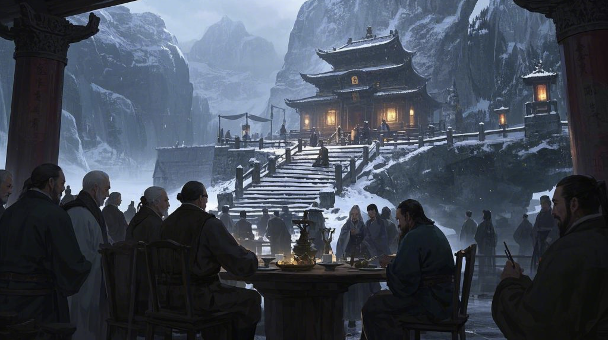

# 篇一·辛丑秋：职场岂能风永顺，移情灵境浪恒游
`建元元年，辛丑年。`
---
### `处暑一日，丙申月癸卯日，七月十六，周一。`
>#### 『要变天也。』
#### 似有女声，响于耳畔。唐文方寐，闻之乍兴。顷睨窗外，旭日始旦，揆知卯时。旋即神复而省，向者女声，所出何处？屋里就他自己没别人哉。岂梦乎？殆寐时脑内司聴之域，故兴，效聴，若有其唤，而实乃梦也。

#### 残梦犹镌枕上痕，文寤犹记。张丽华昔为学生时开演唱会。圆台中据广庭若璇玑，万众骈阗环伺若星拱。影仪凌空，转映华其容姿遏云，巨像巍立台央，举手回风，折腰承露，玉颜星眸，霓裳流彩，纤毫毕现，虽远必睹，观者血沸，喝彩裂帛。文非台下痴客，乃执乐近侍，咫尺天颜，鸾歌燕舞。及歌竟曲阕，华翩然趋近，方欲联袂，竟为彼女声惊寤，怅然喟叹：『此梦非念起即得者矣！』
#### 罢也，勿多思也，兴意既畅，乃起。有导引术，大名鼎鼎，称「八部金刚功」者，文晨起必练之，坚持不懈。
#### 有名「智器」者，俗称「人工智能」，智器乃其雅称。智，识词也；器，才之用也。夫智器之用，能拟人智而拓之，依文理而推演，可识词、析物、解疑、断案、定策，此诚辅弼之利器也。或曰，假以时日，能效庖丁解牛之术，通阴阳之变，达万物之情，理数术于瞬息，演八卦于无形，道宇宙之奥妙也。又有名「灵镜」者，乃某类眼镜之器械，重瞳之辅弼，其重三两余，戴之则可现太虚幻境，观乎恍惚，殊异尘寰之实。或现姑射仙山，或化华胥之国，朝市可变林薮，晴空能转星汉，白昼可化长夜，尘世可作天宫，市井可转桃源，通衢可变阡陌，左目观星知天时，右眸窥渊测地脉，转睫阆苑瑶池，眨眼沧海桑田，重霄九野幻化无方，瑰玮之观人世不觏。乃觉形骸若遗，神游八极矣。幻境可随心而变，皆在一念之间。亦可熄幻境之荧惑，则虚廓尽敛，洞照本真，使所见复归素朴，犹若常眼镜矣。更有虚实相济之术，使真中嵌幻，以显玄机于万物，尤见妙趣：可注玄文于器物以辨其肌理，如开周鼎殷彝；可易罗裳于佳人以添彼情色，似遇洛神湘妃；瞻乾象可知风雨，瞰渊潭可测浅深，观车马则度其速距以判趋避，察机栝则明其损益以晓休咎。诸如此类，十分便捷。此皆智器运筹于玄，而假灵镜以现之也。兹「虚拟现实」交融之德，有先圣名之「灵境」。夫「灵境」之致用也，非独系于灵镜一器焉。盖诸术皆可通玄，然灵镜者，器之至轻利者也。虽小而纳大千，微而通八极。又有轻耳罩配之，未盈五铢，发天籁以合幻景，使耳目相谐，视聴交映。文晨练必佩镜覆耳，虽身囿于丈室，神游于太虚。但见云海浩渺，有七丈琼台孤悬其上，飘飖乎若青莲一茎凌清波，皎皎然如冰月孤轮映碧落。文乃修习于此方寸之地，甚喜之，乃自命兹幻境曰「方寸灵台」。此非庄生逍遥之境，阮籍大人之界乎？

#### 既讫出遊，忽有阵风拂过，曩者，文必不以为异，吹个风多正常也，而今却有感。恍若其梦女声，犹在耳畔。
>#### 『真是要变天也矣。』
#### 文言辞若此，未假思虑而遽发之。你亦难辨其语，究为戏言，抑或他意？
#### 果然，他被雷阵雨浇半道上也。让你出门不先看天气预报。
#### 张丽华今晨睡到自然兴，伸手观时，辰初一刻也。
#### 秋天她贯裸睡，惟着内裤，偶覆睡裙，惟一袭乃唐文送之。其非吝琼瑶，盖久未遇合意者。昨寝裳之，朝起更衣，鲛绡皎皎，君子所贻，藏之箧笥，如怀瑾瑜。
#### 华每晨起贯饮一杯水，睡前温之，旦而饮之，凉热适宜。文谓之「开脉」。既出卧室，步临后厅窗边，眺院景以张眼神。知今有雨，近日皆雨，且奇多降于夜晨而非昼者，若某主之。眺景有顷，心说，那傻子别再又晨练被雨淋着也夫。

#### 华之居所甚秘。夫宅第广袤弘伟，缘蒙祖荫，内有五处庄宅，六处府院，七处地泉。五庄分据东南中西北，各通一府，而华居南庄。南宅最里进有两房两室，为华寝居。宅门有匾，题名「斜月三星居」，昔文见素楣待墨，乃制椽题榜，取《西遊记》菩提祖师之典。华颐，乃命良工镂之玄玉，镌梓悬楣，永镇宅门。门外立碑，镌七言绝句一首：
>#### 碧落璇闺伫玉人，灵台化境焠元神
>#### 庭栽百草丹参秀，室满檀香涤俗身
#### 此亦文所篆，用魏碑体。南宅屋内，紫旃盈室，沉水作屏，暗香浮于画栋。百草园内植丹参、黄耆、川芎、三七、山楂等药草，自产自销。猗嗟兹宅，惟华独居，内室秘兮，椿萱莫窥，迄今独文得履也。
#### 从后厅回来，洗漱准备一番，而后易练功衣，束其及腰长发，步入宅内专设练功雅室，启每日晨练。亦以导引术始行，伸展一刻有半，继而遍练周身。见她：
>#### 杏目含春，梨涡凝俏，青丝泻瀑，纤秾纯素。
>#### 舒皓腕若推天门，折柳腰似叩地户。
>#### 跃惊鸿如点沧浪，旋流风犹回雪舞。
>#### 弓背成桥，恍若星河奔涌；劈叉开屏，惚如地脉延布。
>#### 温泉忘沸，凝观颈下盛月；飞瀑失声，暗慕酥胸堆雪。
>#### 辛夷低垂，羞比玉腿修长；锦鲤沉潜，愧见蛮腰柔曼。
>#### 屏息片刻，鼻腻鹅脂染霞色；吐纳悠悠，樱唇微启绽兰馨。
>#### 香汗淋漓，化珍珠而缀冰肌；娇喘细细，作云璈以和凤鸣。
#### 如此操习，活五体，通六脉，治七伤，终还操几式导引术以调息。晨练乃竟。素手执玉壶，咽若琼浆注。见她：
>#### 凝仙滴泪，垂光玉颐；檀溪随壑，弄珠隐丘。
>#### 皓腕凝霜，彩蝶窥窗；朱唇含露，丹鹤鸣松。
>#### 襟前起伏，春山含翠；腰间摇曳，弱柳扶风。
>#### 颈肩未晞，芍药晨光；脐心含钿，百合珍珠。
>#### 窗外青鸾振翅，应其娇喘之声；涧底玄龟昂首，慕其流转之眸。
>#### 观其神也，新荷承瀣于瑶池；察其气也，春樱吐蕊于阆苑。
>#### 腮晕朝霞，灼灼夭桃逊其艳；肌凝脂玉，皎皎明月黯其辉。
>#### 汗浸鲛绡，犹现玲珑之山峦；气蒸云鬓，似成氤氲之华盖。
>#### 轻纱映日，透莹纨现珊瑚色；薄汗凝香，染胸衣成云母纹。
#### 俄而通感，三焦通畅若长江奔海，百骸轻灵似冯虚御风。方知庄周梦蝶非妄，婵娟入画岂空？形归易兮神守难，纳昆仑于芥子间。此舒爽之德，操习之功也。悦之。

#### 看表已至辰正。事先准备之早饭当好也。餐讫又转去浴室将身上擦拭一番，镜前倩影自赏一番，又转去仪表装扮一番，再弄姿自赏一番，又准备整齐，然后出门，恰辰正二刻，上班时间不早不晚刚刚好。见她：
>#### 有佳一人，婉若清扬。
>#### 万类俱寂，唯睹天人。
>#### 荣曜秋菊之英，华茂春松之秀。
>#### 其容色兮，媚若流萤；其神光兮，耀逾繁星。
>#### 巧笑倩兮，蛾眉皎皎；美目盼兮，流眄烨烨。
>#### 面如芙蕖，白露未晞。青丝绾髻，簪以琼琚。
>#### 丹唇启朱，皓齿呈贝。领如蝤蛴，细腕凝霜。
>#### 缁衣墨染，素锦为裳。腰约缃绮，瑶珮琳琅。
>#### 瑰姿艳逸，行云惊鸿；仪贞体娴，姑射绰约。
>#### 怀章韫玉，气若幽兰；振袖回风，香逐步转。
>#### 顾盼生辉，芳草失颜，翩跹曳影，桃李敛衽。
>#### 风动松涛，如聆清徵。驱车彭彭，鸾铃锵锵。
>#### 东园悬飞瀑，西园绕紫烟，南苑卧石麟，北苑栖凤凰，中土镇灵鼍，五庄纳八荒。
>#### 推窗辞玉阙，俯首瞰曙城，楼影浮霞篆，车流泻细盐，垂光簪鬓角，含笑落晶帘。
>#### 停骖芳皋侧，整佩玉衡巾。忽见檀郎立，霞映桃花津。金乌为之驻，流水为之逡。

#### 甚巧，甚巧，唐文亦刚到单位。旦而觌之，中心欢喜。盖素例，每会，文必赞华仪美服采，契若符节。今文其目周览华之服佩，徐曰：
>#### 文：『素缣为里，玄缃为表。领如蟾魄，袖若垂虹。岂无华彩？恐违慈教。』
>#### 华：『就是我穿之素点亦好看乎。』
>#### 文：『猗——「裳裳者华，其葉湑湑。」』
>#### 华：『来，你之葉快来滋润下这朵花。』
#### 但见华迎文其面而上，依依互动一番。继而打趣：
>#### 华：『言有幽旨，辞含微趣，美之誉之，神摇意夺——这是多少学妹给你喂出来者邪？』
>#### 文：『就你。多大人也，还当系我学妹。』
>#### 华：『你不就喜欢学妹无。』
>#### 文：『我喜欢者，这里「颊若渥丹」，这里「春葩映日」，这里「秋月临潭」……』
>#### 华：『外面！别动手……』
>#### 文：『喏，今是该严肃些。』
#### 文甫所言，今日，华萱之诞，文慈同辰。虽无牲醴钟鼓，无张乐设宴，然心虔如向春晖矣。其华之容也，簪珥有节，协于慈训，殊于常日。
#### 惟偕行相聊，华惯睐文颜。而文常弗察之，犹鱼潜阴渊而忘其冽，鸟沐阳阿而昧其暄。其情所由，其意何之，寐在子而寤在姝也。凡必文先发《鹿鸣》之章，华乃应《木瓜》之报，承《淇奥》切磋之慎，途《溱洧》芍药之谑，终夫《关雎》正始之音弗失度也。
#### 巳正开工时刻，唐文並张丽华均按时到岗，而毛一元却没有，直临午时才姗姗来迟。元甫到便偃仰工位椅上，闭目养神，脑子里翻来覆去念昨夜之梦。或曰，梦可道也，非恒道也。元已届而立之岁，不比儿时，今常兴则忘夜梦，间或困极将寐之际忽现前夜梦之残影，而转瞬即逝，终尽忘之，殆大脑翻篇而备他梦也。此象其由终不可知，虽有趣焉。素日梦之无痕，而今竟反彰。梦力之强，犹可忆之，怪哉怪哉。
#### 正琢磨着，筐一声，躺椅有人撞也下，因纳着闷便压根没理。其人见他没反应又来拍他两下，及此就不耐烦也，一扭头一挑眼，噫嘻，你兮，君实兄也。
>#### 『又迟到，还躺着你。』
#### 唐文哂之。
#### 自两年前打工人毛一元之绩效被打成丙科后，人就再没按时出勤足时在岗过。巳时开工，人午前能到就算给脸也。有时午休后人就没影也，日昃先遁，遑论傍晚守职。如此次一年绩效，亦即去年，再丙。按说连两次丙，法当调岗或可辞退之，然而元凭其本领竟乏替者——你说这能不是笑话哉？不仅如此，元在工作中更效狡狐营窟，暗植机枢，使若有继者难窥堂奥，于短时之间，实不能承其职，若贸然为之，必致大谬。一言以蔽之，只要项目在就离不了他毛利贞。遂傲然作色：『虽连膺下考，你动我兮试试？二丙是夫？』遂今年启肆无忌惮。岁首受事，以其能本当二日之务，竟托八月之期。蚁穴溃堤之术，孰能察其虚实？唯纵狂澜，莫之能御矣。事始，每旬虚报簿录，继而日耽戏乐。唐文知其实，尝计其业，至今已有，番剧近两千集，游戏时长一千多个钟，皆元当值所为也。元尝曰：『夙兴夜寐以娱，太疲也，干活挣钱都没之一半操劳过也。』

#### 言归当下，元见文来谑，遽振衣而起。相与闲聊移时，见钟甫过午初，即挽之食午饭去也，不欲留岗须臾。
#### 路上，文复打趣：『对坐惟莽汉，负此流黄刻。午休这大好时光，不得约个姑娘何者。』此非妄语。厂里元与哪些女人往来，其往常携翠袖过午者，文尽知。元哂而不应，思及昨梦，犹豫再三，乃言：
>#### 元：『我昨夜做也个梦，竟记之十分清楚。说与你替我解解？我躺那就在琢磨之耳。』
>#### 文：『吁，你是真有工夫嘻。你说之前，我先算算。今是何日也，辛丑丙申癸卯，你做梦时约几点？』
>#### 元：『……这我怎知邪？』
>#### 文：『你说一个。』
>#### 元：『……我随便说你还能算准不邪？』
>#### 文：『还能几点乎？做梦一般不都后半夜或快兴时候乎？算也，就给你算卯时夫。是乙卯……噫……月柱就不灵也……亦还行不过……而此日与时辰……』
>#### 元：『听你啄啄这邪乎尔……你这能算出我梦也何？』
#### 文闻声睨之，喉振商羽，啮舌三息，终直曰：
>#### 食神扬秀耀文川，印绶藏锋慧性虔
>#### 任是江湖风雨骤，一蓑寒水钓虚烟
>#### 幽怀总向诗书寄，清节偏随竹菊眠
>#### 莫叹财官皆隐遁，灵台自渡即瑶天
#### 其实唐文亦算借机自筮也，毕竟夫梦中女声，恰是卯时也。而元听讫，心头一沉，曰：
>#### 元：『盍若一言以蔽之？』
>#### 文：『就是你命中将有贵人相助也。』
>#### 元：『得也夫。你当我听不懂诗尔……不过听着，你这谶辞，与我之梦在色调上倒真有几分……神似……奇也……』
#### 恰此时，一女声突现身后：
>#### 『此有何景好观？不惧霈俄至乎？今报亦有雨不知道乎？』
#### 聆声辨人，不旋踵而知张丽华至。倏睹华自文左翩跹，若惊鸿之翥。
>#### 华：『看着你俩出来者。』
>#### 文：『我说耳你怎能跟着。正给他解梦尔。』
>#### 华：『是无！你梦何邪？』
#### 三人竝行，元徐言曰：
>#### 南海有宴，叟群我孤，谈吐奕奕，神朝上都；
>#### 地凄声寂，无钟无鼎，宾客不雅，主持失秉；
>#### 如夜困顿，如冬蛰伏，我问奈何，断崖望路；
>#### 道险且长，修艰还远，掌兮签书，执兮金吾。

>#### 华：『掌兮签书，执兮金吾——结局亦不错无。』
>#### 文：『你当是好话尔？此皆受累不讨好，还儋责任尔。曷为上差？搞不好脑袋别裤衩里。』
#### 华闻声而噱。文睨之无奈。独元瞩其笑靥生春，倾身凝睇，耽其姿之夭绍。及华敛容，乃收神摄魄，复顾文曰：
>#### 元：『要不你把解梦之诗再给她念一遍？』
>#### 华：『听了。刚你念其大声，周围都有人看你。』
#### 文没接茬，顾元肃然，曰：
>>#### 梦境虚真须慎始，尘途过失莫轻终
>>#### 漫说红楼皆幻影，须知浩史亦虚烟
>#### 文：『我辈，安分第一，无德不進，无道不行，无准不欲，无备不遽。许多貌似机遇者，眼前彩霞而脚下断崖矣，正如尔梦境一般无二，安知休咎与？一眼天堂，一脚地狱，是也！』
>#### 华：『妄念常嘲梦里有，异象犹忧幻成真。』
#### 华承之言，楚楚其裳，依依其姿。遂顾文而言它，相谑如常，作色作娇。而元未顾二人嬉闹，乃自语：
>#### 『好言好语兮真好聴，只怕事果发于己身兮难看清。人途多舛，盖莫如是。』
#### 三人遂一路打扯，偕食午餐。餐讫看点刚过午正一刻，乃过会社午休点不久，他人始出就食，而此三人皆食讫矣。元知他俩素早起早饔，故今早饷君实也。
#### 三人方闲遊于会社楼下花园，忽有女声响于耳畔——
>#### 华：『看，要变天也。』

### `处暑九日，丙申月辛亥日，七月廿四，周二。`
#### 上午，唐文适毛一元处，临其案，见彼凝睇异邦文书，奇而问之何书。
>#### 元：『此罗国布政之檄，题曰《论、罗人与竟人、之历史统一》。试猜，孰为此书？是何人手笔？』
>#### 文：『这我哪猜去。整个罗国现在我能叫上名字者，亦就其国君也。』
>#### 元：『不错，猜准也。就是他写者。怎样？咂嗼出何味也没？』
#### 文闻声，色微动，承曰：
>#### 文：『足下诚有闲情，然罗人恐无此逸致。』
>#### 元：『子适何思？』
>#### 文：『闻否？这月初，罗师受约北地郡，与我合兵万余兵操。据报右军都督府首次许彼用我主战装备参习，即罗军出兵，我军出备，彼执我锐，我驭彼卒。两军亦始合建牙账，用所谓「两军专用指挥系统」，允罗人别置行辕分枢，凡此种种，皆开先河。而且此番兵操中新式军备十有逾八，我天兵参习力量，创历年两军联习联训之最。就此，你听之有何感想？』
>#### 元：『当年秦欲东进而见晋国挡它道也，所以有秦晋之好，以使晋国能高抬贵手，弛其制而容秦之兴；而崤之战后，晋国势强，不再给秦国之发展让道也，遂秦复顾楚与启百年之好，共抗晋国争霸中原。后来吴陷楚之郢，还去秦国求救尔。那么「彼时彼刻」？』
>#### 文：『他罗国之文章是刚出者？』
>#### 元：『上个月。』
>#### 文：『兵操这种大动静不会临时安排者。若你是罗君，有彼告示，你会何时颁之？』
>#### 元：『……有道理……当然是开战前一秒。甚至于「大事」氐定之后都来得及。』
>#### 文：『你认为，西方是否将大打出手？』
>#### 元：『整个西方？至于无？当下情况是，罗竟两国都在增兵。军队出征光食饭就是大消耗，所以两国竞相增兵，绝非闹着玩者。何况有此告示为先导，或有更多敌对势力暗与其中，国战启日当不久也。……。不过你这么一提，其实我亦好奇，罗国之力数倍于竟国，竟「国小而不处卑，力少而不畏强，无礼而侮大邻，贪愎而拙交」者，是也，简直一字不差——丫凭何有恃无恐耳？』
>#### 文：『叫何物？「历史统一」？他哪怕换个题目耳。大国欲打灭国战，兹在历史上，诚如春秋入战国之关键，转折之枢机矣。昔商周鼎革，唯德是辅；逮至春秋，虽霸主迭兴，尚假「尊王攘夷」，打所谓「反恐怖战争」，敷演礼乐；及于战国，终礼乐崩坏，所谓「普世价值观」弃之如敝履，……夫战国之后欤？……』
>#### 元：『你说话总让我觉之邪乎矣！难道——真要变天也无？』

#### 二人相对无言。少顷，文启喟曰：
>#### 文：『所以你去扒人家告示干何？还是罗国者。你这可不是一般人能干得出来之事哉。』
>#### 元：『我这是正好看到它也。这个月之黄金价格波动特别大，简直上下翻飞……』
>#### 文：『你炒黄金邪？玩之够花也。』
>#### 元：『是矣，所以国际风云得看矣。此金价异变，得非兵燹之兆哉。』
>#### 文：『嘻。你现在若仅凭炒黄金之话，够活无？』
>#### 元：『还没到其份上。』
>#### 文：『若你还是多看看国内风云夫。』
>#### 元：『哑？有影响金价之消息？』
>#### 文：『有影响你工作之消息——会社可能将要裁员也。或者，此行业之变，远不止企业裁员这么简单也。』
#### 下午申初整，开部门全会。会上申部门不予裁员之决，以稳众心。然亦首次于部门层面，明认今年行业势颓，会社乃遭浸微。虽言不黜人，然霜刃悬梁，危象彰已。元在辅导其班众工作，哥几个完全不理台上其套。果然，台上部长忽点元名，询其见解。岂料元虚应之，不过敷演其意而迄，再无多言。既坐，复前况焉。
#### 会后，元与女同事聊扯，若得便则约与下楼逛逛。她无拒意，且赧且怡，然无故离岗恐遭议。元径造彼之组长，欲与出之情。组长欣诺，毫不犹豫。她身姿窈窕，是新晋实习生也，自震旦大学本科刚毕业。曩者宴娱，她侍元，甚殷勤，听使令，约同退。适组长亦与同去，伴行一段途。其间，她见元之发散，借口倚其身，亲为绾发结辫。组长是女人，得睹此情，岂不明缘由？故而今日之状，即肯，甚有惊喜之色。更何况组长常受元之惠，纵无曩况，自此处要人，亦不阻也。遂联袂而去，竟日不复返，唯见暮云合璧，弦月东起，但聴檐下猫闹，波浪逐岸。此间风流，实得《世说》任诞之髓，虽竹林七贤不过如是。

### `白露二日，丁酉月己未日，八月初二，周三。`
#### 今日有会于京，题为『议太和「一带一路」与四七二七年永青之业』。国内外高官名士云集于此。夫昔愚公移山，遗其朴拙；今精卫填海，德其圆融。今我中国，布风车于葱岭，冶精钢于洪炉，示诸夷泽世之术，以助之易俗。麋鹿避秦人旧道，青鸾栖周室新桐。丝路迢递，贯虹霓而接星纪；绿意葳蕤，覆黄沙以生碧涛。数术云骧，可摹河图洛书；算法波衍，能参连山归藏。西域诸公观而叹曰：『中国有长生之道，诚天授也。』斯会之成，九译仰德，开混一枢机，肇百年变局。有司者申曰：『厥有基建，必察四时之序；其行商贾，毋犯山川之神；风光生电，则百姓蒙其利。夫通泉货者，当效管仲轻重之术，通利万物而不斁。』大哉斯言，道以弘仁，运筹于能源、生态、金融之上，施德于三才、五伦、七政其中。有赞曰：『昔周穆西巡，未若今之达也。合抱之木生于毫末，圣人之谋成于累德。』
#### 唐文受邀与会，乃陈曰：
>#### 有幸与诸位在此共同探讨文明演进之根本命题。人类文明史其实不断在动态重构着。当文明行至当前，遇到「基因编辑」突破自然边界、「量子计算」重塑人类对物理法则之理解、「人工智能」再造知识结构之际，我辈更需严谨洞察，以正人道。
>#### 「技术与伦理」，二者博弈，亘古不息。我称之为文明演进之「根本矛盾」。试问：「自动驾驶算法」能否解决「电车难题」？显然不能。盖其要害不在技术，正在伦理。技术符合伦理，使权力与风险合理分配，则文明存续，否则崩溃——这是显而易见之道理。
>#### 当前「技术-伦理」博弈呈现三个维度：其一空间上，伦理风险防范从物理转入认知空间，社交媒体算法所引发之群体认知极化，展现信息技术滥用之破坏力远超工业污染；其二时间上，技术成本核算必须纳入代际伦理，核废料半衰期与基因编辑之进化链扰动者，要求我辈建立跨时空之得失评估系统与反馈机制；其三主体上，「人类中心主义」并非傲慢独断，一切技术都应被人类伦理规范，这正是保障文明存续之实践理性。
>#### 技术从来都是挑战者，而伦理从来都是把关人。例如该在「脑机通信」、「人工智能」等或将突破「人格存在界」之领域预备伦理规矩。从专家垄断转向多元共治，从被动响应转向主动塑造，从工具理性转向道德理性，是文明实现有效发展之关键。如今，手握「智器」与「能源」者，应使「伦理」脱离抽象道德训诫，而成为可计算之文明操作系统，以管理各种「技术」之应用。
>#### 《周易》革卦曰：「革之时大矣哉」。「农耕时代」用「宗法制度」消化风险，「工业时代」用「社保系统」消化风险。每当技术叩击伦理边界时，让我辈能再现大禹治水之智慧以积极应对，不断完善「伦理耗散结构」，在风险与创新之张力场中探索文明稳态，实现人类文明永续演进。
#### 文陈辞讫，下坛归席。方坐未安，有记者矮身蹑踵而近，居文座下谒，称属尚书台司科其下报社，请通尺素。盖坛席之间，有谒者请名刺或通尺素，此诚常者，不足异也。记者既得而退，未多啄扰。
#### 午时，会设飨宴，宾客满堂，觥筹交错。张丽华此番随行也，被之祁祁，象服是宜，翟衣纁裳，步摇琳琅，男人止步，女人相妒。二人同案共膳于专用雅室。适见记者再拜。华端详之：女人，青春未辞颜，细枝挂硕果，素绡隐春酥，渊渟自含瑳。若彼与华同镜而观，素梅映芍药，百合映牡丹，一方绛纱笼雪，一方玉质莹然。文为介绍。华察彼女乃误判己与文之谊也，竟效己近文而坐。文弗察异，漫聊惬意。

#### 餐讫，华下午典会，遂以职务辞。文送之，目至华影去，转身，但睹彼女伫候婷婷。文始请教。彼女莞尔一笑，曰：
>#### 女：『俊生容盛志伟兮，更有佳人相伴与！』
>#### 文：『吾齿长容十夏，非少矣。』
>#### 女：『无妨。』
#### 彼女笑对。遂约文后访而辞。
#### 甫别，华来讯，文回言递去，又递来，如是。
>#### 华：『我走后，彼女又来找你也无？』
>#### 文：『她只说，往后几时或有约我采访之事，已作别。』
>#### 华：『我这是刚走多前兮就又黏上邪？』
>#### 华：『好想陪你矣！开何物破会。』
>#### 文：『你可以不回去。回来夫。』
>#### 华：『我倒是想不去。』
>#### 文：『若就真别去也！何光景也，你辈还在那装样子尔？』
>#### 华：『谁不知道是「摆弄空城计」哉？谁让我是部长，这「空城计」还得我领唱。何似你有正当理由请假，大摇大摆在外面晃荡。』
>#### 文：『入职没两年飞升部长，可以也。』
>#### 华：『有个屁用！一裁员何都不是。』
>#### 文：『不用怀疑也。主营业务彻底完蛋也，就现在之体量，光给开工资一月二十个亿，接下来丫哪拿之出来也。市值这半年跌去 98%，只剩 2% 也。资本市场比谁都先知先行。裁员是必须者，且为期不远也。亦好，休息一阵夫，咱都。』
>#### 华：『喏，聴着亦不错！』
#### 唐文举首瞻天，不慎犯曜，目眩神摇。倏忽，竟复忆半月前「女声之梦」，恍若灵光乍现，烛照神识。其日解梦时，判词昭昭然；察乾坤将易之机，兆天枢转动之始，肇运数更张之端，演造化弄人之初。洞知，当历之劫，避之弗脱矣。正如，太阳系是相对银河系面上下振动者，当与银河系面相交时，因星际环境骤变，地球必将遭受天文异象，事发之密集，休咎难以估量，此即所谓「历劫」。轮回从未止息，而轮到谁头上，回到谁身上，自有天数。
#### 然是际竟复寤女声之梦，若玄灵儆之当谨，遂警跸其神，引以为戒。
>#### 文：『要变天，要大变天也！仙女姐姐，你警示之好矣！』
#### 举目而望，恍睹方才女记者之影没于人丛中，若电光之过隙。竟觉欣慰，莞尔一笑，乃复歬行。
### `白露十三，丁酉月庚午日，八月十三，周日。`
#### 唐文与张丽华适飨午餐，突收讯于佳姒，乃久疏之。姒邀文中秋节造邸相会。
>#### 华：『有好消息？』
>#### 文：『聴口气很高兴。但不能急，亦不做假设。就当她是单纯想看看我而已，毕竟亦好久没见也——好事多磨。』
### `白露十五，丁酉月壬申日，八月十五，周二。中秋节。`
#### 今日中秋佳节，假日。张丽华循例偕父母飨于中宅食堂。家制，日食饔飧二餐，食时朝餐，哺时夕餐。时值中秋团圆日，增设夜膳以观蟾宫。饔讫，庖役即备飧宴，值京城天晴，遂张幄布席于中宅之庭，设琼筵以待夜月。
#### 今日聚宴者非独张氏，更有袁欣、马艺、贾仁三家表亲，皆张氏母系五世外亲。欣、艺皆华表妹，仁其表弟也。巧哉，三人同诞猴年马月望日，今适满十七岁又三月，且有同窗之谊，级高二。二姝及笄待字；仁未冠而自取表字曰「博」。未及午时，三亲毕至。姊妹四子拜辞父母，嬉遊而去。
#### 华引弟妹至南宅游戏厅。随即四人具备，戴目覆耳，神入「灵境」游戏，一意贯串。四人一起所玩者是组队做任务之游戏，任务都是开放性者，无既定之轨，亦无必定之的，但观行止施赏罚。此处乃无法用成绩来攀比之世界，堪称世外桃源也。游戏主题是救人。当然，欲济人者必先存己，己活越久方能救者越多也。
#### 四人首次同游一戏，且看他辈在其中之角色：
#### 张丽华之角色是「法师」，和她现实中之职业一样，有制器之能，有傍身绝技，号曰「乾坤一制」，其能力如斯，只要描述清楚，且元材料具备，便能化成天地万物，而其机栝在解题，得解则可玉口开玄门，言出法随，三清万象顷刻就。
#### 袁欣之角色是「精灵」，美艳无双，能读心，能驭鬼，有傍身绝技，号曰「元灵皈心」，能魅惑人魂，影响记忆与情绪，而其机栝在唱歌，朗歌起则百感兴，歌声越妙效果越好，当其效臻至善之时，能彻底改演记忆，令七情翻转无痕。
#### 马艺之角色是「巫祝」，通医术，善厨艺，能占卜，有傍身绝技，号曰「五炁潮元」，能调较人魄，号天气把地息，而其机栝在跳舞，花肢动则四象移，舞姿越美效果越好，当其效臻至善之时，能运三才五灵之气，知宇宙诸有波动。
#### 而贾仁之角色则为书生……嗟……就是高中生也，其能也……不过他在学校之成绩还是不错者也。
#### 且看四人之容貌：
#### 张丽华，法师：
>#### 姿容若桂宫之影，气韵拟兰台之辉。
>#### 云鬓簪螭纹青玉，斜晖映墨色鸦青。
>#### 眉蹙远山，黛染春烟之翠；
>#### 目凝秋水，星涵太虚之渊；
>#### 鼻若琼峰擎玉；
>#### 唇如樱颗点朱。
>#### 珰垂珠蚌之辉，光摇累丝之璨。
>#### 纤秾合度，着乾坤玄纁之服；
>#### 举止皆宜，披流云曳雾之帔。
>#### 绅带垂玄，织金柿蒂隐龟书；
>#### 广袖涵虚，垂云纹络纳河图。
>#### 柔荑削葱，冰指蕴璇玑之变；
>#### 素手拂霭，香气化万象之形。
#### 袁欣，精灵：
>#### 身姿窈窕，娇美欲滴；
>#### 茜染霓裳，轻披云绡。
>#### 瑰姿艳逸，容华曜世；
>#### 冰肌玉质，皎若凝霜。
>#### 堕马半垂，玄绸墨染；
>#### 云鬟委迤，乌泽流光。
>#### 银钿耀鬓，辉同宵魄；
>#### 双珰曳耳，璨拟飞霙。
>#### 璎珞络绎，缀珠玑于皓颈；
>#### 芳泽萦纡，垂琼瑶以环身。
>#### 靥辅承颧，笑隐梨涡之浅；
>#### 眸含横波，神藏星汉之深。
>#### 纤腰约绮，翩若惊鸿之态；
>#### 举止娴雅，婉如游龙之形。
>#### 襟缀玄火纹，赤焰灼灼彰皓质；
>#### 袖卷苍水络，碧涛泱泱映清芒。
#### 马艺，巫祝：
>#### 神清骨秀，气若幽篁；
>#### 肌理莹彻，质比崑岗。
>#### 云髻峨峨，饰瑶华以错彩；
>#### 翠鬟袅袅，缀琼珰而流辉。
>#### 睫扬玄羽覆玉鉴；
>#### 眉蹙寒星映丹砂；
>#### 眸转天河倾碧落；
>#### 鼻擎素月出沧溟；
>#### 唇启未点丹朱，色夺安期之枣；
>#### 腮晕自生桂象，光掩少室之桃。
>#### 楚腰束绵，拟流风之回雪；
>#### 赵带萦虚，化飞燕之栖尘。
>#### 纨衣皦皦，若姑射山巅之新雪；
>#### 素色泠泠，似瑶台月下之凝霜。
>#### 裁冰为缕，织就鲛宫千丝茧；
>#### 截云作纬，缀成羽客九秋裳。
>#### 纁裙染赤霞，似火浣天孙之纱；
>#### 彩帔曳流霰，疑鲛裁水府之纺。
>#### 踝系五色星芒络，步摄八卦阴阳爻；
>#### 尘寰不染玲珑迹，唯见履痕生碧瑶。
#### 贾仁……嗟，高中生也。身着儒服，襟印校徽，仅此而已。

>#### 艺：『救人？此间亦闹大疫也无？』
>#### 欣：『若这亦太过「虚拟现实」也夫。』
#### 仁以无异能而谨肃。华慰之。欣艺曰当险为蔽。仁感姐妹其诚，奋应曰，我男子汉也，若势迫，将以武最；若不得已，当以殉竟！
#### 初入戏，当先试解谶。解之则得预上务，否则止于常务。示曰：（51.213、39.16），似某坐标。华惯精察其类，此 39.16 非几近唐文故邑北纬之度乎？忽忆儿时尝与之共制数字隐语，《广韵》为图，遂试以推演：51 者，声母第五喉部声一影纽，合 213 为上声十三阮韵；39 者，第三齿音声九生纽，合 16 为平声六脂韵。影阮相切得「宛」音，生脂相切得「师」音，两音合读为——「偃师」。竟解之，乃断戏本为周穆之世。三子奇之。
>#### 艺：『夫示者何意？要救之人？』
>#### 仁：『传周制，设「司空」总领百工，下设「工师」。彼「偃师」或为偃氏工师。偃氏一说乃少昊之裔，留有「偃师商城」为遗迹，其建筑与冶金技术独步天下，或为墨家之原。』
>#### 欣：『此人怎也？疫病也？先隔离夫。』
>#### 华：『哪有这么简单。』
#### 遂入戏，止于郊林。仁劝先谛情况，且防虫兽凶狠。欣艺哂曰，游戏而已，岂入地狱？仁辩曰，岂类地狱，正是人间。华乃尉曰，不必较真。然漫行非计，遂分途察探，华仁一组，欣艺一组。
#### 仁又劝应备器具，愿协解题。遂姐弟共议造物。
>#### 华：『我辈不如先造辆车夫？周遭尽是木材。就是这木轮会不会把咱颠死邪？』
>#### 仁：『我怎觉之，颠死之前，车会先散耳？这木材强度够作车轴无？』
>#### 华：『有道理。多少得要点金属。夫问题来也，金属哪搞？』
>#### 仁：『要不说冶金决定文明高度。商周王权立于掌握冶金科技，汉唐兵盛都是因为冶金先进。我天朝最强于当世，盖有钢年产量占世界五六成之最，有稀土加工产能占世界九成之最，其中重稀土加工者天朝当主，无出我右。此间若能找着矿，就凭姐姐你，咱可称命建国也。』
>#### 华：『要不说车在古代是贵族专用者耳。』
>#### 仁：『是也。夫有先秦列国皆以车乘量国力矣。』
#### 华惭其所能者不逮，仁且宽之。
>#### 仁：『要不，试试现搓「元素周期表」？这元材料可漫天都是。』
#### 华欲试之。遇题，曰：有空气一尺见方，若使其中氧尽聚变，所需之能几何？终释之能几何？以氧化硫所为释能最大者，算得终释能准一百九十二石标准煤，爆则百步糜灭。然造压强、温度以为聚变所需者，耗能甚巨，统计亏二千六百七十三石，入不敷出远甚。仁乃怃然。
#### 忽察解题可以积能量，遂劝预备；华曰善。所遇诸题，皆决策类，关于运筹之学，博弈、优化之问。凡有线性规划、动态规划、启发算法等诸算以为用，华皆备，独解，或试仁以线性规划解者，以彼高中之所学可也。尚学者仁觉已仕者华风仪殊美，至情不自禁，凝目佳人——
>#### 行则兰蕙含风，立则松筠挺雪。
>#### 动则星河倒悬，静则混元归一。
>#### 唇未启而香生豆蔻，语将出则韵合宫商。
>#### 指捻兰诀，瞬息化几何璇象；
>#### 袖卷星辉，虚空绽太乙青莲。
>#### 履迹过处，苔纹自生回鸾篆；
>#### 佩鸣歇时，林籁皆寂听云璈。
>#### 偶沾杏雨，自生太素清净炁；
>#### 暂染梨云，立化冲虚混元光。
#### 但闻华姊三唤，遽醒，遂敛衽赞曰：
>#### 仁：『姐姐你这些数学算具都预备好也矣。拿来就用。这效率，太帅也。』
>#### 华：『「有人」还提醒过我，切勿囿于工具、形成路径依赖。我用筹十分小心者，生怕堕入算法陷阱。你不注意，常会迷迷糊糊就陷进去也。』
>#### 仁：『是指那种或将条件用错、参数不对，导致错误结果者无？』
>#### 华：『纸面上之错误，检查仔细不就得也。就像我教你答卷一定要复查。怕只怕你根本不觉犯错之时候，等发现就晚也。』
>#### 仁：『工作中经常用夫？』
>#### 华：『夫许多决策、调度算法早就融入生活也。像订单分配：外卖、快递、公交，用到「混合整数规划」；推荐算法：网上你常能见到自己喜欢者，是「随机规划」与「健康优化」，几乎在塑造你之消费习惯；经典之「路径规划」、「仓储运输」，优化类课题之滥觞也算是。今天你邮寄从宝安县氐京连六个时辰都不用，都是这各种算法在起效。许多问题你来上手解都行，不过是些资源分配也、博弈也、优化也、兵事你喜欢者，兵事上太常用也——《孙子算经》、《武经总要》：许多规划兵力布置也、后勤调度也这些……对，《管子·轻重戍》，这我不还让你仔细读过者无？』
>#### 仁：『姐姐居然会对兵事感兴趣？』
>#### 华：『噫嘻……还是「你辈」男人感兴趣……「有人」给我提过这几本书。』
>#### 仁：『猗，对。伯父曾当过兵。其你辈都用哪邪？』
>#### 华：『单位无？研发「智器」。』
>#### 仁：『「智器」会用到这些？』
>#### 华：『你觉之耳？』
>#### 仁：『亦对。「思考」过程本身就是「路径规划」过程。其「概率学」是干何者？』
>#### 华：『防止钻牛角尖也。』
>#### 仁：『喏……若思考时，思维跳来跳去者，得非「概率」之表现？』
>#### 华：『嘻，你点到关键也。人脑与「智器」就岔在这里。在「智器」上应用「概率机制」本质是种数学模拟。而操作人脑计算者是「心神」，「魂神意魄志」五神中之那个「神」。反正我还不知道「心神」是怎算者。』
>#### 仁：『妙哉。夫「优化思想」实乃法术革命之枢机也。人类所逑「最优解」者，本乎格混沌以构算图。自《易》演卦爻，迄今「衍偶课数」，皆为制无常者也。其要也，假算图而运筹，俾有限之资，臻极理之序。陶钧万类，六合八纮。』
>#### 华：『若，有没有想过代价耳？我刚不说最怕堕入算法陷阱无？错误往往不会在算术之内让你看见，而在之外。「效率」提升往往伴随者是「代价」转嫁。这已非数理问题，而是物理问题也——「效率机器」可视作「耗散结构体」，其内部「效率」提升等于「熵减」，而「代价」就是外部「熵增」。内部减得越多，外部增得更多。效率提升得越厉害，越污染环境矣。』
#### 华与仁论道之际，忽若灵台映照，唐文昔日谠言跃然心上。今华之所言，宛然文音复振，恍惚尽吐之。盖方与仁之论，恰似与文辩难之时，遂使神游往境，应机而发，若钟磬自鸣，浑不觉已蹈文之旧辙矣。

#### 仁聆华论，目眙神夺。华甫所言，仁未尝闻焉，乃效颜渊之叹，子张书绅。虽未达，然遵姊诲若奉蓍龟。仁自幼即乐与华姊聊天论道。如切如磋，如琢如磨。华姊龄长，犹望月映群星；仁郎受教，犹贾谊闻《春秋》。每其谕，可比山涛启事，字字珠玑。而感佩其诚，皆铭之肺腑。仁常事华姊如影随形；如今四姊妹分列，则必侍之。矧华姊未辞，诸妹弗异。今虽身长已掩姊而依旧，俨然松柏，不愆不忘。《诗》云：「靡不有初，鲜克有终」。人之生也，冀守幼时之契，犹卞和持璞；岂若蛇蜕蝉衣必弃故形欤？总角之约，恰似瑾瑜藏匣，虽历寒暑而温润如初。孟子曰：「大人者，不失其赤子之心者也」——想必人人儿时都曾有过这般幻想矣；至少，当下十七岁者仁，仍是抱其信念者也。
#### 然而，毕竟，仁长大也，萌芽已发。幼时观弈，惟识黑白；而今临枰，已懂神韵。呜乎！华容烨烨，皎如明月出云岫，焕似初日照高林。乃屏息凝睇，若睹瑶光之降太室，而魂摇魄动，竟不觉移晷。

#### 欣、艺二妹偕行察野，睹灵境之陆离，乃兴歌踏舞为乐。舞酣之际，艺觉气异，桑中之阴，隐有洧水秉兰之会，乃执欣袂趋。华闻讯循往，仁从之。四人遂聚槐荫。欣、艺纵聊庠序《郑风》新事。
>#### 欣：『这学期起班上兴换座也。』
>#### 艺：『基本都是男生去换和女生同桌。』
>#### 华：『为何邪？』
>#### 欣：『还能为何，想和人坐一块夫。』
#### 而仁犹专戏事，弗顾欣艺，径与华曰，察彼男女，殆关扃启。华默契，率众徐至。彼男女方狎，骤睹众至，犹见有玄衣纁裳者，误为王后临凡，匍匐稽颡，莫敢仰视。仁遽觉其谬，让华免开尊口，他亲诘其由，乃知男者实穆王庖。仁遂命速引谒王所。仁言甫落，艺忽觉彼男女气异，然未得窾郤。庖肃请「王后」登舆。仁愕曰：
>#### 『这亦太「虚拟现实」也夫！』
#### 盖《周礼・春官・巾车》有云「王后之五路」，王后行必乘辂，违之则大悖礼。岂料「灵境」之中，亦困于人世规矩矣！仁方欲言，华忽命曰：『舆驾驻跸前亭，可随行』。瞬目示艺通意。艺乃踏禹步，形似款行，实运气势。须臾，男女偃地。欣曰：『戏虽趣哉』，然色不豫。华使欣尝摄寐者魂以鉴其心，欣试得穆王驻跸处。
#### 欣蹙眉，曰：『庖已疑我属矣，胡为遇诸野。』华笑曰：『庖岂虑「椒风」妒？得非王掖庭新纳「西王母」乎？』又问穆后琴瑟谐否。仁乃整襟作揖，呼「王后姊」而奏：『《穆天子传》载，穆王好西狩。后镇国理政，焉得野游？』华扬袂曰：『既踏「灵境」，当竟「偃师」案也』。仁曰：『然则谒王者殆为枢机』。华曰：『善，「本宫」同意』。众闻姊言，皆拊髀粲然。然何以入王帐邪？四人衣裳眩目，迥殊闾阎，既无车驾，寸步维艰。众莫衷一是。
>#### 欣：『这怎办？放倒这野男女，不会唯一之通关线索断也夫？』
>#### 艺：『应该不至于。「柳暗花明又一村」无。』
>#### 仁：『未尝不是一种暴力过关之办法。就是，只让一个人累着。』
>#### 艺：『无妨。我能舞一天，中间让我休息会子就行。』
>#### 欣：『姐你要不干脆造辆王后车驾算邪？』
>#### 艺：『对也对也。干脆风光一把。』
>#### 仁：『刚好我辈伊始就想过造车也。奈何材料无备。』
>#### 欣：『此间竟须如此较真？』
>#### 华：『咱还是换装夫。』
>#### 欣：『哑？姐不当王后也无？』
>#### 艺：『他在这咱怎换？』
>#### 华：『怕何？又不是真换。』
>#### 欣：『好哉。让我试试你这身能不能真脱下来。』
>#### 华：『我亦脱你者。』
#### 二姬遂罗襦交解，纨素纷披，若流云戏，春光闪烁。艺横身障仁，摘其戴，厉喝『没收！』仁目顿失美景，惟觉香风飒纚中，但闻耳机赓其欢声若波浪，佩环锵锵杂娇呼。艺亦下覆目，与仁愕眙相觑。俄顷，华执其耳目具徐近前，曰午时将半，当进饵糍以救饥。且申时大飨中秋宴，诸子宜腹虚以待。
#### 四人列果饵于庭台，进午飨。三女言笑晏晏，独仁默然。食既，华、欣起而周览，唯艺留与仁对案。仁犹徐啖不止。

>#### 艺：『子方愠邪？』
>#### 仁：『非也，方思良策耳。乃可请华姊造枪，己执为锋镝，欣艺歌舞随之，以直突王帐。及见穆王，或伺隙制之。』
>#### 艺：『迄今未辨孰人当救。』
>#### 仁：『救躯是救，救心亦是救；救生民是救，救机器人亦是救；救善人是救，救恶人亦是救。皆救人也。世界混沌，盍如考试做卷子简明？题有定问，答有定式，虽优劣有别，高下殊途，而终得心安矣。』
>#### 艺：『恶人都救？若不是害好人乎？』
>#### 仁：『所以，最恶便是守善也。夫严刑俊法岂非救人之德？』
>#### 艺：『碰上瞎作者尔？就像米国其年初被赶下台者。』
>#### 仁：『所以，夫无为不仁岂非救人之德？』
>#### 艺：『吁。正反话都让你讲也。亦没个准谱。』
>#### 仁：『我亦以为应有个准谱，奈何世道复杂也。譬如这回，假设要救者就是偃师，若为何要救他耳？这人当救无？』
>#### 艺：『玩个游戏干何这么累邪？是游戏任务也。你脑子是富余。』
>#### 仁：『嗟。不怕这里有坑无？毕竟首次做「上务」，与「常务」完全不是一路数。到现在就是瞎逛感觉。你辈倒是挺欢乐。』
>#### 艺：『玩游戏不就是图乐子无。你辈男生玩游戏都能当回事亦真行。猗，对，何物「常务」、「上务」者，我刚玩，头回听说游戏里还「分轨制」者。』
>#### 仁：『是也。「分轨制」下，差别大也去也。下回带你去玩「常务」夫，那我熟。』
>#### 艺：『喏！嘻嘻！夫「上务」要解谶，「常务」耳？』
>#### 仁：『不用。我倒好奇为何要设此准入限制耳？你看这回，就给你俩数，还以为是何「坐标」耳——咱哪找门去？要翻《广韵》得，怎想者？』
>#### 艺：『就是矣。有题目之文章好做。就算「八股文」都还能「破题」耳。这连题在哪都不晓之，蒙都不好蒙。』
#### 艺睐仁颜，俄而循其目精所注，乃华行处。
>#### 艺：『开始探野其会，你和姐姐在一块都干何邪？』
>#### 仁：『就一直在解题，然后被你辈叫过去也。』
>#### 艺：『题还没做够尔！玩个游戏还做题，疯也夫——我说你。』
>#### 仁：『嗟，你提醒我也——对矣，怎么净是做其类题邪？』
>#### 艺：『做题做懵也夫。逮个题就做。亦不琢磨琢磨为何。』
>#### 仁：『……。听说，她其行，不太好干也。』
>#### 艺：『她其专业不是挺挣钱者无？』
>#### 仁：『话说，你以后想学何？』
>#### 艺：『你想学何？你是否想过和姐姐报一个专业？』
#### 仁方欲启齿，华欣遊归，袂卷椒风。华笑问，方所聊者何。艺语塞。欣乃曰，「私语不逾阈」，此两之私也。仁突问惑于华：
>#### 仁：『突然意识到，咱之前解者那些题，与游戏仿佛关系不大也。』
>#### 华：『游戏机制使然夫。就像发论文，都是公益甚至倒贴，想拿学位、评职称，必须之，奈何。』
>#### 欣：『智力都无偿付出也。』
>#### 艺：『还有人生。』
>#### 华：『好歹解决问题也无，不亦攒也能量也无。』
>#### 仁：『姐姐亦是第一次玩上务无？还是……』
>#### 华：『喏。还挺紧张耳。』
>#### 欣：『呜乎，姐姐「第一次」欤！』
>#### 华：『……』
>#### 仁：『……』
#### 而复议「偃师」案：
>#### 仁：『第一步，想办法入王帐；第二步，让穆王把偃师人交出来，还有夫台进献之「人工智能机器人」，瞧瞧何德性者。这第三步……至于救谁，怎救，暂不妄下定论，见机行事夫。我同意姐姐之判，「上务」之事，不会简单。』
#### 四人戴覆整齐，复入「灵境」。竟止于穆王帐外。时既晦。遂匿迹暗陬，相顾愕然。
>#### 欣：『这型制，应是王帐也。真是「踏破铁鞋无觅处，得来全不费工夫」。之前咱还愁要怎进来耳，这倒省事也。这剧情故意者夫？』
>#### 仁：『真是不给人一丝喘息之机矣。艺，你探探里面何动静。』
>#### 艺：『万一在干些何见不得人之事耳？』
>#### 仁：『若不正好，直接控制他。让他连裤子都提不起来。』
>#### 欣：『你别说，你还真别说，我仿佛聴到点何声也……』
>#### 艺：『嗟！你别吓我！』
>#### 华：『你辈看着点。我好专心看有何物能做。』
#### 仁闻华声谨应，未察艺紧攥其襟。骤回首，面相及。

>#### 欣：『你俩动静小点。』
#### 艺但觉膺中鹿撞，息若游丝渐促，桃晕自双颊生，乃启樱唇，兰息轻飏，呵气成雾，尽染仁郎项，犹未之觉也。而仁虽专察八方，焉能不觉身旁玉人香息凌乱，娇躯微颤乎？
>#### 仁：『你怎邪？缺氧邪？』
>#### 华：『缺氧？』
#### 音甫落，华与仁相眙，异口同声，曰，『妙矣！何未早思之？』仁旋赞艺明慧，乃附耳密语。艺只觉耳畔彼息酥痒难禁，纨素轻颤欲避。仁反揽其纤腰，锁其耳，必尽言方休。欣眄此景，微哂而不语。
#### 华令众入帐。既入，果睹穆王与诸姬戏于氍毹，玉体横陈，雪肌映烛。四人趋行数武，迫近床前丈余，王属始惊觉。未待响应，仁喝『艺！』艺本踏禹步进，周察华电离之气卻如缕，既明，引正负电荷各汇于等离子气体綮径之两极，既备，应声而发，电曜四周，霆霓贯帐。穆王众何曾睹此天威，震怖失声。

#### 欣亦瞠目良久，乃悟方三人所默契者，惊讶华其「造物之能」竟可如此用矣。
>#### 欣：『这动静亦不怕招兵丁进来。』
>#### 仁：『毋惧。无王命他辈不敢，谁知帐内在干何，万一看见不该看者尔，是夫。』
>#### 欣：『若这等场面是我辈青少年能看者乎？』
>#### 仁：『现在谁注意那个。再说姐姐都没说话尔。』
>#### 欣：『……罢也。都是假者。』
>#### 艺：『可……这场面诏偃师，不怕夜长梦多？』
>#### 仁：『……见机行事也。』

#### 华即止闲语，而令欣艺歌舞，且授仁以竹笛和之。欣歌引魂灵若丝牵，昔葛天氏操牛尾歌八阕，未若欣音之惑心；艺舞激血脉如汤沸，昔阴康氏舞大庭以宣滞，岂及艺袖之乱神？歌舞交映相激荡。穆王众方愕眙，俄而目眩神驰，已陷《九韶》之囿。曲终，欣禀曰：
>#### 『控制完了。』
#### 但见穆王率侍妾稽颡若崩厥角，方承欢诸女虽裸呈而仓皇不及自蔽，急奉帔裳以覆王躯。
>#### 王：『臣，人王，拜见仙子。』
#### 欣闻而乐，乃暗忖『我成仙女也！』唯此间仪状殊可笑也。
#### 仁度时机已洽，遂徐曰：
>#### 仁：『是否有名「偃师」者曾献工于你，仔细讲来。』
>#### 王：『臣唯命。臣西巡狩，越昆仑，不至弇山。反还，未及中国，道有献工人名偃师。荐之，问曰：若有何能？对曰：彼唯命所试，然已有所造，愿臣先观之。臣曰：日以俱来，吾与若俱观之。翌日彼谒见臣。荐之，曰：若与偕来者何人邪？对曰：彼之所造能倡者。臣惊视之，趋步俯仰，信人也。巧夫！领其颅，则歌合律；捧其手，则舞应节。千变万化，惟意所适。臣以为实人也，与盛内御并观之。技将终，倡者瞬其目而招臣之左右侍妾。臣大怒，立欲诛偃师。彼大慑，立剖散倡者以示臣，皆傅会革、木、胶、漆、白、黑、丹、青之所为。谛料之，内则肝胆、心肺、脾肾、肠胃，外则筋骨、支节、皮毛、齿发，皆假物也，而无不毕具者。合会复如初见。试废其心，则口不能言；废其肝，则目不能视；废其肾，则足不能步。始悦而叹曰：人之巧乃可与造化者同功乎？诏贰车载之以归。』
>#### 仁：『这……是、是真……』
>#### 艺：『……真还元矣！这辞！』
>#### 欣：『嗟，你个戏中假人亦这般认真乎？』
>#### 仁：『……。咄，人王，夫偃师安在？』
>#### 王：『上仙欲得偃师？还是倡者？』
>#### 艺：『他不会以为咱是被假人招来者与？』
>#### 欣：『他不会以为咱欲把偃师带上天与？』
>#### 华：『人王，你刚亲口说：「人之巧乃可与造化者同功乎」。夫偃师能造人近乎道，及使人器难辨也！彼既「巧夺天工」，若何需天命？若偃师得以立，你人王还能做得这天子无？』
>#### 王：『……』
>#### 艺：『他不会把偃师宰也夫？没救成？任务失败邪？……不对，他刚讲也，「诏贰车载之以归」，肯定藏哪也。』
>#### 仁：『噫嘻，非也。姐姐这话，我忽然明白也，此间关键并非偃师其在也。之前误判也。』
>#### 艺：『怎讲？』
>#### 仁：『关键在穆王为何荐偃师也！夫偃师手中高科技所为者何？祭祀矣。几千年也，都此用矣。所谓国之大事唯祀与戎，因此偃师在商代是权贵，封邦建国，而于周却不见活跃于朝廷也。夫偃氏诸邦更沦为华夏与东夷交锋之前线，在两边反复不定。噫！惟彼弗荐朝廷，而献工于王未及中国之际者，殆以为故也。』
>#### 艺：『因为「商周鼎革」，「惟德是辅」，商其祭祀不再用也，就沦落也乎。可毕竟如是机巧厉害，不正好上战场乎？「人工智能」、「机器人」诸类不都先用在军事上无？』
>#### 仁：『大抵「军工复合体」这块，偃师家族插不上手哉。否则你以为所谓「百工」为何分为「百工」尔？』
>#### 艺：『嘻嘻！真想逮来问问是不是。夫人王亦不张嘴。游戏没给丫配辞？』
>#### 仁：『夫儒家批判「奇技淫巧」者，并非技术本身，乃其后有所企图者。道家讲「人多利器国家滋昏」同理也。试问，夫偃师愿将他手中这套「人工智能」及「机器人」技术免费开源给「百工」乎？若彼不肯，其「高新科技」你敢放心用乎？不怕尾大不掉乎？不怕被它反噬乎？若反过来，偃师大德，敢带开放技术之头，则其它「百工」将如何处之？』
>#### 艺：『所以彼私会于王未及中国之际而不敢见于朝廷，是也。怕上去下不来夫。其为何今日人辈愿意开放科技共享也尔？』
>#### 仁：『今非昔比，不是一道。』
>#### 欣：『别再扯远也，就说接下来当如何处之？』
>#### 仁：『彼之存假人者，犹秦帝铸金人，类郑伯纵共叔。故当寻得假人，毁之！并寻得偃师……』
#### 华止仁言。遂命王缴假人。仁说，宜导穆王禳祓于渭，沈假人于渊，且伪作河图献瑞，全其颜面。亦契始终之义。华曰善。欣艺缮后。及诸事讫，该游戏方示任务名称「巧夺天工」，其剧情于是告一段落，且许众续游后戏，或可退而择时继之。华观时临申初，号众退。嘱曰：
>#### 华：『欣艺，务使穆王众忘掉这段经历夫！就当我辈从未来过。连同夫台机器人，只作传说。』
#### 四人返现世。欣犹虑，议曰：
>#### 欣：『此番任务，我辈到底要救谁？偃师不管邪？』
>#### 华：『殆所救者人世，而非某人。乃必除他其霸道机器，不错。真如王之前所述，夫偃师所造者「人工智能机器人初代元型机」，其先进却只为倡，斯谬也。倡，祭祀之典礼者，以歌舞通天之灵。而「祀」之本质，是资源攫取与分配，是王权之枢机——试想这等要害，若科技、信息、规矩、是非都只控制在偃师一族手中，果将如何？商亡则偃氏失势——往低也讲，是国政之争；往深也说，乃人类文明发展路线之争夫。』
>#### 仁：『夫罪不在机器，不在技术，尚在人心不备矣。』
>#### 欣：『好比，今日「智器」若为「资本家」所垄断之话？』
>#### 华：『情况一模一样也。恐怕，夫掌握大法术之家族，或许曾经，企以其手中法术为筹码，图人类文明之话语权矣。』
>#### 艺：『噫，对。西方不有个姓「马」者，叫何物「克」…者一厮，就敢叫嚣他要「主义人类文明」——简直狂犬吠日！』
>#### 欣：『蛮夷也。』
>#### 仁：『难说，夫王用偃师者，得非固权之所以也。毕竟，史载，说周穆王「不恤国事」，又说「荒服者不至」，是内外交困之况也。故，第一步除夫机器，却未解穆王之困，今日游戏不过引子而已，后续必有大剧情！咱何时继续？』
>#### 华：『噫兮……国庆？我亦好奇后续剧情。』
>#### 仁、欣：『好矣！』
>#### 艺：『姐姐，彼时「工程师」都能作权贵矣！』
>#### 华：『夫乃「工师」也，当下对标者是垄断大法术之「资本家」矣，当是权贵也。』
>#### 艺：『猗，你辈是怎想到放闪电这招者？哔唎哔唎，太刺激也！』
>#### 华：『因我悟到也，化物之机栝在于能量矣。我都想好也，只要夫人王不老实，都不用你俩出手，我直接将他周身氧气都电离也。』
>#### 艺：『还有氮气耳，不管邪？若我可放不了电，击穿电压太高也。上次你不就都电离也无？』
>#### 仁：『你光想着电，憋都憋死他也。人体在等离子体内连挣扎之机会都没有。』
>#### 华：『严谨讲，不是憋，是烧。』
>#### 欣：『「人之巧乃可与造化者同功乎？」你辈说，人类会有一天造出和自己同等之物乎？』
>#### 仁：『现在就能矣！男女……』
#### 三姝未及仁言讫，皆憬悟相视。仁睹娥娣眸色而噤声。华决断曰：『我不拦着，弄他！不学好！』遂逐闹不已。

#### 入夜，望舒拜月。家中尊长赏月不久，去看电视也，值放「中秋联欢晚会」。三子不意与之，托言赏桂，避席庭中。华姊伴遊。兹八月十五团圆节，长辈重天伦，少幼耽嬉游，壮者虑职守。张丽华竟日周旋于长幼其间，而旦日将复趋打工事也。
>#### 『月饼，还是只爱食豆沙和枣泥者。』
#### 四人皆如是说。
#### 月华流素，梧桐参差。罗袂扫尘，珠履陷岁。声纹漫漶，碎影交叠。檐铃噤寒，砌金洇夜。华与欣聊会社之事，欣与华聊庠序之事，皆男女之心曲。艺凝睇仁哥之侧颜沐月，而仁沉思华姊之遗问照心：
>#### 华：『仁：方今算法大行于世，民当何以守扬其智邪？诚天下之大变也。《易》曰：「通其变，使民不倦；神而化之，使民宜之。易穷则变，变则通，通则久。是以自天佑之，吉无不利。」观夫：商君徙木，非循旧法；文侯择相，弗依蓍龟。你欲为者，奴乎？主乎？』
#### 华姊如仙，敏慧非凡，未尝蹉跌，今竟困于职场之厄；这让他这个高中生有些难辨休咎也。眼下，他当只专注于高考为是。然而往后人生，他能规划好无？可有「算法」为之乎？该如何「守扬我智」与？
#### 古有屈子问天，今有仁之问月——
>#### 我欲自主也。我何自主邪？

-------

## 《灵境打工记》
### 目录
#### [零](零.md)
#### [一·辛丑秋：职场岂能风永顺，移情灵境浪恒游](一·辛丑秋：职场岂能风永顺，移情灵境浪恒游.md)
#### [二·辛丑秋后：时来未许君非器，旧意难平子不酬](二·辛丑秋后：时来未许君非器，旧意难平子不酬.md)
#### [三·建元二年初：慧眼勘穿千幻海，真心涤净万尘秋](三·建元二年初：慧眼勘穿千幻海，真心涤净万尘秋.md)
#### [四·辛丑年末](四·辛丑年末.md)
#### [五·壬寅立春](五·壬寅立春.md)
