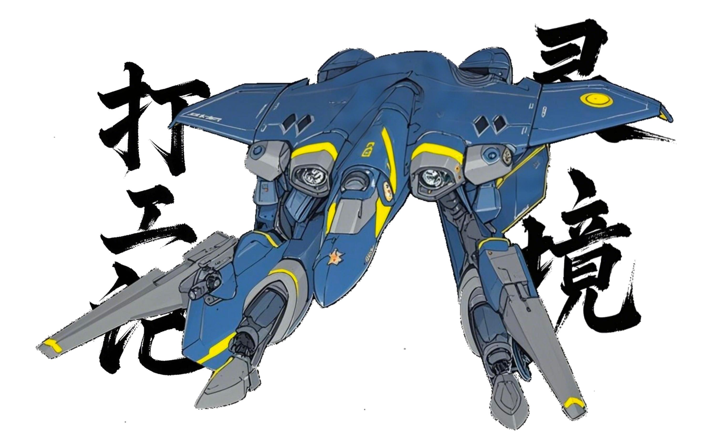

# 篇二·辛丑秋后：时来未许君非器，旧意难平子不酬
`建元元年，辛丑年。`
---
### `白露十六，丁酉月癸酉日，八月十六，周三。`
#### 上诰《知识产权强国建设纲要（元年期十五年）》，经「知识产权」之业，垂宪未来十五载，而制鸿猷于庙堂者也。
#### 南海郡产业劝进会执事邀唐文适遊南海郡，约于国庆假期。
### `秋分九日，丁酉月壬午日，八月廿五，周五。`
#### 今日国庆，假期七日，始也。昔太祖高皇帝宣立新朝于是日，有七十二载矣。
#### 依国法，国庆节当日始，续假三值日。而今是周五，乃延次周一、二亦为假日，由是连假凡五日也。然要续假七日，而行「倒休」，易日补务。是易节前之周日、节后之周六为值日，而可以次周三、四为假日也。惟其如是，使值日足数，而保产能不失一日。昔「元始农业社会」耕作循岁，必遵天时，故有「庆年」之礼而传之今朝；而今「工业社会」，能源革鼎。其产，不必遵天时，乃要「电」也；产期之计，不复循岁，乃纲之「日」也。人即机杼，民皆齿轮，而人需日息，故期以「日」计。故休一日，则少一日之产；而值一日，则多一日之实。因有调休之规。一年该休几日，国家准之，为保必要之产能。况今已有产器者巧之极也，例如「智器」，人功尽去，则「日」者亦失度，而规于器其律也；其产期者，至以镱、锶光钟计也，乃不受天地人三才之范，可终其生而无休也。
#### 曷为延假二日乎？试以五日者，你欲适远，一往二日，返又二日，则止余一日遊之。其你必怏怏。诚得七日，可余三日也，其你必恰恰，而往志愈坚也。故制假七日，一则民可遊更远，用济彼方，二则氓可客更远，佣工彼方，而期此足暇归省以全人伦也。夫方今四海，夫妻打工，异地各处，或终岁难晤，而有桑间濮上者，众矣；甚者，育非其嗣，彝伦攸斁，闻之咄咄。其如此制，全国各地，可纳客更远，客或旅游，或打工，皆益当地生计。逮国朝五十载，肇此制，号「假七黄金周」，诚谓名副其实，它是真能给各地生金银矣。
#### 张丽华今奉唐文父母、己父母，同适「国家大剧院」，聆《红旗颂》、《黄河》诸雅乐，由国家交响乐团所奏，又观话剧《直播开国大典》。
### `秋分十一，丁酉月甲申日，八月廿七，周日。`
#### 袁欣、马艺、贾仁三子造张丽华宅。未及与家长叙话几句，仁乃坐不安席。家长睹而知他嬉游心切，遂使姊妹四人同去。华方欲与文通话缠绵一番，或使直播南海郡风光，而遣三子自娱。惟仁不从，而固请华姊共之。先是「灵境」游戏「巧夺天工」途中而退；仁欲复入，自度能解谶即可。乃备《切韵》、《唐韵》、《广韵》、《集韵》诸字典，「六经」、《伊尹》、《道德经》、《管子》、《列子》、《黔娄子》、《邓析子》、《韩非子》、《邹子》、《鹖冠子》、《淮南子》、《推背图》诸子经典，尽其所需。若当之，先咨「智器」，而因以校雠决断。其备也，不可谓不周。遂约欣、艺继续。盖剧情悬疑未果，二姝亦方兴未艾。课间乘暇，欲入之时，讵知以三子未成年无长偕而被拒！这……把三人都气笑也——这能否入局还要看「身份」乎？
>#### 欣：『毕竟上回是有些「少儿不宜」之镜头乎？』
>#### 仁：『废话。你记之，黄毛鲜卑电影《焉以炼钢》，有个镜头不是，女主把男主「宝儿」拉她房里，脱衣服，还记之不其镜头；还组织咱看耳，小学时也。』
>#### 欣：『你辈男生净记些这个。后来不都把这些删也无。』
>#### 艺：『唉，现在谁还缺那点看；「灵境」里不到处都是，亦没人管管。』
>#### 仁：『管？管就没人去俞。生意还是要做之。——唉，还得麻烦姐姐。』
>#### 艺：『算也，让「姐夫」带你玩夫。我辈都是女生，有你在，碰见「这种」，其实挺尴尬者。』
>#### 仁：『没我在，你辈女生碰见「这种」就不尴尬也，是夫？』
>#### 艺：『噫！』
>#### 欣：『你不替姐想想？她乐意无？』
>#### 仁：『若我当面问她。你俩不欲，可以不跟着，不「强迫」——我先为你俩「着想」也，可是，乎？』
>#### 艺：『你、……』
#### 反正，欣打小便嫌仁「素不懂事」，或有如此跳踉，而每笑艺之慕情何以堪矣。今三子具陈始末，华顾而不及文也。不过，她有言在先，曩者解谶，惟偶中而已。若此番不灵，无可奈何也。
>#### 艺：『姐姐你老惯着他。』
>#### 华：『我亦好奇后续如何矣。你不好奇邪？还赖我？「自己男人」不会管。』
>#### 欣：『噫嘻。姐姐你抽空教教她「御夫之道」夫。』
>#### 艺：『我有手段！』
>#### 仁：『你仨扯何耳？还不来。』
>#### 三姝：『你！』
#### 四人再入「灵境」，试继续彼其名曰「巧夺天工」者未竟之游。于是，见有谶辞曰：「一上六下，乾坤变化」。
>#### 仁：『这……没邪？』
>#### 艺：『上回不亦就一个「实数坐标」无。』
>#### 华：『此乃「八卦」也。』
>#### 欣、艺：『噫吁嘻，有道理。』
>#### 仁：『我知道也！《洛书》上，数字一对坎卦，六对乾卦。这「一上六下」，就是坎上乾下——「需」卦。其象曰：健而不陷，蓄势待发！』
>#### 艺：『…………没解完？……是不后面其句「乾坤变化」亦该有何说法？』
>#### 欣：『对，肯定不是白给之。』
>#### 仁：『猗，我懂也！艺提醒之好矣。漂亮！每次都你最关键也。』
>#### 艺：『是无……真者矣……』
>#### 欣：『……………………』
>#### 仁：『夫「乾坤变化」，就是指从「乾」到「坤」之变化过程，若得按「伏羲八卦」之顺序来说也：「天地定位，山泽通气，雷风相薄，水火不相射」。其一是坤，六是艮。坤上艮下，「地山——谦」卦！好矣！六爻皆吉！象曰：「裒多益寡，称物平施」。噫！均输平准，经世济民！』
>#### 艺：『於戏，正合「救人」之题矣！』
>#### 三子：『………………』
>#### 仁：『还不对？没更多提示邪？』
>#### 艺：『是不是，该跟剧情有关才行？』
>#### 仁：『谁知后面何剧情也。』
#### 恰此时，文之电话来也，曰好食者「清远鸡」将寄一百只来，三姝闻之欣喜。
>#### 华：『就为这事，打个电话？』
>#### 文：『我想你也！不行邪？』
>#### 华：『我提醒你一声，她辈都在耳。』
>#### 文：『噫兮……若你辈先玩夫。』
>#### 华：『正好，让你解个谶乎，曰：「一上六下，乾坤变化」。』
>#### 文：『简单。「六爻」就是「二进制」无，「一」是「001」，六是「110」，各对应「艮」和「兑」；其「艮上兑下」，噫嘻，阴阳不济，上下分离矣……』
>#### 华：『「艮上兑下」，「损」卦……』
>#### 三子：『……………』
>#### 文：『是，「损、益，盛衰之始也」，若使「乾坤变化」，惟惩忿窒欲，与时偕行。』
>#### 华：『惩忿窒欲，与时偕行。』
#### 其言甫讫，其谶攸解。欣艺不禁欢呼赞叹。
>#### 欣：『好帅也——！！』
>#### 文：『噫，接着说，你猜这「六下」我想起何也无。古时有个「六」邦，「四圣」之一「皋陶」之裔，「偃氏」，就在今天庐江郡六安县。「周穆王」时……』
>#### 欣：『猗！「君实哥哥」你快来矣！你太适合玩也！我、我替姐姐…需要你！』
>#### 文：『……』
>#### 华：『接着说。』
>#### 文：『噫，没事。尤其刚听你说「六」时，你用之古韵，不过因之联想而已。』
>#### 欣：『「君实哥哥」，「周穆」和夫「六」邦，是不有何故事邪？』
>#### 文：『欣妹妹？』
>#### 欣：『喏！——猗，妹妹失礼也！——妹妹袁欣见过君实哥哥！』
>#### 文：『嘻嘻嘻兮……都大也！噫，故事是夫，若可太有也。曰，周穆王西狩时，有徐国趁机发动「淮夷之乱」，裹胁淮夷诸邦。夫徐国君，「徐偃王」，你听这名；得注意何物耳——徐国嬴氏，一说「伯益」之裔；「伯益」是谁耳，「皋陶」之子，而「皋陶」姓偃矣，发现也乎？亦即，淮夷其地，偃氏诸邦如六邦是大宗之后，而嬴氏诸邦如徐国是小宗分家自立门户者。其徐国「徐偃王」裹胁淮夷大部发动「淮夷之乱」，「诸偃」之立场可就关键也。「徐偃王」，丫活着时就称「偃王」，故彼非谥号，乃尊号也。噫嘻，敢给丫尊号上「偃」，这何物意思邪？这大旗是他扯之耳，还是「诸偃」给丫扯之耳？这前后差别可大也乎。搞不好就是一出「你亦配姓偃？」——不过历史已经告诉我辈，淮方有个偃氏大邦，就是这个「六」，服周也，与周楚联军镇压也徐国之乱，一仗让淮方安静四五十年。因此，穆王称「六」君为「伯」，任它来统率「诸偃」也。喏。』
>#### 欣、艺：『猗兮——！还有家族伦理剧情矣！』
>#### 文：『噫，对，我现在英山。漫山遍野之红茶园矣，开车半小时都是，走不出去也感觉。正好下秋茶，我弄个一百斤？尝尝千年贡茶。』
>#### 华：『差不多得也。到你这都「一百一百」者。你是去旅游，是进货去邪？』
>#### 欣、艺：『嘻嘻嘻兮……』
>#### 华：『给家长弄点夫。快冬天也。』
>#### 文：『亦给你辈多弄几十斤，冬天也，拿去泡澡。』
>#### 欣、艺：『猗兮——！！』
>#### 仁：『见过先生，贾仁请教。』
>#### 欣、艺：『……』
>#### 文：『这么客气也。后生可畏，后生可畏矣。嘻嘻。何事。』
>#### 仁：『喏。夫「一上六下」我解为「地山谦」，不知是否可行？』
>#### 文：『「地山谦」……《洛书》乎，嘻。可以矣！』
>#### 仁：『卦象解为「裒多益寡，称物平施」耳？』
>#### 文：『不错，教科书之解读。很扎实。』
>#### 仁：『可是不对矣。是否因我没参透「乾坤变化」之故？』
>#### 文：『嘻嘻嘻兮……这玩没那么玄乎。千万别再钻牛角尖也。《易经》通篇所讲，哪个不系「乾坤变化」邪？夫卦辞句句皆为「应变」之道矣。是经书弗错，你亦没错。止是，你之所学，还没到该用之时候矣。』
>#### 华：『噫嘻。我之前就奇怪，仁弟说之很对也，却没给过。』
>#### 文：『象示天道，谶看人德。』
>#### 华：『嘻嘻！你也！有趣夫？这游戏，回来一块玩夫。』
>#### 欣：『噫！噫！』
>#### 文：『这何邪？算卦者？解迷？』
>#### 华：『这游戏也，是解谶准入，不解玩不了。』
>#### 文：『……这世道，玩个游戏、都、论资排辈邪？』
>#### 艺：『这世道，哪不论资排辈与？』
>#### 文、华：『嘻！』
### `秋分十五，丁酉月戊子日，九月初二，周四。`
#### 今日，国庆节假期末也。
#### 有一女法师，鄚颉郡人，现打工华亭邑。初与元遇于「灵境」某法师群，元观其命蝎宫，而私通讯。中秋假期前日，女法师谑曰，元若之华亭与会，当惟诺所欲。元乃当机立断，当晚飞氐华亭。及晤，犹疑，而态度恭谨。女法师为设飧洗尘，而后引入其舍。遂二人立即大开大合。彼女情欲喷薄，元甚欢喜，缠绵不休。而今乃告曰，彼已有孕，且将在京出差几日，暮氐京，欲晤。元下午遣实习生归其舍，乃踅氐候空港。既连日奋作，不舍昼夜，而虑今宵表现如何。彼女语，欲流产，待回华亭将做，遂将来几日可尽情快活。元无异议，乃无忧无虑也。既氐元舍，继续奋作，元竟雄风不减，悦兮，惬兮。
#### 元请曰，不若来京为伴；而彼女以为惟适华亭。元不解，不复议之，任她去也。
#### 《大学》教曰：「知止而后有定，定而后能静，静而后能安，安而后能虑，虑而后能得」。其中「知止定静安虑得」是谓「七证」。此所道者，自明志而达道，轮回如一也。由知氐得，将迈六步，环环相扣，既为养性，亦为至知。话虽如此，而元迄今渐觉夫打工生涯也，知行难契矣。第一步之「止」，就根本完不成。何谓「止」？找到归宿，找到立足点，找到身与心之根据地。《大学》教我「止于至善」。说之跟我能自主似者。咱先别提何「至善」不「至善」者，就先说我该怎么「止」也。当下，我止不止，止在哪，是好是坏，我说也算无？我在京有居舍，叫「止」乎？我在京有打工，叫「止」乎？我若又在京觅得伴侣，叫「止」乎？这些都能长久无？夫「止」且不达，何谈后事，何谈进步与。
#### 其母常谓「买房是止」。其几块破砖头能食乎？其母常谓「落编制是止」。其打工哪有何编制？母诘「向使参军或入衙署，岂不愈今？」辄对「毋假设；若辩证，可期来生」。有大人教曰「人当有主体性」——废他妈婢话！来，你先使我掌权，我立示汝自主之容，何谓「乾纲独运」，何谓「刚健中正」！盖人是生物，是「耗散结构体」，惟有环境益我，我方能「独善其身」矣！我若泰然，六经注我；我若蹇困，大话无用。
>#### 元：『爽、乎？』
>#### 女：『喏！……！猗！』
>#### 元：『受孕也！』
### `寒露四日，戊戌月壬辰日，九月初六，周一。`
#### 毛一元所属部门通知裁员，上至部长，下至实习生，全员尽罢。唐文、张丽华各所属亦如之。
### `寒露六日，戊戌月甲午日，九月初八，周三。`
#### 元属部门解聘谈判，议偿。以在职岁数加一为总倍数，与其月俸之数相乘，计为偿，偿金免税。元得钱二十二万七千。
### `寒露八日，戊戌月丙申日，九月初十，周五。`
#### 晚有部门散伙宴。退时夜深，地铁止轮。因元舍道远，而女同事代晨舍近，遂宿晨舍。共浴。
### `寒露十一，戊戌月己亥日，九月十三，周一。`
#### 二人共末造会社，各离职事毕。
### `霜降一日，戊戌月甲辰日，九月十八，周六。`
#### 晨携元会友共娱。

### `霜降二日，戊戌月乙巳日，九月十九，周日。`
#### 晨以元居其舍，迫使他分担房租，曰「当独立」。元舍广晨之三倍，且有小院，家什舒适，环境安和，买菜方便。邀同居，不要房租。晨嫌远。遂元归己舍，不复屈就。
### `霜降三日，戊戌月丙午日，九月二十，周一。`
#### 晨之元舍，愿同居。而绝口不提给元房租。元不计较，许她白嫖。
### `霜降九日，戊戌月壬子日，九月廿六，周日。`
#### 晨曰，今米国节日，纳贽。斥曰：『汝蛮夷邪？我华人也。』
### `霜降十三，戊戌月丙辰日，九月三十，周四。`
#### 晨曰日常缺「仪式感」矣。哂曰：『氓也，不配「仪式」。』
### `霜降十四，戊戌月丁巳日，十月初一，周五。寒衣节。`
#### 晨要元出钱帮她在京买房。元辞『当独立』。晨以元舍宜居，乃白食白喝。元不计较，尽给其用。
### `霜降十五，戊戌月戊午日，十月初二，周六。`
#### 晨曰，愿以「对话沟通」解彼此矛盾。哂曰：『然向我所语者，你为何总听不进去哉？』
### `立冬二日，己亥月庚申日，十月初四，周一。`
#### 冬，终也。立冬，冬之始也。
#### 元今始打工新会社，巳初莅职，携晨俱往，欲举之。代晨，代晓春，大都师范大学博士，系教育学，欲求研经之职。兹会社隶司科院计算所，策晨，察其术业弗协，遂辞。元乃请复试晨法术，终不录。由是，晨不得与元再比翼同栖也。
#### 元之复职，文、华悉知，而弗亟比之。三人其故会社之所处，是资本密集型行业。在职之俸，皆出于资本，而产售徒为噱头耳。资本如洪涛，其俸比涓流。资本以涓滴之俸使打工人服役，如臂使指，如主驱奴。故文华根本不欲上赶着给资本卖命，不似元计俸额之汲汲。华本欲待来春复觅良栖，而文谓：一葉知秋。是你我之失业，盖资本之退潮，非独会社之困，非独行业之难。源枯支竭，只在早晚。纵来春复职，不过片时温煦。秋阳非长夏，冬寒必有时。若无准备，必将倒楣。
### `立冬六日，己亥月甲子日，十月初八，周五。`
#### 毛一元约会一猎头。「猎头」其号，元素恶之。夫牙人也，为用工方罗打工人者，盍直谓「市侩」耳。夫称「猎头」，譬如伥虎之走狗，惟视元之类打工人若人头。故元专择女猎头戏之舒恨。而她辈视元为良货，因务应与，或非本愿；然亦有者，顺水推舟，假公济私，实与撩骚。例如今之所约者姝，尝语「善舞」，应元所求，传其影像。看而即识，是求偶舞也。然当世教习者皆讳言明，惟道姿仪尽显美也，见悦于众也。夫姝亦惬也，舞蹈曼妙，录以示元。她喜之，元更欢之。亟欲晤，更扬言语『见着你一定要看你跳舞』。元之居舍不在城里，在城西南郊一里，而新会社在城北一坊，两处打车单程一百一十余里，而乘地铁最快亦需近一时辰。故周末假日，惯居舍不出；而向择值日约会，盖此时众打工人皆在城中也，方便会晤。夫猎头本不必晤打工人者，藉尺素通讯则可事也。况彼亦类打工人，要值岗也。然而巧也，此姝会社有制，允月出三度，以为晤察打工人。夫姝欲就元之会社，寻茶肆，乃免元之奔波。而元径指画展，适途程相若。遂俩人当值日，出门约会。
#### 既晤，叹姝姿仪，真赏心悦目。夫姝赧讷，而元不怯场，径启姝习舞故事，不吝赞之，乃蔓及其它，语必萦之。姝亦欣然，娓娓道来。元实无趣画展，惟欲欣赏彼姝遊廊，素袂拂画，流连顾盼，丹青映面，姝画相彰。夫姝似悦然，既得遊伴，流连其间，偶指画谈。
#### 遊讫，姝曰『既出，归当报告，怎编？』元初误其欲返，而彼实欲为之谋。乃安，亦不窘之，自陈打工期望，让其措辞有据。又问彼从业之故。对曰『在京不知干何，半年也，未成一，安知能守几时』。元竟恻悯，诲曰：
>#### 『过去几年，有些大型会社，掠打工人，如蝗过田，如篦如剃，而今却要汰冗，不欲豢也。曾经众会社几乎是个人头就抢，且工资因而水涨船高，若猎头市侩自是坐享鼎食分汤，可谓躺着挣钱。你上级就大你几岁乎？她就赶上也，但你就没戏也，盖变天也。』
#### 姝乃曰然，夫上级何都不懂，于己无助。问元之会社何况。肃曰，日薄西山也。
#### 夫资本主义体制也，使经济有周期。每期临终，累债必多，必行清算。其在微观，即夫个体失业或破产，既而为世所弃，如弃破鞋。夫太上老君那，掉下一颗炉灰碴子，砸入凡间，即是火焰山也。其债何有之？营运败绩，其表也；举世透支未来，其本也。夫金融资本，强民透支未来，人人竞效，你敢不跟，就比不过也。过去几年，有些大型会社，掠人如寇，实金融资本盲目扩张之孽征。丫抢人不是为用，是为使别人用不着。实乃相毁彼此所透支之未来，而致累卵之患矣。若纵不戢，必堕深渊。矧夫众皆透支未来，等于众皆徒劳，更背债也。有债必有息也。息恒有而不随波动，而未来盈缩不可预知矣。夫蹇困者则被清算也。今行业各遭清算，你辈寄生者，其殃滋甚矣。
#### 元本欲深谈而旋止。察察昭昭，何益之有？无非明其所以绝望耳。谁让你晚生几年赶上乎？然早生者岂遂安乎？泥沙俱下，众生平等，谁死谁活，但凭本事。惟超然局外者，或作隔岸观曰：「看，那塌也」「猗与，至少得死几个」。夫天道轮回，希冀总有复时，惟你命不及矣。譬如好运终来，少壮乘势，而你老已，则与你无关也。盖惟泥沙俱下，方众生平等；而良机独予适者也！——嗟乎，当以此谕之乎？彼岂似求真之人乎？她今与我晤，是真没备聊正事矣。得非托辞而偕男人散心乎？我可是语过，「晤也，必观你舞与」。你之那求偶舞与。你当何以践约乎？我非徒逞口舌与，你不得逋与。
#### 二人默然有顷，盖元走神也。夫姝乃请献飨，以酬午餐元之贶也。孰料元如鬼使神差，遽曰『你家方便做饭不』。言讫方觉唐突，正欲转圜，复忖彼必不敢忤，而慢也。更不可料之，夫姝竟不假思索，应曰己舍乱，弗如之元舍，而反问其几程。元闻之，色若止水，中心惊澜。怎么办？我舍，远矣，我又没车送你。不是，你欲适男人舍？心够大也！还是……？既如此，元亦不逡，曰，舍也，地铁自此亦需一个半小时之远。夫姝曰，值旦日周末，今但交差足矣。元患夜长梦多，亟欲遣之返。夫姝叹元其出入自在。忽灵光乍现，径电话上级，辞气晏晏，旋告元曰，今可免归，夫报告下周上班再交亦可也。且欲随元之会社一览。元喜出望外，况己亦当返取物。遂携姝入，引之巡庭。差不多也，收拾走人。
>#### 姝：『单位不管你者矣，这么自由。』
>#### 元：『我就拿这当跳板，肯定呆不久。』
#### 及舍门前，元再问姝『今晚可以看你跳舞乎』。夫姝不置可否，流眄它处，乃随入。
#### 事中。元故谓姝曰：『你其舞，是为求偶者！你知道无！你还敢，跳给我看！』而彼粲然，谑曰『早知矣，你不喜欢无？猗兮！坏人！我爽，你不、亦、爽…乎？』元叹曰：『呜乎！昔达士好优伶之事，吾知之矣！』夫姝樱口不歇，间停而语以助兴。言彼打小习舞，迩来始舞此类。谓当青春也，就该骋芳华，展艳姿，舒情欲，飨良人。继续语舞房轶事，或男女诸趣，甚有履舄交错之观，毋谓真伪，惟以煽情。元乃兴意遄飞，神游高唐。
#### 元叹，习舞者，体格出色如此！纤秾适度，形神俱妙矣！竟发痴念，使齿少十岁，复畴昔奋勇，当与她相匹，定不落下风！遂踊身竭力，与之争风也！
#### 事后晏息，夫姝始言职事。
>#### 姝：『领导让我只挑有大厂履历者推荐。但那些人态度都特傲慢，对待遇挑挑拣拣。但试着推荐那些没有者夫，会社那边态度就傲慢起来也，对候选人挑挑拣拣者。有病夫都！』
>#### 元：『你知道有个词叫「资源错配」夫？过去其几年，这行业，大撒币矣，感觉，把会社与打工人两边，都搞魔怔也。但凡你敢是个法师，起薪没有低于两万块者夫，京城这边？是夫。别管何学历。我有一学妹，就比我小两岁，在成都一学校，搞菌者，就那种生物发酵也，之类，副教授也，升之很快。你猜多少钱？——不到五千。我这前来个女者，不知谁放进来者矣，分到我组也。坐那一周没人管她，到我想起来分她个小活，就那种傻婢都行者矣，她不行。才他妈交代，就找一何物破机构，培训也三个月，就他妈来打工也。然后滚，没辙。我这他妈是你能蹭者无。还说她起薪「只」要一万八，多委屈她似者。嘻。唉。』
>#### 姝：『大撒币，多好矣，他接着撒币矣。他不撒币，我辈怎挣钱也。』
>#### 元：『噫，对。丫接着撒币，你好，我亦好。』
>#### 姝：『噫嘻。夫女者是不是长之不漂亮邪？』
>#### 元：『……。嘻。一般。比你肯定差远也。主要是，她其智力与态度，抵消掉也一切。妈、傻婢都行她不会，我入。噫，还有个小子，说，可以不要工资，只为到我这学习——若我他妈是不该找你要学费矣，我入。这都他妈何物人也。』
>#### 姝：『噫，对，我还看到有个女者，大都大学者，几乎每半年就会跳一次，全是大厂。竟都不嫌这个女者不稳定无？吁，夫履历上，列者全是，同共没干几年。你说，她呆半年，真能干出何物无？绩效都是编者怎地，我都看不懂。好么，又是都大，又是大厂。她真行。』
>#### 元：『谁知道耳。许就看上她是都大者夫。她能在各大厂辗转腾挪，大抵就是因为彼时大厂都在抢人夫，让她赶上也。而且看之出，她很会钻营，很懂如何给自己脑门上贴金，不愧大都大学出来者矣。唉，亦是神人也。这叫何物，这叫「只做正确之事」，「在正确之时候做正确之事」、乎？有道是：「好风凭借力，送我上青云」尔！知道这句诗无，薛宝钗者。』
>#### 姝：『猗，夫电视剧我还看过，知道这人，挺漂亮者……一提薛宝钗，怎来劲也。』
>#### 元：『……噫，先别管它。……。你亦歇会。』
>#### 姝：『我不歇。让我继续玩会。嘻嘻！……。噫，你说，都大夫女者，应该很漂亮乎？』
>#### 元：『入……咨……唉！古有楚王好细腰，良以有人类社会其日起，所谓「美」就是一种暴政。以形态将人分为「美」与「丑」，背后象征体制价值观对大众之批判。「美人」无须为其存在辩护，其存在本就是一种顺从，是体制对大众之教训。《道德经》中所言「天下皆知美之为美」，所描述者，正是大众对秩序、可预测性和等级制度之潜在渴望。符合体制审「美」之人，将在自我顺从中感到安全。体制并不需要刻意教导，它只需提供环境，让屈服看起来像是自我提升。于是，「美」将被视为责任，打扮成为纪律，仪容成为道德，衰老便是失败。在这一氛围下，人人都将自发向其体制屈服也。是也！……噫？你怎么不弄邪？』
>#### 姝：『嘻嘻！若我继续。听你说完无。』
>#### 元：『她爱怎怎地，哪有你实在。』
>#### 姝：『嘻嘻！有候选人找我，没正经事，都懒得理他辈，耽误我工作。有个亦不哪听见我会跳舞，天天给我发猥琐文字，可恶心也。我一点都不客气。』
>#### 元：『嘻。』
>#### 姝：『有人追我。很认真者。』
>#### 元：『多认真？』
>#### 姝：『想娶我那种。』
>#### 元：『候选人？』
>#### 姝：『老家者。』
>#### 元：『在京？』
>#### 姝：『喏。不知他是不是像你一样行俞。』
>#### 元：『合着他还没碰过你？』
>#### 姝：『夫哪能随便给碰。就吊着他。』
>#### 元：『噫，欲想知道亦只能试试也。』
>#### 姝：『怎试？这样？』
>#### 元：『噫嘻。你还不想嫁人邪？』
>#### 姝：『他若能在京买房再说夫。我跟他说也，得给我房子，亦不难为他，别太偏就行。他追我好多年也，追着我来之京邑，发誓要把我娶回家。你耳？有对象邪？我看这屋里像住过女人者。』
>#### 元：『只是住过。』
>#### 姝：『若我能不住几天？』
>#### 元：『噫吁嘻，要赶国庆节前好也。』
>#### 姝：『嘻！美之你！谁让你之前不约我。』
>#### 元：『噫吁嘻，后悔也！真后悔。再下周继续过来夫。』
>#### 姝：『太远也，你得接我。我带几身「战袍」过来。』
>#### 元：『就是舞服是夫。对，应该者。都带来！若看着才……猗、爽！』
>#### 姝：『嘻嘻，好好期待夫！』
>#### 元：『猗！你说，等你嫁人也，还能看你跳舞无？』
>#### 姝：『嫁人也，你再找我，就只给看跳舞也。』
>#### 元：『我肯定还把你叫进屋来关起门来给我跳，像今天这样。』
>#### 姝：『只要你媳妇不介意就行。』
>#### 元：『你在京我就找你。』
>#### 姝：『好矣，我可不想离开京邑，我觉之这可好也。』
>#### 元：『是夫……』
#### 话虽如此，元固知与姝难长契也，惟凭缘相聚，得欢几时，且欢几时也。昔在读硕士研究生时，尝遇妇于「灵境」，彼生居扶余郡，亦是体格出色，纤秾适度，形神俱妙，眷眷怀顾。彼妇慕京邑，亦慕元之达途，乃跋涉两千余里，委身于元之校外陋寓，止得几宵缱绻，犹谓至幸也。元竟痴以为其爱永驻，而及之妇适人，乃鱼雁无消息也。嗟，夫男女衽席之语，惟用云雨，毋念久也。惟其如是，方和中节。而今兹姝芳华正妍，似乎惟待逑者献京宅而适之，而之前惟寻欢作乐，是也。殆姝自幼习舞，体格出众，气血通畅，所以心境开朗乎？其逑姝者所虑，安献京宅；而元所虑，安存己至领「社保」其日也。
#### 元走神之态，夫姝察焉，乃试激之。呜乎，年轻是好矣，活力四射，激情不已。此刻，其逑姝者或当奋之所虑，克娶她也；而元乃奋克与她继续「鏖战」，毋虚良宵。
>#### 元：『再跳俩舞夫。』
>#### 姝：『可，没衣服。』
>#### 元：『就，不要衣服。』
#### 唐人罗隐有诗《自遣》，云：「得即高歌失即休，多愁多恨亦悠悠；今朝有酒今朝醉，明日愁来明日愁」。写之好矣！写之妙矣！写之对矣！
### `大雪一日，庚子月己丑日，冬月初四，周二。`
#### 有新会社倍禄聘元。今日履新，任部长，独开署。然号为部长，实则孤单，盖部门新开，僚属皆无，当自辟之。是社所以延法师毛一元者何为？
>#### 夫「灵境」含章，吐纳八殥之息，数术之典也；「可变形飞机」藏象，蕴含百科之用，工程之典也。欲耦二者，使相济合德，倍蓰其效——事目号为：「悟空」。

#### 奈何既此，方告要情。元虽容止恭谨，进退合仪，然五内惶惑矣！喟曰：
>#### 元：『这怎搞？这搞何物？是你能搞者无？是我能搞者无？我只知给我工资翻倍我就过来也，上家单位我刚呆一个月还差两天哉！嗟……坏也坏也，脑子一热……』
#### 然既入彀中，乃自宽曰：『既至则安』。惟暗忖：『倍俸虽厚，得保几何？』履新伊始，已度失业之期。畴昔未尝虑「力有不逮」者，今始惕然。
#### 只是，看起来，他早把君实兄其日解梦之辞，忘一边也。毕竟，好言好语兮真好聴，只怕事果发于己身兮难看清。人途多舛，盖莫如是。

-------

## 《灵境打工记》
### 目录
#### [零](零.md)
#### [一·辛丑秋：职场岂能风永顺，移情灵境浪恒游](一·辛丑秋：职场岂能风永顺，移情灵境浪恒游.md)
#### [二·辛丑秋后：时来未许君非器，旧意难平子不酬](二·辛丑秋后：时来未许君非器，旧意难平子不酬.md)
#### [三·建元二年初：慧眼勘穿千幻海，真心涤净万尘秋](三·建元二年初：慧眼勘穿千幻海，真心涤净万尘秋.md)
#### [四·辛丑年末](四·辛丑年末.md)
#### [五·壬寅立春](五·壬寅立春.md)
