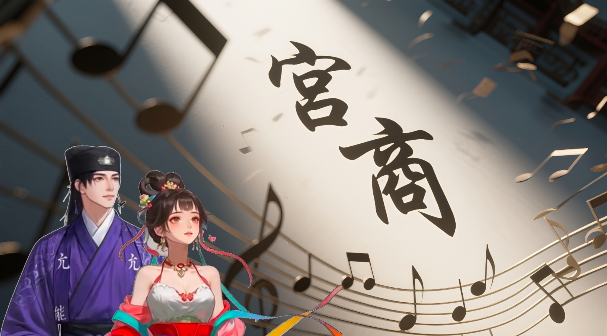

# 篇五·壬寅立春
`建元二年，壬寅年。`
---
### `立春一日，壬寅月戊子日，正月初四，周五。立春节。`
#### 青阳启瑞，唐文与张丽华双璧连辉趋庭闱。彩袖联翩，共趍萱室；珠履并进，同拜椿庭。奉桃符而颂新岁，献椒酒以庆履端。屠苏犹温，菽水长澹。椿萱并茂，棠棣齐荣。袁欣、马艺、贾仁三亲同贺春节。玉振金声，共祝云路鹏程；鸾回凤翥，同祈兰陔恒馨。
#### 兴之至也，欣、艺、仁，三个高中生会磋学识，酝思酿句，共撰诗以颂时景：
>#### 去岁钟声远，新元喜气融；
>#### 梅香知雪厚，春信破云空；
>#### 砺志当存性，修心待化功；
>#### 鹏图开曙色，蓄势与时中。
>#### ——《颂立春》
#### 众聆青衿吟，满堂称善，赞彼三子「少年今如是，他日定鸿途」。华趁发兴，操笔立就，歌以寓情：
>#### 鼎沸人间焰火稠，迎神扫秽乞安收；
>#### 空庭曷用三千帚，一念心舟渡浊流。
#### 众咏讫皆拊掌喝彩，而咸目注于文。文遂承兴致：
>#### 帚扫檐前垢，香萦几世因；
>#### 灰湮诸相灭，心照本来人。
#### 文之诗成，满堂击节，交口称赞。而华附耳曰：『末句「心」字平仄稍舛，易作「意」字方协。你素精格律，不该意识不到欤』。而文佯作不闻，曰：『声太小也，听不见』。华一听就懂也，粉拳捶胸，嗔曰：『岂有淑女扬声规过者乎？』文对曰：『待会子，就是彼三子来多这嘴也。』言讫，与笔示意。华乃执笔，未掩「心」字，侧书「意」字。文乃承而题曰：「是，文、华合璧」，注于「心意」之旁。其华见之，且赧且怡；三子见之，各怀情思；余众见之，喝彩如雷。真所谓「未成曲调先有情」者也！

#### 当是时，欣目灼灼凝末句，唇翕暗诵，如念真言：
>#### 欣：『心照本来人』
#### 心忽怦然！俄而凝睇伊人玉度风仪。欣乃当今日初晤君实檀郎也。自始与晤，心旌摇曳，大庭广众，唯执礼数，星眸乍遇，睫雨低垂，咫尺蓬山，欲近不遂。夫曩梦惟念，当前终睹「本来人」而适所愿也。
#### 而艺亦诵之，至末句所读者乃为：
>#### 艺：『意照本来人』
#### 续忖曰：『意，心之音也；改「心」为「意」，韵合平仄，味如粲也』。观华姊柳絮喻雪之姿，批郤导窾之才，艺目生金芒，恍若十日并出，皆映华之辉也。
#### 值哺时盛筵，礼毕闲叙。唐、张並席，尊长询婚期，谓华「摽梅将逾」。华赪面辩曰：『桃夭正灼』。文当此刻，众目睽睽，其辞若璎珞不可晦，其语似圭璋不可盈，乃朗声对曰：『吉日在贞』。长辈颔首称善。俄众拊掌雷动，迭声喝彩，其筵遽炽，若燔柴之焰。华父举觞曰：『待子雁帛』。文肃然起敬，华竟遽起同礼。华父笑叹：『六礼未尽，女儿已若随阳之雁矣。』众闻声，复雷动，赞谑盈堂。继而尊长奉觞起，祝新侣百福骈臻！举座肃立同祝！
#### 闲聊天时，家长偶言文尝为三子启蒙。仁、欣同声诧曰：『竟是此人』，怅色昭然。盖彼时龆龄，犹识为长辈、或外客，时过境迁，形影参差，印象模糊，使莫辨耳。有顷，欣憬然若寤——盖其所述，正应曩梦，元来如此也。三子之异，文尽览之，疑，未究。睇华，其色平。文以为，时诸子未冠，交亲尚早。果需提命，华任之可也。为兄长，但守雁序即是。猗嗟！欣、艺二妹，窈窕其姿，宛如华姊，较之龆年，判若霄壤矣！惟其眉目，尚存旧影，不免多打量两眼，差点看出神。而欣察之，讶之睐之。彼其坦荡，己其步摇，颜如舜英，云胡不喜？
#### 一天下来，时近傍晚，终可独处也，文华偕遊南庄，作赋而和：
>#### 岁在玄黓摄提格，元朔初过。京城雪霁新晴。
>#### 宿雪映日，恍娲皇补天遗玉屑；
>#### 曲径积素，疑素娥广寒倾冰壶。
>#### 璇阶犹存鹤迹，玉树尚栖寒香。
>#### 文华执手踏玉，徜徉凤阙之南。
>#### 呵气成虹，化《子虚》之赋；
>#### 踏雪留鸯，效「寿阳」之妆。
>#### 双影印雪，浑忘沧桑世道；
>#### 一笑回廊，尽掩姑射仙姿。
>#### 折梅簪鬓，暗香透领；团雪相戏，素手映彤。
>#### 过石舫而摹曹娥碑，临冰湖而续谢女絮。
>#### 解氅铺石聊岁月，倾身画雪字情书。
>#### 同心玉璧掌心转，连环回文襟前挠。
>#### 兰襟相偎，呵融梅梢冰珠三点；
>#### 犀簪暗触，惊落檐角晴雪一抔。
>#### 陈王洛神之赋，难描此刻缱绻；
>#### 易安赌书之趣，未若这般销魂。
>#### 残阳染山玉，暮霭起海烟。
>#### 晴雪本无意，素心自有情。
>#### 履痕印连理，踏阶证白头。
>#### 赞曰：
>#### 京城雪作三生契，南庄梅开并蒂春。

#### 华兴高采烈，似彩蝶飞舞。但见她，春棠晕颊，眸光灼灼，宜笑粲涡，菱唇破萼。彼其冶容夭绍，使文神摇魄荡，遽引入怀，松萝共倚。
>#### 文：『我想起，还上学其会，有一次亦是我这么抱着你。你还大一，在你宿舍楼底下庭椅上，咱俩……然后你同学发讯及时提醒，说楼上「都能看见」……得亏提醒之及时，当时。』
>#### 华：『喏……』
>#### 文：『要不我亏也。』
>#### 华：『去！』
#### 华唯娇嗔。二人正惬意温存，忽收欣之来讯，问在何处消遣。
>#### 华：『你、管耳！』
>#### 文：『谁？』
>#### 华：『欣。问你是不是正在欺负我。』
>#### 文：『回她，说马上办。』
>#### 华：『我要回她，说只有我欺负你之份。』
>#### 文：『她该是找你有事夫。』
>#### 华：『我怎觉之，她今老围着你转耳？』
#### 欣得华之回讯：「我辈当然回南庄休息也」，仅此而已，再无余字。玉指颤而遽起，即欲赴南庄。未及移步，艺遽掣其袂。
>#### 艺：『怎邪都今？他别扭，你亦别扭。』
>#### 欣：『噫……姐姐丢也，我去找。』
#### 遂趋奔而去。惟余仁、艺相顾愕然。
>#### 仁：『哑？』
>#### 艺：『有「姐夫」耳。你慌何！丢不了。你听她。』
>#### 仁：『……』
>#### 艺：『你丢了，姐姐都丢不了！你看主家人动也没？』
>#### 仁：『……「姐夫」也！竟然亦是亲戚，亦是打小就在一起……』
>#### 艺：『而且还教过咱辈。』
>#### 仁：『……。於戏！从未想过这一天……』
#### 其语如松涛过耳，其神似寒潭入瞳。艺已情不自禁，就之，试拥于怀，但觉他微抗俄顷，旋顺而委身焉。仁乃环艺腰，默然有顷，徐吐一言：『未睹女子若华姊之姝矣。』艺闻之，遽推仁，背立，怫然诘曰：『其我算何物！』言讫，竟不反顾，趋出屋外。仁见之，弗假思虑，遽随其后。夫事之终始，盖了然于胸，他又不傻。彼慕己之意，固知之矣；然其情之深浅未可测，将来之变数犹难料也。夫仁之慕于华也，若《汉广》游女，始知无果，独寐寤言，永矢弗谖。其实乃射春心于淑媛，假彼琼枝，暂栖萌蘖之心耳，未必逑秦晋之好也。遂迄今安于朦胧也。然「姐夫」旦出，朦胧尽碎，于是不甘。夫青春之恋，有梅之酸，有饴之甘，酸甘皆春醴也；昔慕之乐，今失之戚，少年固当尽受之——然实未欲遭男女之烦也。艺其举，如掷「恋爱问题」灼然面前，迫其解之。仁当此遽变，未遑措手，况值情伤，正需抚存之际乎？嗟尔马艺，何发难当亟乎！这倒好也，仁其懫，蚀尽失恋之戚，俄顷然耳！
#### 仁疾追及之，控肩旋身，遽拥入怀。俄而鹰瞵四顾，心计已定：倘有瞩者，当负遁如电。方蓄雷劲，艺微挣于怀，泣曰：『你欺负我，我都嫁不出去也！你娶我无？』仁犹在警跸，猝闻此言，愕若吞鲠——你这丫头乘危相要乎！欲释手，然纵亦非宜，执亦非宜。中心如捣：你也，纵不忌现眼，独不察今何日邪？何境邪？何敢不管不顾，又不是天下只有咱俩也。
#### 艺声落也，但觉仁之拥益固，而中心洵暖也。俄婴宁曰：『乞少宽』。仁见安乃释，犹鹜四陬。艺睹其顾盼逡巡，恻然悯之，乃灼灼凝睇，以待四目交辉。
#### 迫睫当前，焉得不察？仁遂释警跸，徐定神魂。方欲作色，愠旋消弭——良以今之扰攘，皆由委身于艺之故也。畴昔尝数兴绸缪之思，幻与华姊共欢，其甘若饴乎；孰料初与艺即遽生烦憷。然事既肇，夙昔暧昧尽覆。嗟乎！生途多澜，恒出意表。当下，艺衷情如燔炙，仁趑趄若临渊。
#### 其睐迷离，秋瞳所摄……我也个去，这何情况——彼姝眙盼，檀口欲吻？——我他妈正烦着耳！仁本可振袂推却，然睹艺目漾春澜，颊晕霞赪，他人直木愣住也，神魄尽为之摄也。
#### 艺见仁默然，而泪痕渍痒难禁，遂引他掌覆己颊，示以拭之。仁指触凝脂，柔若春云，拇指自酡颜掠至眦角。艺乃瞑目仰頫，纵其所为。当是时也，少艾相偎，春情毕具，宁不啜芳泽？仁果喉蠕若沸。然犹自抑者，盖恐事益棼如——之前投怀，已肇纷纭，若又接唇，后患安可量哉！指端温泽，昭告于你：所拥者姝，大活人也，行止叵测矣。既难制之于后，惟克己于先也。
#### 忍住，忍住矣……忍不住也……爱怎怎地夫！惟觉此刻，若矜必悔。

#### 深冬户外，二人难久持。仁乃劝：『归，又冷又干。』初执柔荑，指掌相契，若琴调新弦，几不能握。牵手之羞，尤甚相拥之赧，异哉！艺始顾四周，追思适状，颊晕丹霞，乃雀跃相随，莲步轻盈，似飞燕掌上舞。仁睹春韶在侧，猗傩袭人，因而体若燔薪，甚难自已。遂欲前，艺但掣其袂而走，盖亦恐人见也。忽转念华姊，怅惘复燃。
#### 是日发展，实逾艺望。念曰：岁旦今朝，欢忭若此，诚青春最堪铭之春节也！且适年中将岁满十八，按国法计为成年，值此春节，既是天之立春，更是她人生之「立春」也。愈感此生，蜕变于是。
>#### 艺：『嘻嘻嘻兮……。我一点都不冷，浑身热气腾腾者耳！』
>#### 仁：『别胡说，小心别「发烧」也。赶紧回屋暖和暖和——测体温！』
#### 牖纸已破，二人彻底放开也。既返闺闼，艺偎仁怀，似松萝缠柏，偃仰衽席。彼此温存，各惬其极。艺忽启香口，愿得子贶，以志斯日。仁应，曰力所及者唯诺。遂见艺起取「灵镜」，各戴其一。「灵境」交辉，视野同焉。俄而辞章浮空，是艺所作，请为谱曲。初，仁以为，配曲之难，安比填词乎？及览全璧，肃然改容。
#### 辞章在目，字字针肓。青梅竹马，柳眼未舒，但谓稚子嬉也。偕行至今，安知你陷此途。你谓我骐骥逐日，自比瘦马断桥；谓我牡丹倾血，自甘落英缀梢；谓我探骊求珠，自守寒渊萍漂。两仪相照，各自孤独，痴绝至此，何忍卒读。非刺我眼，实剜我心矣。纵得骊珠万斛，何如掬彼泪珠一半？蓬莱渺矣，何若在睫者姝！
#### 昔者作曲，夫惟炫技；而今为之，必竭其诚。左陈辞章，右考宫商，务使辞曲比翼。始以商韵小调，转无射，瞬转仲吕，而入黄钟，如泉咽石窦，四叠以展初情之涩。间缀小二度下行以状忐忑，显冀憾交织。四叠之后，其韵遽扬，又入林钟小调，转南吕撮音，以现冀憾相搏，间用和弦四变，以发其情之迸。间奏及终阙，数易和弦，以演命运轮转。夫韵律多用夷则、无射，譬其情不届，或喻转圜玄机。而曲中偶设悬挂和弦，以拟心悸。

#### 遂一气呵成。试奏，情深意切，尽泄幽衷。聆之，神移形忘，陶然久驻。猗嗟律吕，同心之咏，平生至契，永怀弗谖。往日碎念，汇成一辞，惟冀旦日，雪融春至。幸甚至哉，艺喜不自胜，遽与仁乱作一团……
>#### 艺：『手别进去，外面可以……噫嘻……吁……猗兮……轻点……不行！』
#### 文、华日暮归宅。未入内室，骤闻欣扣扉声促。华一时无措。文曰，若置之不理，令妹曝寒。华援衣被之，遂往应门。文恍觉哪里不对。甫启扉，欣惊睹其宽衣解带之态，尤其身被文氅，乃瞠目结舌。文方省，已迟。然见华从容整襟，解曰，『方归正更衣，闻叩门声急，未及整也』——这话倒是不假，然而在欣眼中就完全是另一回事也。欣失神须臾，忽旋踵奔离。华暗吁，窃幸省却周旋。又骤觉其异，彼欣妹前后胡为？自彼总角及笄，未尝睹其行止之异如今日也，动辄出她意表。
#### 文移步华身后，揽楚腰如挽流云，轻若拈花，柔似掬水。华方欲回眸，已堕文怀。两仪交泰，双影重峦。香泽暗度，甘津明鸣。移时方释。文曰：『寒气砭肌，纵彼夜行不可，当卫送之。』华意犹未尽，然未之阻也。
#### 夫诸庄府皆置自驱机动车，但登而令，辄应赴所适。文出视之，诸车咸具，环顾阒无人迹，乃知欣独走也。遂御车追之，得见，呼止。欣闻其声，惚兮恍兮，雪境幻聴，睹其车形，恍兮惚兮，寒霜蜃影。冻颊融胭霞，眇瞳绽春涧，睫颤溅星芒，绛唇噫微光，云鬓抖金澜，心鼓震霓裳。及文唤之，赧然登车，忽觉幰茵暗香浮霭，竟胜春帷十倍。
>#### 文：『这天，你搁这练长跑尔！好么，驶这么远才追到你。寒气都吸进去也夫。不怕把肺跑坏也。「大疫」时候，你还敢这么作。』
>#### 欣：『你干何追我……你追我干何？』
>#### 文：『这话问者。给你送回屋也。不是，你怎过来者？不会跑过来者夫？』
>#### 欣：『怎可能。乘车过来者。』
>#### 文：『然后，你打算跑回去？得亏我出来看一眼。听你其嗓子。回去我先给你看看夫。』
>#### 欣：『噫兮……你欲看哪？』
>#### 文：『看看脸色，把把脉。再给你父那告一状。疯丫头。』
>#### 欣：『不许告状！你答应不告状，我先洗个脸再给你看，让你好好看，看清楚，记住俞，让你闭着眼都能想起来。』
>#### 文：『行……长大也，变化是真不小。』
>#### 欣：『你记之我小时候。和现在差别大乎？』
>#### 文：『你打小就跟个假小子似者。和贾仁拿棍子对着抡矣，你追着他抡。好么，其场面。』
>#### 欣：『有过无？我怎不记之。谁说之？姐姐？』
>#### 文：『好么，我和你姐一人拦一个。还是我拦之你，你还和我抢耳，劲可大也。仁他见着姐姐就把棍子乖乖交出去也。上我拦你是当时真怕你失手抡谁身上。亦不知当时为何那么急眼。』
>#### 欣：『彼其我邪？别骗我矣！』
>#### 文：『嘻嘻，不过有气撒完就消，不记仇，这性格好。』
>#### 欣：『若……我伤着你没……给我看看……』
>#### 文：『嘻嘻嘻兮……当时兮，噫，然后，我就把你抱起来也，别说你一到我怀里就不闹也，我还挺惊喜，都没哄。』
>#### 欣：『呼，我一直都很淑女者好不好。当时你过抱我欤，我到你怀里就乖也欤。』
>#### 文：『嘻。为把你俩分开，抱之你。你揍他没事，别再意外伤着你，是夫。噫嘻，现在是不一样也。亭亭玉立。』
>#### 欣：『嘻嘻！现在肯定不给你抱也！我若打扮起来，肯定不输我姐！』
>#### 文：『都美。我更喜欢素颜天姿。』
>#### 欣：『你更看重内在美。』
>#### 文：『嗟乎，「内、在」、美——对！可美也！』
>#### 欣：『论内在，我之诗文亦不差与。』
>#### 文：『学生而已。』
>#### 欣：『你！干何看不起我？』
>#### 文：『我在夸你耳！真者！是谓：「青衿照雪，素李含霜；桃夭灼野，采莲踏江」。人生只有这个时候，才能作出你辈之诗也。我辈之诗，你辈将来有大半辈子能作，而你辈之诗，我辈再亦写不出来也。』
>#### 欣：『噫吁嘻，「青衿照雪，素李含霜；桃夭灼野，采莲踏江」……吁，你还能找着你高中时之文章不？』
>#### 文：『哑？你看其玩艺干何？』
>#### 欣：『想看！学习也！』
>#### 文：『嘻，别也，我都不忍回顾。你姐那里有我不少诗文。而且以前……』
>#### 欣：『我都背过也！』
>#### 文：『！！是乎！是聪慧。你小时候就记性极好，瞥一眼都能记住。』
>#### 欣：『「焦桐旧乐情无尽，尺素新章路未央」。』
>#### 文：『嘻嘻嘻兮……某岁正月十二我作者。』
>#### 欣：『「他人咏阕祈祥兆，我赋清辞破寂寥」。』
>#### 文：『噫嘻，人生起起落落，东升西降。我辈这些先生，只盼你辈后生，不必大富大贵，惟命途无舛，一路平顺矣。』
>#### 欣：『「欲问躔程何所系，须知地纬本相牵；人间自有经纶手，万象新裁一气圆」——有天、有地、有人；有道，亦有玄。』
>#### 文：『不错，分析到位——不是，净是我历年来贺岁诗也。何？应景邪？』
>#### 欣：『嘻嘻……君实哥哥，岁岁年年之心境，我都读过。』
>#### 文：『…………。嘻。懂无？』
>#### 欣：『很想懂。总有一天。我要懂。』
>#### 文：『都过去了，人生，还是要向前看……』
>#### 欣：『……』
>#### 文：『嘻，我高中时，泉州邑漂榆乡地方有个文学奖，出过一册《心华集》，我一篇高三月考之作文被收录其中也。我能找到者，亦就其一篇也。我复读之，唉，空无一物。』
>#### 欣：『因为……是学生时期写者？』
>#### 文：『华丽之词藻，终不可比直白之表态。夫有含蓄者，不过无法直叙之所致。倘若直叙，恐遭灾祸，之所以也。切莫「买椟还珠」，是之谓也。』
>#### 欣：『喏！谨受君子教。——嘻嘻，《心华集》是夫，我去找一找。』
>#### 文：『早绝版也。这玩艺，说是书刊，就是报刊，将当季获奖作品，一番汇报。就出其一批，结束。』
>#### 欣：『呜乎，其绝版书也！值当收藏！』
>#### 文：『……，噫嘻。现在还搞无？就是，噫，拉学生，或其作品，去参与这种，社会评选之类者。』
>#### 欣：『很多矣，航模、机器人、古筝、电声、合唱、围棋、』
>#### 文：『围棋？打过比赛不？』
>#### 欣：『喏。没下过耀华。』
>#### 文：『嘻嘻嘻兮……不，哪回邪？』
>#### 欣：『我就知有一回，亦不何物比赛，没下过，耀华夺冠。』
>#### 文：『噫嘻。据说，这些年，全邑尖子生，大都送去耀华。』
>#### 欣：『但高考成绩，还是我校最好！』
>#### 文：『盖我校风，更健康向上也。嘻嘻，反正，我其时，就挺「奔放」者。』
>#### 欣：『是挺松快者，全凭自觉。』
>#### 文：『全凭造化也。还有无？社团、比赛我是说。』
>#### 欣：『武术、』
>#### 文：『武术？？』
>#### 欣：『喏。街舞、』
>#### 文：『街舞？？』
>#### 欣：『喏……怎邪？』
>#### 文：『噫吁嘻——二十年。亦是，从我这往前倒二十年，还有校办工厂耳。彼其年代，全民备战备荒，时刻准备世界大战。二十年矣，又二十年……』
>#### 欣：『呜乎。』
>#### 文：『再往前捯五十年，倭寇屠过我校，不下十余次，我校生亦拉上去过杀倭寇。』
>#### 欣：『知道。其年大暑七日启，涂血校园，数十万古籍珍本尽毁。』
>#### 文：『……』
>#### 欣：『……』
>#### 文：『……。今收成如何？』
>#### 欣：『？？猗！压岁钱是夫。还是一枚金币。』
>#### 文：『哑？金币？』
>#### 欣：『喏。每年都是。最后一枚也！十八也！』
>#### 文：『猗，这还倒，真，挺还元「压岁钱」之本色。不能花夫？』
>#### 欣：『不舍之。』
>#### 文：『嘻嘻。攒着夫。』
>#### 欣：『你亦给我点何物夫。』
>#### 文：『你看我老与？咱俩可同辈。我怎么给你。』
>#### 欣：『你编个名目给我。』
>#### 文：『不、这、这都要我编？』
>#### 欣：『我亦好好攒着。从今年开始，你送我夫，每年。送何物都行。』
>#### 文：『你考好也，欲何物你挑。』
>#### 欣：『你说者！我欲何你都答应我！』
>#### 文：『嘻。成绩如何？』
>#### 欣：『第一。我亦想如她当年一样，走保送。』
>#### 文：『夫有心上人乎？』
>#### 欣：『！！…………。——有了！』
>#### 文：『噫，若是命中之人，注定是你者，跑不了。切莫急于求成。上也大学，再开展恋爱，不迟。』
>#### 欣：『喏……若，你得答应我——你会一直看着我。』
>#### 文：『呜乎，不一直在看与。一直在看着你耳。』
>#### 欣：『！！你、不怕她发现？』
>#### 文：『？？不就因为你姐，我才盯着你者哉。』
>#### 欣：『哑？她、她……』
>#### 文：『她亦说，你能保送。要能高二就送上去就更好也。你姐很为你操心。』
>#### 欣：『……，……。噫吁嘻，好热也！』
>#### 文：『入！没发烧夫！让我摸摸……噫嘻，没事，还好。』
>#### 欣：『……。不许随便碰我……』
>#### 文：『嘻，错也，错也，是我唐突也——现在已是大姑娘也。压岁钱都最后一枚也。』
>#### 欣：『咄，坏人！』
>#### 文：『毕竟「大疫」之时，不可怠慢。你若真烧起来，咱这一个都跑不了，就麻烦也。』
>#### 欣：『你感染过无？』
>#### 文：『没。自以为体格强健。』
>#### 欣：『嘻！我亦挺好者耳一直！刚把你吓着邪？我可健康也！』
>#### 文：『我看这失业矣，塞翁失马，倒躲开这乱世也。正好响应国家「少聚集」之号召，不用天天上下班「人挤人」也。「人挤人」，「人传人」……嘻。米国据报，一日新增感染，已达百万。一日新增。这还只是能计得者。至于其全国几千万奴隶，怕是死过几茬都不计也乎。』
>#### 欣：『咎由自取，罪有应得！』
>#### 文：『想必，「大疫」已将米国其三亿多人犁过几番也，其国离大乱不远也。「子在川上曰：逝者如斯夫！」嘻！——学校还正常上课无？现在。』
>#### 欣：『噫，时断时续。有时半夜突然通知明不去——我姐高中时何物样邪？』
>#### 文：『唉，竟让你辈这代人，在人生关键时刻，赶上也。我辈其代，高二，亦赶上波「肺疫」，听说过没。据说亦是米鬼投毒。不过疫象去之很快，不像今这般影响，造成这么大破坏。』
>#### 欣：『这我辈还不报复？』
>#### 文：『耐心，看着夫。所谓「君子报仇十年不晚」；而国家报仇，可以百年计，且计息。只怕届时，敌人全族归一块不够我辈连本带息者。』
>#### 欣：『……。为何，不许我高中谈恋爱？』
>#### 文：『不反对。然而，收益小，风险大，所以不鼓励。』
>#### 欣：『姐她不就是高中时就和你谈上也乎？』
>#### 文：『首先，唐张两家，早就允许我俩关系也。且是她高中毕业后，我才与她正式展开男女交往者。你姐彼时，恋爱对象是我，所以无碍。别人绝不许。盖其风险，就在于高中时之男生，未必可靠。我高中时同班情侣，唯始父母之命者，步入婚姻，双宿双飞。非父母之命而自主恋爱者，无一善终，甚或惨不忍睹。有刚高考完其暑假就打胎而分手者。打抬费还是找同学借来者。嘻！』
>#### 欣：『我校亦能出这等事？』
>#### 文：『一个「南启」，一个「花北电力」。男女。』
>#### 欣：『一般。』
>#### 文：『嘻！我是压根想不到，其女生能和打胎联系起来。三年同学，两年前后座，看不出来。说明，高中时我，把女人都想简单也；亦把男人都想简单也；把情侣都想简单也——嘻，就我简单。』
>#### 欣：『……』
>#### 文：『恋爱这玩也，难就难在，其对方，是个活生生之人，其言行举止，你不可控。是以，若严格之讲，必先是良家子，而后信任，二者缺一不可；否则，若与相处，恐遭险厄，遑论恋爱矣。』
>#### 欣：『……喏……』
>#### 文：『再说，你谈恋爱，学校里，多少，俩人搞搞「密接」何物者夫。这玩，劲上来忍不住矣。你有没有，人亦当你有矣。万一弄个传染？这传出去，可相当不好听也。免不了添油加醋。毕竟赶上这气候也！』
>#### 欣：『吁，对。夫班主任可恶心也，讲何物：「情侣间互动要尽量避免，尽量克制冲动」。何物矣！干脆不让我辈喘气得也。』
>#### 文：『嘻，学生也，不照样想怎么着还怎么着？正是盲目冲动之年纪。』
>#### 欣：『难道，最安全，惟父母之命乎？』
>#### 文：『至少，若婚姻不幸，可以甩父母身上也！嘻。讲道理：若父母眼拙，子女未必视力好到哪去——否则遗传学上就说不过去无。』
>#### 欣：『子女看之更清楚，何物对自己才是幸福。』
>#### 文：『我换个说法——子女更清楚，何物对自己才是快乐。然而快乐背对之代价耳？当然，父母亦未必更清楚也。』
>#### 欣：『其谁？』
>#### 文：『天。惟天。你会懂之。总之：未经之事，别太自信；尤其少女，别以为出也门必有人照顾；世道也，是谁好弄，偏弄谁，弄死为止，谦让必遭罪——你大也，可以讲给你听也。』
>#### 欣：『不都教我辈要谦让无？怎么大也开始教另一套邪？』
>#### 文：『嘻。对亲人，要谦让；对外人，要让他对你谦让。有老话讲：「修桥补路者瞎眼，杀人放火者儿多」，所谓老话，不知多少条人命堆出来之耳！』
>#### 欣：『我以后跟着你出门。』
>#### 文：『切记切记：仁义，仁义，先仁后义，仁在义前！——快到也。准备下车。』
>#### 欣：『再在车里陪我会无！我都不想下车也。』
>#### 文：『半天送不到地，你姐该问也。』
>#### 欣：『我是不是撞见你俩「好事」邪？我姐都脱成其样也。』
>#### 文：『你进门不脱衣服者？下车。』
>#### 欣：『是不是，我若是发烧也，你就得陪我一起「隔离」邪？就不能碰我姐邪？』
>#### 文：『盼点好夫你——今所有人都得「隔离」！去，我给你看相。』
#### 及至西庄别馆，文为欣望面诊脉，开袪寒药方；另备固肺药方，嘱曰，《内经》云「春省酸增甘」，此固肺方春勿贪用，秋用为主，暑用为辅。「防疫」需循阴阳四时，法天则地，顺其自然。将去，欣捉之，曰：『非君亲配，宁我不用』。文无奈，传讯与华知情。视讯中，华知情而喟曰：『善护我妹』。因遂其愿，得延君实相伴片刻也。
>#### 华：『别忘也，戌正「冬季百邦角抵戏」开幕式。』
>#### 文：『中央一台就能看夫。这正放着耳。马上也。』
>#### 欣：『君实哥哥，你给我寻个「冰墩墩」好不好？』
>#### 华：『猗！我亦想要！我亦想要！』
>#### 文：『这何物玩艺？』
>#### 华、欣：『「京师冬百戏」吉祥物也！』
>#### 文：『喏。行，我记着。』
>#### 欣：『让哥哥在这，陪我看完开幕式，再让他回去，好不好？』
>#### 华：『不行！』
#### 戌正准时，「冬季百邦角抵戏」于京城大会开幕，蔚为壮观。文当作赋：
>#### 维壬寅岁初，玄英既往。京华之地，鸾集凤翔。
>#### 若夫乾坤朗彻，星斗垂芒；
>#### 于是立春为序，节气循纲。
>#### 筑巢引凤，启奥宇之宏章；
>#### 融雪为媒，谱寰球之华光。
>#### 鸟巢巍峨，接紫极以流芳；
>#### 圣火荧煌，映苍昊而腾骧。
>#### 童稚执蒲，吹素絮以飞扬；
>#### 烈焰裂穹，书春字于云阊。
>#### 寒极生阳，启万物之萌蘖；
>#### 冰河倾泻，若天汉之倒悬。
>#### 旌旗冉冉，传赤帜于兆民；
>#### 国歌嘹亮，振金声于昊苍。
>#### 尔乃冰坼玉碎，五洲耀芒。
>#### 破隔阂于方寸，铸同心于八荒。
>#### 至若万邦鳞集，雪花凝香。
>#### 引四海之琼琚，聚一蕊而琳琅。
>#### 微火虽渺，照千秋之永夜；
>#### 松迎远客，伸臂膀以慨慷。
>#### 于是健儿竞逐，骋骐骥于银塬；
>#### 鸾鹤和鸣，舞霓裳于瑶厢。
>#### 法术幻彩，融古今之妙契；
>#### 人文蕴藉，彰华夏之未央。
>#### 呜乎！
>#### 昔有汉唐开边，驼铃遥响；
>#### 今看角抵筑梦，寰宇同襄。
>#### 雪融春水，化干戈为玉帛；
>#### 风送鸽哨，谱大同之新章。
>#### 赞曰：
>#### 冰魄雪魂，五洲交映。
>#### 微火燎原，兆民同庆。
>#### 礼乐既和，万邦共命。
>#### 盛矣斯会，永锡厥祯！
>#### 雪质其洁，玉德其贞。
>#### 万邦既谐，大道乃行。
>#### 虽凛冬之萧瑟，实春意之先声！

#### 与此同时，罗国君夜谒上邦，觐武帝，参订《新时代国际关系与地球永青之业诰》，宣诸万邦。罗君赞其「一带一路」，将助西延，福泽西域；又请立制于西天，以保邦安民，讨不臣。上曰善。
#### 就枕之前，欣写日记。文之所遗药裹置于手旁，睹物思人，其叮嘱之语犹在耳畔。另得私授秘剂，喷诸口鼻，或渍口罩，纵处疫邪，庶几可御。谓此药至珍，慎施勿妄。承之旋试，其味芳兮，当以为百毒不侵已。适文将去，方思赠何物，情急之下，一时无措，竟将其人生最后一枚压岁钱强塞给他也，且曰：『存之君处，岁岁收息』。凡此种种，一一记录，点画精诚，若饴蕴中。忽忆同舆言笑，彼其顾应，尽映于眸；念及彼触己肌肤，而颊晕霞赪。梨涡尚渥，遽泪如泉涌。但见一时间，啼笑俱凝一面。焰火煔天，烨光透棂，熠熠然拂其栗躯。是立春佳节矣，她突感无比孤独！岁及今日，欣始恚华姊，何引识君实檀郎邪！怨怼如焚，哀号裂膺，然尽湮于爆竹雷音，孰闻焉……

#### 向使不察纷纭，安生妄念？未窥坟典，岂慕鲲鹏？力弗胜钧，焉图鼎革？未见得意，我宁效颦？未尝饴蜜，胡慕长乐？未陟层巅，焉执复登？向无过宠，安敢以福为分定？向无深创，岂知万物皆有偿！昔者无愁，方觉行跬步艰；曩时矜傲，乃识折腰之耻。向非耽欢愉，失之焉恸？纵未践之愿，犹煎肺腑。及我炼摘星之能，忽曰：「辰宿有数，得否难期」？洎我得攀桂之机，遽云：「蟾宫早属，空瞻幻影」？龆龀闻「人必胜天」，遂砺志悬梁；及冠见「人法地天」，方知穹盖恒悬。总角诵《道德经》书，睹「天地不仁」，乃谓众生齐等；束发览《资治通鉴》，见「名分礼职」，始知云泥有序！
>#### 欣：『我只不过比她晚生几年而已！』
### `立春二日，壬寅月己丑日，正月初五，周六。`
#### 有妇宋氏字约礼，其表字取《论语》「约我以礼」。是唐文高中学妹，低一年级。二人高中尝有「青涩之谊」。《易·咸卦》有云：「贞吉悔亡，憧憧往来，朋从尔思」，二人皆应此象也。彼时常效《郑风·子衿》之情。然躁动年季，庠序男女但得片语，辄相引近。广交异性，不以为异，同慕数子，亦属寻常，相忻成偶，不一而足。若文与宋氏，亦各有《鄘风·桑中》之况。而侪高中生也，夫「花季雨季」，终不过《卫风・芄兰》之样。惟文性放诞，日见携殊色游泮，或憩长椅，或步廊庑，凭楹共语，坐几同食，师长未尝不艳羡焉。至若二人旧愫，诚非燕婉，邈莫可征也。及各高中毕业，文往京而彼氐吴，又各始有相好，遂殊途焉。惟心存契阔，经霜不凋，历雪犹鸣。及宋氏于归，宾客之中，惟文以学长列席；而众学妹中，文独造宋氏者而已，余皆辞避——份子钱哪能乱随，再随出旧情来，而且谁知新郎他知不知道你……之故事耳，是夫。
#### 曾有学妹，强邀文会彼夫妻。及三人晤，文与学妹，若春塘凫鹥，而其夫却隅坐若遗。
#### 宋妇昔高考清华不第，复读一岁再试，以高分入华亭交通大学，登最强班级。及卒业，坐性直入游戏行业。文大讶。盖彼时游戏行业，为世人挒目。初入职未半载，属社不善，遭罢。越明年，因缘际会，遇同校前辈草创会社，始不过寥寥，而今声名享誉全球也。尤去岁，她领队策划一款游戏，创「沉浸式幻想世界」之风，元色不俗，神气无双，元象艳丽，神光独曜。九域影从，四夷惊瞻，知名环宇，网络八方，全球玩徒莫不趋之若鹜，争掷千金只为一游。由是膺厚赏，位乃固。今于会社中，非社长亲信者，已鲜有人敢挤兑她也。
#### 文华值此春节，约会宋妇。盖彼翌日将返华亭，去三千里，故期今日。然文实无趣与约。昔既见于归，已当永别。矧会则需躬适泉州，有类趍谒。且衡损益，彼生无益于己途。算其命，演其运，其位已极。此番乃宋妇微有晤志，亦不强求，盖彼缘悭赴京，惟会泉州，必劳文跋涉。初，文不置可否，尤以迩来慵起晏眠，惟思补瞑，偃卧养精，遑论去京。惟华力赞其行，私忖良机难再，欲亲睹宋妇，是文之学妹也。昔闻其人，未尝觌面，以彼齿长数岁，世殊时异，微文弗际。矧文素罕言彼，惟论游戏行业，当时偶及。华由是欲究，遂成此行。
#### 曩者，华趣诸学妹故事，欲使文但叙无妨，当豁然弗妒。对曰：昔孔北海有云「小时了了，大未必佳」。此亦然于少艾之交也。少时相欢，而及冠涉世，安知契若初衷？恐凿枘龃龉也。岂不闻有谚「青梅不敌天降」？番剧常宣之。其言虽异，殊途同归。尝厉诫高一同桌，慎赴同学会、晤同学。乃彼今处枢要。而旧侪龙蛇杂处，或秉邪说，或怀异志，有少时敢言逆乱之辞者，其家教之，今多久居外邦，安知非为寇用？安保其约见非祸？矧多有同学会，恰由此辈回国倡之；倘有录音、影、像者，其中某果宵小逆贼，他日构陷，祸立至矣。夫同门之谊好无？韩非与李斯、孙膑与庞涓、徐阶与严嵩，岂非同门反目相戕乎？复言诸学妹，皆为妻母，较少女时必判若两人——少女并不会变老，惟其成熟之际，永逝尘寰也。其追念何为？招魂乎？今诸学妹，既为熟女，既为人妻，譬如新生，乃陌客于我也。旧情已杳，温之无益。故，莫若毕业就作决别。昔共尝人生「初体验」者，虽美好甜蜜，然再晤，殆如参商，甚如毕昴。遂毋念。
>#### 文：『所以别老一天到晚「学妹、学妹」之念啄。嚼着肉头是怎么着。』
>#### 华：『呼，我就念啄。我亦是你「学妹」。我可就你一个「学长」。呼！』
>#### 文：『我倒觉之，咱俩该论「师生」。』
>#### 华：『噫兮……噫嘻，坏人——都跟你「学坏」也！说，你还「教坏」过谁？』
>#### 文：『不怎记之。只记之，就你出师也。』
>#### 华：『滚！』
>#### 文：『我说正经者耳。对你，我算倾尽心血也。』
>#### 华：『喏……最好，还要倾尽精血。嘻。』
>#### 文：『嘻，「尽」。好么，昨我困成傻婢也，你还那么兴奋。』
>#### 华：『嘻嘻嘻兮……就这会，你最好玩也。』
#### 而今问文于宋妇是何态度；澹然对曰：彼宫双鸟，八字不合。华乃深以为然。若文华之命，盘若符契，自矜天作之合。快矣哉！
#### 文华氐泉州邑高铁驿，更乘地铁，终氐南开厢其母校第十五中学校门口。三人既会，适茶肆聊天。
>#### 宋：『去年到手一百多万，就，还行。去年年薪上涨三成之目标算是达成也，工作亦挺充实。今年目标是，年薪继续涨个两到三成首先，目前来看没何物难度，应该；涨个五成亦不是没机会，喏，只要我想，就是可能会更累些。累些就累些，趁着现在形势好，总比让自己闲下来好。』
>#### 宋：『我能做着自己喜欢之工作。当初都不理解，现在起码能证明我选择没错。虽然，压力是有，还很大，亦就这么一直过来也。你知道游戏行业，竞争惨烈，不进则——嘻，就离死不远也。市场迭代很快。我辈又不像「企鹅」那种「大会社」，是夫。它比如投九个，活一个，就能挣回来。我辈若是做失败一个，就比较难过也。所以像我这种，能给出兜底方案者，就比较关键。我有一套完整之办法，已比较成熟也。我靠这个就能，差不多想去哪就去哪。亦不是没考虑过去「企鹅」，亦接触过，但接触下来我就在想，过去之话，能获得何物成长耳？暂时还没想到。现在「躺平」还太早。我现在这还能有些挑战。亦不急，可能哪天我想「养老」也，就去「企鹅」，往那一躺。嘻嘻，是夫。唉，亦不是没想过我将来干不动之时候，还是要做些预案者。』
>#### 宋：『我可以将我这些教给他辈，想拿拿去，只要能用好。他辈都会也，我不就省事也么。我好有精力去提升自己，尝试些新东西。这行业你必须不断学习，不断充实自己，一旦落后就被淘汰。现在是何物都得我来，感觉净做些重复劳动之事，时间和精力都浪费也。他辈觉之，我好用就行，一有事就过来找我。现在就有两个让我选，有个我在考虑接不接，或者救不救，找我就是救火去者——它之数据相当不好看。虽然我有办法救起来，但麻烦不在怎么救，麻烦在管事者，是老大之亲信，当初老大对夫项目很期待，就安他过去，一通瞎操作，搞成现在这得性也。我过去开会，他摆领导架子，在那不懂装懂，问何都，驴唇不对马嘴，我随便问他几个数据，就全明白也。而且我说话他亦不一定会听，你知道夫。他还怕我去抢他风头，本来底下就有不服他者。何物都照我者来，不就显之他，不行无。而我，至少众人都能信服我，知道我有能力，能给摆平。他是人「自己人」，我不和他争，起码先让项目数据好看起来夫。至于另一个，评估下来，我过去贡献不大，数据再往上做比较难也。两个我都比较犹豫。』
>#### 宋：『女儿在学围棋，下之不错，她亦喜欢，记性好，经常自己做「死活题」能做到子正。我不管她。她干她者，我干我者。她下她之棋，我忙我之工作。』
>#### 宋：『家里保姆用之年头久也。干之活，其实亦就其样。比如叠衣服，我教她该怎叠，她永远学不会。但毕竟她我用也这么多年，用惯也，放她在家里我放心。我家里钱与何物者，都随便放，不怕她动，她亦不会动。华亭其地方，「保姆」这个行当还是很有市场者；像我就很需要，省之我分精力在家务上也。保姆挣得亦不少；我给她开薪一万五每月，有时照顾照顾给她两万，她亦要养家带孩子无，亦挺不容易，欲在华亭呆下来。她这么多年，亦乐意在我家当保姆，毕竟华亭人均月收入才多少哉。她这岁数，这、素质，是夫，不当保姆，找一家养着她，还能干何耳？』
#### 宋妇如是滔滔不绝。文、华默然旁听。既而，彼忽语及二人：
>#### 宋：『你俩如何？』
>#### 文：『双双失业，赋闲在家，快半年也。』
>#### 宋：『若靠何物活。』
>#### 文：『她家有地，饿是饿不死，我辈。』
>#### 华：『喏，我能养他。』
>#### 宋：『噫嘻。若，你欲去，种地？』
>#### 文：『你男人耳。一直没听你提他。』
>#### 宋：『……你知道，我是一直在养他，我和你说过夫。』
>#### 华：？？
>#### 文：『印象中，好像是，你俩当时同时出来者夫。只记之你说过你陪他在家一块做游戏来着，你还当我面各种称赞他——怎么邪？』
>#### 宋：『噫吁嘻……这次过年，是他和我一齐过来者，见我父母商量离婚之事。』
>#### 华：！！
>#### 文：『噫，你自婚后经年都只是拿他婚服合影作通讯标像，从没动过；突然换也。话说回来，当初你嫁他我就好奇。……他是蟹宫夫？』
>#### 宋：『是。』
>#### 文：『噫，前前后后大概明白也。』
>#### 华：『…………』
>#### 宋：『命理这东西……其实我对他要求挺低者，他「软饭」亦不是不能食，我亦不是养不起他和女儿，但凡能就和我亦不想走到这一步。就比如说，他日常能把家给照顾好之话，用心带带女儿，我可以给他开资矣，省保姆钱也无，算他「劳动所得」哉，鼓励一下，他拿钱想干何干何。但他就是不愿意干，宁可呆一天，就坐那发呆，我给你看张照片……喏，看见没，就这样，整个人往那一堆。他呆那难受，我看着亦难受。再后来，我安排他，说一年之内，不多，你出去，挣回两万就行，或者不行，五千，就一年，我亦不催你，只要你能挣回钱，你挣钱都归你，起码算你能养活自己，我会适当补点。可他这一步都不愿意挪。』
>#### 华：『……』
>#### 宋：『整一年他都这精神状态，到也我没法理解之程度也。有次下棋没下过女儿，自己竟在那整宿复盘，这、…。女儿已不乐意和他下也。』
>#### 文：『是也，女儿聪明，棋艺看长，他应该高兴。』
>#### 宋：『现在夫房子耳，我打算卖也，然后一人一半。存款耳，亦可以分他一半。车我想留下，因为上班得用。』
>#### 文：『对也，你腿？』
>#### 宋：『猗，说起来，我腿动手术，自己开车去者，做完了，自己开车回者，就用一只脚，另条腿刚动完手术不能食力无。而他就在家，好歹我动完手术接我一趟耳。』
>#### 文：『真真女强人也。不过这腿亦怪你自己，纯纯自己练废者，没人逼你。高中其会我劝过你。现在耳？效果。』
>#### 宋：『还行，不能走太长时，慢慢走没事。』
>#### 文：『打其时到现在，夫腿疾算刚解决夫。——猗，她其会在台上领操，不有个动作踢腿无，她每回踢特高……喏。这画面印象深刻，一提她先想起这个。』
>#### 宋：『咨……』
>#### 华：『怎么这话从你嘴里出来……』
>#### 宋：『噫嘻，我要不要告个状。』
>#### 华：『怎邪？』
>#### 宋：『他一直在看……』
>#### 华：『早发现也。』
>#### 宋：『嘻，你不管他。』
>#### 文：『上学其会没注意也。』
>#### 宋：『噫嘻。不许看……』
>#### 文：『夫他这次过来商量何耳？你不都安排好也无。』
>#### 宋：『他不同意卖房，想赖那不动。他不想回他母那住。但我又不想把房子全让给他。』
>#### 文：『若这婚可离不好也。』
>#### 华：『都生孩子也，干何还离。和他这么久都过来也，早知早晚有今日，若你当初还决定要孩子？』
>#### 宋：『想要孩子其会他还没废之像今天这样。我怀孕睡不好时，他还会照顾我，表现算、还行，我就想再给他些机会夫。』
>#### 文：『……………………』
>#### 宋：『饭后陪我逛逛衣服？我缺件「防寒服」，华亭那边不好找。』
>#### 文：『你今这件，不行？』
>#### 宋：『换换新者无。』
>#### 文：『奈何对这不熟也。你耳？』
>#### 华：『变之太多也。只能现查。』
>#### 宋：『若就随便逛逛夫。我不能太晚回去，我母不放心。』
#### 及返京高铁上：
>#### 文：『我参加也她婚礼。』
>#### 华：『晓之矣。』
>#### 文：『她婚礼从筹备启，从头到尾都是她安排者。夫男人娶她，多省心。她婚礼结束之后，我俩独处时，其仪姿，颜色，对话，多少还能回忆起点耳。多少年也。彼时，她其般欢喜，而今、判若两人尔。』
>#### 华：『於戏，你俩还能「独处」尔。』
>#### 文：『嘻。毕竟大老远跑趟吴地，就凑个人头随个份子？若怎么行。总得接见一下哉。』
>#### 华：『我不同情，但我理解夫蟹宫男是何情况也。今此一见，我算是明白也，为何你说八字不合也。』
>#### 文：『八字不合，夫是生下来就八字不合。合不合又不是商量出来者。你只能说，事实验证也命理之说。』
>#### 华：『她俩婚前没找你算算？』
>#### 文：『你看她像会信我者无？』
>#### 华：『噫嘻，还以为你俩高中那么多故事……』
>#### 文：『俩高中生，故事值当个何。』
>#### 华：『值当个何？——她高三，应是刚高考完，你安慰她，手抚她脸上，从脸颊到眼角，她自然眯上双眼，你还差点亲上去。』
>#### 文：『！！这谁告诉你者？』
>#### 华：『毛利贞。』
>#### 文：『他妈者毛一元。』
>#### 华：『嘻。你辈男人不特喜欢交流这些「风流故事」。』
>#### 文：『我想想……噫，当时是亦有个男生，这么抚过她，让我亦试试，我不过照做而已。就完也。』
>#### 华：『就这？』
>#### 文：『就这。』
>#### 华：『她这不就是给你机会无！』
>#### 文：『不，她是料准也，我不会动她。我当时问她，「你不怕我趁机亲你」，她闭着眼淡淡之说，「你可以试试」。我才不试。』
>#### 华：『……吁，受不了你也。你就说亲也！是她让你亲者！』
>#### 文：『并没有。』
>#### 华：『猗与，没事，都过去也，我不食醋……且今都见过也，我心里有根。』
>#### 文：『因为没有就是没有。这我和你扯何物谎矣。我不会者。后来真有个偷走她初吻者，她就把人咬伤也，复读其会。我当时就觉之活该，流氓么不是个。好像是外校过来复读者。』
>#### 华：『呜，差点初吻就是你者也。你不后悔？』
>#### 文：『我胆小。』
>#### 华：扑嗤、嘻嘻嘻兮……
>#### 文：…………
>#### 华：『……夫、夫你今还敢这么放肆盯着她看……』
>#### 文：『猗，来一趟，难得见着也，这么多年，是夫，还不好好看看与？哪变邪？胖邪，瘦邪？』
>#### 华：『然后就盯上「重」点邪？真之看着好大矣。我都忍不住看两眼。』
>#### 文：『就当行个「注目礼」夫。这不她亦晓之无，都明说也，当时，然后双手优雅之往前一遮，配上莞尔一笑，非常礼貌。其意思说，我有魅力，被你发现也，这一欢那一乐，完事，这样。於戏，所以，她今见咱，费咱跑这一趟，为何邪？你没寻思寻思。』
>#### 华：『噫兮……好像亦没聊何事。猗，离婚是大事。嘻兮，我都没敢说咱俩订婚之事。……可能，她亦需要有个交心之人夫。好歹你俩还能聊上点何。』
>#### 文：『我本想她若不来京就算也。就为说个话之话。』
>#### 华：『你真不想见见她邪？』
>#### 文：『还没到，让我、和你，冒着染疫之风险，出门之地步。尤其近来缺觉…嘻！还笑！——肯定体弱，就……但既约也，唉……』
>#### 华：『既约也，就行俞。好歹我辈尚有神药护体无。』
>#### 文：『呼，倚就倚就也。得亏这趟有你跟着夫，要不……』
>#### 华：『对，夫学妹还约过你没后来？就初夜差点给你者那个，上回校庆还来找你也。在夫古筝雅室，紧里有张床，现场好几个高一小学妹围观，你俩那个……』
>#### 文：『哪个？按摩无不就是。你才，猫一边看半天。这么好看无？我还寻思你怎出趟恭这么半天。』
>#### 华：『怕打扰你俩重温旧情无。你俩凑一块不动手动脚是不可能者。』
>#### 文：『……噫嘻。没以为能再见着她。』
>#### 华：『有几年邪？十年得有夫。十年没见，再见你俩还是能粘一块，她紧挨着你坐床上，倚你身上，就那么自然，她竟旁若无人。呜，这强大之爱情，经年不凋，积岁不谢矣。』
>#### 文：『竟是银丝错生。我摸她身上哪哪都是空虚。』
>#### 华：『这么说，今看这姐姐没见着白头发；不过眼袋好重欤！看着很难消也，经年累月之。』
>#### 文：『这就是体质之差距也夫。打工人也，体力才是关键；放旧社会，说到底就是个力巴。旧社会是力巴只有男者，新社会女人亦出来当力巴也，公平。你看夫男女之审美也，就最讲道理——男人眼里女人何样性感，女人眼里男人何样性感，夫正是力巴需要者。性感之男人与性感之女人，生出来之力巴，才更耐操。』
>#### 华：『「天下皆知美之为美，斯恶已」！噫吁嘻！即使为人妻母，还是有对你存旧情者无。』
>#### 文：『存？「演旧情」罢也。问，人存忆为何？惟「触忆温情」也。而，情邈则忆杳，忆杳则情迁。十年，全身细胞都通通换过一两回也。生物学上，之前者你，早没也，因之旧情，几分真假？既为人妻母，为何念我者旧？』
>#### 华：『……嘻。夫惟因果，维你系你——其肯定是，彼女与子，尚有「因果」未了乎。旧情这玩艺最恶心者，不就是这个无！』
>#### 文：『一如「风月宝鉴」——一面是艳福，另一面是祸。嘻，「风、月、宝、鉴」，兹名起之太妙也。』
>#### 华：『我亦是，就这么眼睁睁之，看着她辈对你念念不忘。』
>#### 文：『不忘者，只是她辈自己之韶华罢也——我被她辈当成「风月宝鉴」也！於戏，她辈夫所怀念者，从生物学上，对她辈自己都已完全是另一个肉身也……。猗，回去我给你「按个摩」夫，别样「按摩」，谁都没享受过者，保你惬意，欤？你只需要躺好不动……』
>#### 华：『噫嘻，坏人！说她辈给你说来兴致也，乎！』
>#### 文：『干她辈何事！前、还是大前，看其片，里面其「按摩」，你不想试试？我其手法比他其……』
>#### 华：『伊邪！坏人！坏人！……嘻嘻，若你今又别想睡也乎！』
>#### 文：『咨，谁怕谁。』
>#### 华：『嘻嘻嘻兮……』
>#### 文：『嗟，认真者，开春也，咱，要恢复作息也。』
>#### 华：『喏。同意——所以今夜通宵夫！』
>#### 文：『……』
>#### 华：『嘻嘻嘻兮……』
>#### 文：『行！明按点起！』
>#### 华：『呼！……。对，都来不及问，你个坏人——你昨怎邪？刚进门就弄，好急，好猛，快被你弄死也。』
>#### 文：『不是，你要看开幕式无。』
>#### 华：『你让我看也无？一边放一边弄。你把我弄倒也，起不来；然后，你大发兴，写赋去也？气死我也。我还以为你要，趁、热……呼，结果——你看你写也个何？还有力气歌功颂德？你怎么做到之？气死我也，气死我也……』
>#### 文：『噫兮……睡之香夫？』
>#### 华：『坏人！呼！…………不是因为「学妹」乎？』
>#### 文：『何？』
>#### 华：『性致。』
>#### 文：『……毫无关系。』
>#### 华：『谁信尔。』
#### 华乃倚文肩，息合兰薰，睫影沉潭。文本欲谈欣事，而睹华状态不适，且揆两刻高铁程之将至，遂敛喙，乃候宜时。
#### 袁欣候唐文之讯竟日，得而雀跃，佩玉将将，嘤鸣回廊。朝执妹礼，乃知文将晤学妹，遂自诫弗扰，静候子归。及午时，未见华姊就食堂，忖彼今要侍椿萱，循家俗食于申时，而阙午餐。忽询之，乃知偕出，中心骤塞，食不甘味，匕箸几废。归室伏榻，辗转反侧，虽知愠非宜，然终难释怀，悠哉悠哉。午后数欲传讯，几拨电话，欲窥华姊与之行止，其渴闻兮，其复惶猗。向使不知姊偕，本静待其归而趋也。终传讯于文，丁宁防疫，兼求归述学妹见闻。书方发，旋得文诺，乃安，遂治日课，余念俱捐。彼其少女，虽困春怀，然课业不辍，精魂自持，此志未堕。今既耽误，惟举纲舍目，择要而竟，余者间作，抽隙补苴。及毕，憩，乃澄虑省愆。刚被情乱，实隳作息。庠序之业，重轭犹在。课评不堕，兢哉惕哉。志必守之，若护琬琰。乃憬而自诘：若适文不应，何以自安？弗可知也。盖此假设，未之验也。嗟乎，此后，情志、起居、安宁，皆系于君实哥哥之颜色乎？昔华姊何以安处邪？何以衡琴瑟于学业邪？惟赖君实翼庇乎？猗与巧哉！辗转未已，文讯忽至。若未夕食，邀与共餐。曰，一小时后，抵南庄可以——夫还说何？就算真食过晚饭亦当没食过矣！遂遽告之于父母。
#### 乃忖文之所悦，计漏梳妆。昨闻，君实哥哥所悦「素颜天姿」，且赞「青衿照雪，素李含霜」，其如是，从高中女生装扮也！青春绝色，娈比华姊，行止无怍，怡然自得。纤心难抑，别致仔细，怀春之娥，与姝争丽。你将合髻，我犹及笄，君实身畔，双妍竝媞。
#### 至南宅，叫门。文赴而启，悦睹丽姝，云髻斜绾，青丝拂肩，樱唇微噘，星眸灼灼，睢睢盱盱，曜若观趣，伫阈相眙，凝睇不移。然未顷，文退，延入。盖门外朔气侵肌，彼裘我襌，相较何堪？欣睹，遽谑：『看你能撑到何时候』。
#### 屋外值玄英，屋内如阳春。欣甫入而解裘，粲然一身校服。文乍睹瞠眙——谁过节在家穿校服矣！欣眄其愕，会心一笑，翩跹于前，尽展姿仪。凤翥瑶台，如雪萦风，鸾回三转，旋影流光。青衿照雪，素李含霜，桃夭灼野，采莲踏江。惟彼凝睇，赧意骤生，难遁君目，甘之如饴。鹿跃近之，颔首踟蹰，欲掩你眸，柔荑忸怩。将君实兮，无逾我里，君可怀也，亦可畏也！
#### 文色惟澹，而曰，时尚早，餐未具，将之厨，与华共，你可爱，请自便。欣一听就不依也——姑娘我折腾过来是缺这口食乎？遂径趋厨房，捷足先入，呼借君实。众皆愕。时文方及门外，闻声而整色，乃趋歬几步，而顾欣曰，此需人手，你不饥，我还饿耳。而华忽应曰，亦可。庖役乃请文华皆去歇也，说庖事有曹，文华勿劳。惟华愧谢，曰哺时过已，当歇者庖。众欣慰曰，岁禧，愿劳。遂出文欣，而华留膳。
#### 有庖人曰，「欣其丫头，幼时喜从姑爷嬉闹，今竟未改也。髫龄既暌，昨不还差点没认出来无。」言者或无心，听者若罔闻。未几，又有，恍曰，「惟欣独至」，乃为具备。众复异。然见主妇不言，皆默，如过耳旁风。乃专厨事。
#### 欣得与文独处也，引其袂趋食堂，喜笑颜开，如沐甘霖。
>#### 欣：『压岁钱你收好没？藏哪邪？』
>#### 文：『压岁钱也，按旧俗，当然得藏枕头下也。』
>#### 欣：『猗！嘻！你不怕被发现邪？吁，没结婚还不能同床，是夫。若就先压着夫——婚后你怎么办邪？』
>#### 文：『到时再说俞。』
>#### 欣：『反正你敢弄丢也，我看你怎么赔我。呼！』
>#### 文：『你不会还想定期检查夫？』
>#### 欣：『这可说不准与。嘻嘻！好像搞「地下交通驿」矣。我辈商量个「接头方式」夫。』
>#### 文：『我回来弄个「京邑地铁」之标夫，给你。』
>#### 欣：『猗兮！嘻嘻嘻兮……』
>#### 文：『唉，简直和她当年一模一样……』
>#### 欣：『噫？华姐无？』
>#### 文：『这都听之见？』
>#### 欣：『我耳朵可灵也。其实你声小点，我能听很清楚。你这声量，离你近也，听我耳朵翁翁之。』
>#### 文：『我是喜欢扬声宣言，不自觉之……』
>#### 文、欣：『若兮……』
>#### 文：『你先说。』
>#### 欣：『哥哥先说夫。』
>#### 文：『没事。我只想说，你这耳朵，很适合做乐队指挥。』
>#### 欣：『喏。我现就是乐队指挥。』
>#### 文：『吁。管弦乐？电声乐？』
>#### 欣：『当然电声也。管弦乐队那种，甩来甩去，多累矣。』
>#### 文：『不都老师无。你辈现在管弦乐，指挥，会让学生上？想想有点滑稽与。』
>#### 欣：『没怎注意。』
>#### 文：『嘻。你刚想说何？』
>#### 欣：『噫兮……你在我这，不能提「别人」。』
>#### 文：『你姐都不行？夫是你姐也。』
>#### 欣：『……只能我先提。』
>#### 文：『这次没叫仁艺一起过来也。』
>#### 欣：『是乎？没叫他辈无？就只叫我邪？』
>#### 文：『对，听你姐安排。正好回你信，你就我来叫也。』
>#### 欣：『今年，变化好大……感觉过去者，不会再来也。』
>#### 文：『是说，每年你辈四个都聚餐，是夫，就今日，华姐主厨，亲手喂你辈。昨春节是大家团聚，然后转天是你辈继续。』
>#### 欣：『喏。猗！对！你亦会做饭！听说很好食矣！噫兮嘻，我后悔叫你出来也，本能尝尝你手艺者。』
>#### 文：『若我现在回去……』
>#### 欣：『不行！你先欠着。对，咱俩通讯内容，你让她看邪？』
>#### 文：『你姐才懒之管咱俩聊何耳。再说，我与她间没秘密。当然你辈女人之间有没有秘密就不好说俞。』
>#### 欣：『怎么可能没有……若，咱俩搞套密码夫？就咱俩能看懂。』
>#### 文：『噫吁嘻。她小学之时候，二年级，就搞出过一套。按《广韵》将汉字转译为数字，一段话写出来是个算式其样。所以，你不搞还好，否则，不此地无银三百两无，生怕她瞧不出这里有诡？』
>#### 欣：『……噫，你现在说话这声量，我就聴之舒服。……，猗，你把压岁钱压枕头下，是想常掏出来看看无？还是想睡觉时，手插进去摸着邪？』
>#### 文：『压岁钱耳，就是压秽者。得能镇邪，保我不做噩梦。管用我就常压着；哪天不管用也，怎么办邪……』
>#### 欣：『嘻，肯定管用！——君实哥哥，你放心夫，我只想我辈都做好梦。噫嘻，不过哥哥你可不能忘也，答应我者——我考好也，我要何物，你都要满足我。』
>#### 文：『绝不食言。要天亦给你。但考不好，其压岁钱我就没收也乎，你亦别想何物利息之事也。』
>#### 欣：『嘻！——你当年是不是就这么哄姐姐者？』
>#### 文：『是。』
>#### 欣：『坏、人！』
#### 相聊未几，盛馔设席。畅聊遽断，岂欲顾食？欣愈渴闻文故事，纵其与华姊者亦可也。此番咫尺，比肩接蹱，目不能舍，神游玄圃。惚兮恍兮，子形伟岸，恍兮惚兮，子躯虬健。其姝如欣，竟萌往昔未有之念。适来人也，方惊觉身异，怕如曾经初潮耳。遂托言赴湢而遁。当是时也，庖役治膳，侍者设席，文独凭牖覃思。及华唤之，乃助布理。
#### 饭桌上，华始留神于欣容，谑曰：『今竟在家注意打扮也』。尤异其发型，昔所未见，辗转间仿佛飞仙堕马。姊妹自妆奁聊及校园艺演，言笑兴致，而渐及君实。当面不避，莺啭春林。二姝语密，唇舌不息，脔肉入碗，翻覆不啖。文独啖啜不辍，案馔风卷过半。及文止箸，二姝见之亦啖几而止。文乃请续，他来收拾。欣起欲随，曰，往年皆三子事之。遂华亦起，三人共之。
#### 只剩洗碗也。华遣文去，而留欣。乃问曰：『今用香水干何』。此香乃华常用。夫惟曩者，欣为艺演，手头正缺，遂贻一瓶，而竟见其用于今日也。应曰：『下午锻炼，出汗也，拿来遮一下』。其实，为晤君实，早已汤沐；而仍怕未净，乃用香水。是也，虽未诳语，然隐沐兰之故。夫真语藏半，譬如观莲，茎葉在明，根藕潜渊，孰能穷焉？华闻之惝恍，惟以为她怀春也，而注意饰容，如己曾经：青衿照雪，素李含霜，桃夭灼野，采莲踏江。青春绝色，娈比学姐，行止无怍，怡然自得。纤心难抑，别致仔细，怀春之娥，与姝争丽。诚知艺仁情发，又睹欣态，乃忻叹诸妹皆苗秀矣。既念琴瑟，春潮涌臆，遽欲怀文，扑倒身下。
#### 宴馀夜深，及欣当归，而未尝恋恋若今宵矣。忽欣闻文将送，又闻华曰，将抵她舍门口，淹留无妨。文色澹而应。
#### 及返，但讶华竟一身校服，云髻斜绾，青丝拂肩，樱唇微噘，星眸灼灼，睢睢盱盱，曜若观趣，伫阈相眙，凝睇不移。芳馨未晞，与欣同香。
>#### 华：『我刚洗干净也欤！』
#### 文弗答，遽揽之，掷绣茵。衣带纷解，落英辞树。

-------

## 《灵境打工记》
### 目录
#### [零](零.md)
#### [一·辛丑秋：职场岂能风永顺，移情灵境浪恒游](一·辛丑秋：职场岂能风永顺，移情灵境浪恒游.md)
#### [二·辛丑秋后：时来未许君非器，旧意难平子不酬](二·辛丑秋后：时来未许君非器，旧意难平子不酬.md)
#### [三·建元二年初：慧眼勘穿千幻海，真心涤净万尘秋](三·建元二年初：慧眼勘穿千幻海，真心涤净万尘秋.md)
#### [四·辛丑年末](四·辛丑年末.md)
#### [五·壬寅立春](五·壬寅立春.md)
