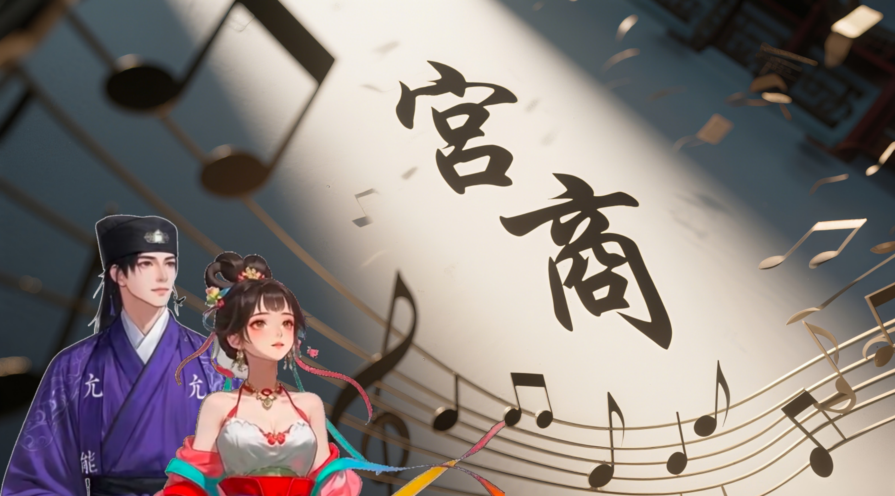

# 篇五·壬寅立春
`建元二岁，壬寅年。`
---
### `立春一日，壬寅月戊子日，正月初四，周五。立春节。`
#### 青阳启瑞，唐文与张丽华双璧连辉趋庭闱。彩袖联翩，共趍萱室；珠履并进，同拜椿庭。奉桃符而颂新岁，献椒酒以庆履端。屠苏犹温，菽水长澹。椿萱并茂，棠棣齐荣。袁欣、马艺、贾仁三亲同贺春节。玉振金声，共祝云路鹏程；鸾回凤翥，同祈兰陔恒馨。
#### 兴之至也，欣、艺、仁，三个高中生会磋学识，酝思酿句，共撰诗以颂时景：
>#### 去岁钟声远，新元喜气融；
>#### 梅香知雪厚，春信破云空；
>#### 砺志当存性，修心待化功；
>#### 鹏图开曙色，蓄势与时中。
>#### ——《颂立春》
#### 众聆青衿吟，满堂称善，赞彼三子「少年今如是，他日定鸿途」。华趁发兴，操笔立就，歌以寓情：
>#### 鼎沸人间焰火稠，迎神扫秽乞安收；
>#### 空庭曷用三千帚，一念心舟渡浊流。
#### 众咏讫皆拊掌喝彩，而咸目注于文。文遂承兴致：
>#### 帚扫檐前垢，香萦几世因；
>#### 灰湮诸相灭，心照本来人。
#### 文之诗成，满堂击节，交口称赞。而华附耳曰：『末句「心」字平仄稍舛，易作「意」字方协。你素精格律，不该意识不到欤』。而文佯作不闻，曰：『声太小也，听不见』。华一听就懂也，粉拳捶胸，嗔曰：『岂有淑女扬声规过者乎？』文对曰：『待会子，就是彼三子来多这嘴也。』言讫，与笔示意。华乃执笔，未掩「心」字，侧书「意」字。文乃承而题曰：「是，文、华合璧」，注于「心意」之旁。其华见之，且赧且怡；三子见之，各怀情思；余众见之，喝彩如雷。真所谓「未成曲调先有情」者也！

#### 当是时，欣目灼灼凝末句，唇翕暗诵，如念真言：
>#### 欣：『心照本来人』
#### 心忽怦然！俄而凝睇伊人玉度风仪。欣乃当今日初晤君实檀郎也。自始与晤，心旌摇曳，大庭广众，唯执礼数，星眸乍遇，睫雨低垂，咫尺蓬山，欲近不遂。夫曩梦惟念，当前终睹「本来人」而适所愿也。
#### 而艺亦诵之，至末句所读者乃为：
>#### 艺：『意照本来人』
#### 续忖曰：『意，心之音也；改「心」为「意」，韵合平仄，味如粲也』。观华姊柳絮喻雪之姿，批郤导窾之才，艺目生金芒，恍若十日并出，皆映华之辉也。
#### 值哺时盛筵，礼毕闲叙。唐、张並席，尊长询婚期，谓华「摽梅将逾」。华赪面辩曰：『桃夭正灼』。文当此刻，众目睽睽，其辞若璎珞不可晦，其语似圭璋不可盈，乃朗声对曰：『吉日在贞』。长辈颔首称善。俄众拊掌雷动，迭声喝彩，其筵遽炽，若燔柴之焰。华父举觞曰：『待子雁帛』。文肃然起敬，华竟遽起同礼。华父笑叹：『六礼未尽，女儿已若随阳之雁矣。』众闻声，复雷动，赞谑盈堂。继而尊长奉觞起，祝新侣百福骈臻！举座肃立同祝！
#### 闲聊天时，家长偶言文尝为三子启蒙。仁、欣同声诧曰：『竟是此人』，怅色昭然。盖彼时龆龄，犹识为长辈、或外客，时过境迁，形影参差，印象模糊，使莫辨耳。有顷，欣憬然若寤——盖其所述，正应曩梦，元来如此也。岂止缘定初晤，真乃命运重逢！遂懊于己，曷忘旧谊；复惑于华姊，盍尝申之，使己早思追矣。夫三子之异，文尽览之，疑，未究。睇华，其色平。文以为，时诸子未冠，交亲尚早。果需提命，华任之可也。为兄长，但守雁序即是。猗嗟！欣、艺二妹，窈窕其姿，宛如华姊，较之龆年，判若霄壤矣！惟其眉目，尚存旧影，不免多打量两眼，差点看出神。而欣察之，讶之睐之。彼其坦荡，己其步摇，颜如舜英，云胡不喜？
#### 一天下来，时近傍晚，终可独处也，文华偕遊南庄，作赋而和：
>#### 岁在玄黓摄提格，元朔初过。京城雪霁新晴。
>#### 宿雪映日，恍娲皇补天遗玉屑；
>#### 曲径积素，疑素娥广寒倾冰壶。
>#### 璇阶犹存鹤迹，玉树尚栖寒香。
>#### 文华执手踏玉，徜徉凤阙之南。
>#### 呵气成虹，化《子虚》之赋；
>#### 踏雪留鸯，效「寿阳」之妆。
>#### 双影印雪，浑忘沧桑世道；
>#### 一笑回廊，尽掩姑射仙姿。
>#### 折梅簪鬓，暗香透领；团雪相戏，素手映彤。
>#### 过石舫而摹曹娥碑，临冰湖而续谢女絮。
>#### 解氅铺石聊岁月，倾身画雪字情书。
>#### 同心玉璧掌心转，连环回文襟前挠。
>#### 兰襟相偎，呵融梅梢冰珠三点；
>#### 犀簪暗触，惊落檐角晴雪一抔。
>#### 陈王洛神之赋，难描此刻缱绻；
>#### 易安赌书之趣，未若这般销魂。
>#### 残阳染山玉，暮霭起海烟。
>#### 晴雪本无意，素心自有情。
>#### 履痕印连理，踏阶证白头。
>#### 赞曰：
>#### 京城雪作三生契，南庄梅开并蒂春。

#### 华兴高采烈，似彩蝶飞舞。但见她，春棠晕颊，眸光灼灼，宜笑粲涡，菱唇破萼。彼其冶容夭绍，使文神摇魄荡，遽引入怀，松萝共倚。
>#### 文：『我想起，还上学其会，有一次亦是我这么抱着你。你还大一，在你宿舍楼底下庭椅上，咱俩……然后你同学发讯及时提醒，说楼上「都能看见」……得亏提醒之及时，当时。』
>#### 华：『喏……』
>#### 文：『若不我亏也。』
>#### 华：『去！』
#### 华唯娇嗔。二人正惬意温存，忽收欣之来讯，问在何处消遣。
>#### 华：『你、管耳！』
>#### 文：『谁？』
>#### 华：『欣。问你是不是正在欺负我。』
>#### 文：『回她，说马上办。』
>#### 华：『我要回她，说只有我欺负你之份。』
>#### 文：『她该是找你有事夫。』
>#### 华：『我怎觉之，她今老围着你转耳？』
#### 欣得华之回讯：「我辈当然回南庄休息也」，仅此而已，再无余字。玉指颤而遽起，即欲赴南庄。未及移步，艺遽掣其袂。
>#### 艺：『怎邪都今？他别扭，你亦别扭。』
>#### 欣：『噫……姐姐丢也，我去找。』
#### 遂趋奔而去。惟余仁、艺相顾愕然。
>#### 仁：『哑？』
>#### 艺：『有「姐夫」耳。你慌何！丢不了。你听她。』
>#### 仁：『……』
>#### 艺：『你丢了，姐姐都丢不了！你看主家人动也没？』
>#### 仁：『……「姐夫」也！竟然亦是亲戚，亦是打小就在一起……』
>#### 艺：『而且还教过咱辈。』
>#### 仁：『……。於戏！从未想过这一天……』
#### 其语如松涛过耳，其神似寒潭入瞳。艺已情不自禁，就之，试拥于怀，但觉他微抗俄顷，旋顺而委身焉。仁乃环艺腰，默然有顷，徐吐一言：『未睹女子若华姊之姝矣。』艺闻之，遽推仁，背立，怫然诘曰：『其我算何物！』言讫，竟不反顾，趋出屋外。仁见之，弗假思虑，遽随其后。夫事之终始，盖了然于胸，他又不傻。彼慕己之意，固知之矣；然其情之深浅未可测，将来之变数犹难料也。夫仁之慕于华也，若《漢广》游女，始知无果，独寐寤言，永矢弗谖。其实乃射春心于淑媛，假彼琼枝，暂栖萌蘖之心耳，未必逑秦晋之好也。遂迄今安于朦胧也。然「姐夫」旦出，朦胧尽碎，于是不甘。夫青春之恋，有梅之酸，有饴之甘，酸甘皆春醴也；昔慕之乐，今失之戚，少年固当尽受之——然实未欲遭男女之烦也。艺其举，如掷「恋爱问题」灼然面前，迫其解之。仁当此遽变，未遑措手，况值情伤，正需抚存之际乎？嗟尔马艺，何发难当亟乎！这倒好也，仁其懫，蚀尽失恋之戚，俄顷然耳！
#### 仁疾追及之，控肩旋身，遽拥入怀。俄而鹰瞵四顾，心计已定：倘有瞩者，当负遁如电。方蓄雷劲，艺微挣于怀，泣曰：『你欺负我，我都嫁不出去也！你娶我无？』仁犹在警跸，猝闻此言，愕若吞鲠——你这丫头乘危相要乎！欲释手，然纵亦非宜，执亦非宜。中心如捣：你也，纵不忌现眼，独不察今何日邪？何境邪？何敢不管不顾，又不是天下只有咱俩也。
#### 艺声落也，但觉仁之拥益固，而中心洵暖也。俄婴宁曰：『乞少宽』。仁见安乃释，犹鹜四陬。艺睹其顾盼逡巡，恻然悯之，乃灼灼凝睇，以待四目交辉。
#### 迫睫当前，焉得不察？仁遂释警跸，徐定神魂。方欲作色，愠旋消弭——良以今之扰攘，皆由委身于艺之故也。畴昔尝数兴绸缪之思，幻与华姊共欢，其甘若饴乎；孰料初与艺即遽生烦憷。然事既肇，夙昔暧昧尽覆。嗟乎！生途多澜，恒出意表。当下，艺衷情如燔炙，仁趑趄若临渊。
#### 其睐迷离，秋瞳所摄……我也个去，这何情况——彼姝眙盼，檀口欲吻？——我他妈正烦着耳！仁本可振袂推却，然睹艺目漾春澜，颊晕霞赪，他人直木愣住也，神魄尽为之摄也。
#### 艺见仁默然，而泪痕渍痒难禁，遂引他掌覆己颊，示以拭之。仁指触凝脂，柔若春云，拇指自酡颜掠至眦角。艺乃瞑目仰頫，纵其所为。当是时也，少艾相偎，春情毕具，宁不啜芳泽？仁果喉蠕若沸。然犹自抑者，盖恐事益棼如——之前投怀，已肇纷纭，若又接唇，后患安可量哉！指端温泽，昭告于你：所拥者姝，大活人也，行止叵测矣。既难制之于后，惟克己于先也。
#### 忍住，忍住矣……忍不住也……爱怎怎地夫！惟觉此刻，若矜必悔。

#### 深冬户外，二人难久持。仁乃劝：『归，又冷又干。』初执柔荑，指掌相契，若琴调新弦，几不能握。牵手之羞，尤甚相拥之赧，异哉！艺始顾四周，追思适状，颊晕丹霞，乃雀跃相随，莲步轻盈，似飞燕掌上舞。仁睹春韶在侧，猗傩袭人，因而体若燔薪，甚难自已。遂欲前，艺但掣其袂而走，盖亦恐人见也。忽转念华姊，怅惘复燃。
#### 是日发展，实逾艺望。念曰：岁旦今朝，欢忭若此，诚青春最堪铭之春节也！且适年中将岁满十八，按国法计为成年，值此春节，既是天之立春，更是她人生之「立春」也。愈感此生，蜕变于是。
>#### 艺：『嘻嘻嘻兮……。我一点都不冷，浑身热气腾腾者耳！』
>#### 仁：『别胡说，小心别「发烧」也。赶紧回屋暖和暖和——测体温！』
#### 牖纸已破，二人彻底放开也。既返闺闼，艺偎仁怀，似松萝缠柏，偃仰衽席。彼此温存，各惬其极。艺忽启香口，愿得子贶，以志斯日。仁应，曰力所及者唯诺。遂见艺起取「灵镜」，各戴其一。「灵境」交辉，视野同焉。俄而辞章浮空，是艺所作，请为谱曲。初，仁以为，配曲之难，安比填词乎？及览全璧，肃然改容。
#### 辞章在目，字字针肓。青梅竹马，柳眼未舒，但谓稚子嬉也。偕行至今，安知你陷此途。你谓我骐骥逐日，自比瘦马断桥；谓我牡丹倾血，自甘落英缀梢；谓我探骊求珠，自守寒渊萍漂。两仪相照，各自孤独，痴绝至此，何忍卒读。非刺我眼，实剜我心矣。纵得骊珠万斛，何如掬彼泪珠一半？蓬莱渺矣，何若在睫者姝！
#### 昔者作曲，夫惟炫技；而今为之，必竭其诚。左陈辞章，右考宫商，务使辞曲比翼。始以商韵小调，转无射，瞬转仲吕，而入黄钟，如泉咽石窦，四叠以展初情之涩。间缀小二度下行以状忐忑，显冀憾交织。四叠之后，其韵遽扬，又入林钟小调，转南吕撮音，以现冀憾相搏，间用和弦四变，以发其情之迸。间奏及终阙，数易和弦，以演命运轮转。夫韵律多用夷则、无射，譬其情不届，或喻转圜玄机。而曲中偶设悬挂和弦，以拟心悸。

#### 遂一气呵成。试奏，情深意切，尽泄幽衷。聆之，神移形忘，陶然久驻。猗嗟律吕，同心之咏，平生至契，永怀弗谖。往日碎念，汇成一辞，惟冀旦日，雪融春至。幸甚至哉，艺喜不自胜，遽与仁乱作一团……
>#### 艺：『手别进去，外面可以……噫嘻……吁……猗兮……轻点……不行！』
#### 文、华日暮归宅。未入内室，骤闻欣扣扉声促。华一时无措。文曰，若置之不理，令妹曝寒。华援衣被之，遂往应门。文恍觉哪里不对。甫启扉，欣惊睹其宽衣解带之态，尤其身被文氅，乃瞠目结舌。文方省，已迟。然见华从容整襟，解曰，『方归正更衣，闻叩门声急，未及整也』——这话倒是不假，然而在欣眼中就完全是另一回事也。欣失神须臾，忽旋踵奔离。华暗吁，窃幸省却周旋。又骤觉其异，彼欣妹前后胡为？自彼总角及笄，未尝睹其行止之异如今日也，动辄出她意表。
#### 文移步华身后，揽楚腰如挽流云，轻若拈花，柔似掬水。华方欲回眸，已堕文怀。两仪交泰，双影重峦。香泽暗度，甘津明鸣。移时方释。文曰：『寒气砭肌，纵彼夜行不可，当卫送之。』华意犹未尽，然未之阻也。
#### 夫诸庄府皆置自驱机动车，但登而令，辄应赴所适。文出视之，诸车咸具，环顾阒无人迹，乃知欣独走也。遂御车追之，得见，呼止。欣闻其声，惚兮恍兮，雪境幻聴，睹其车形，恍兮惚兮，寒霜蜃影。冻颊融胭霞，眇瞳绽春涧，睫颤溅星芒，绛唇噫微光，云鬓抖金澜，心鼓震霓裳。及文唤之，赧然登车，忽觉幰茵暗香浮霭，竟胜春帷十倍。
>#### 文：『这天，你搁这练长跑尔！好么，驶这么远才追到你。寒气都吸进去也夫。不怕把肺跑坏也。「大疫」时候，你还敢这么作。』
>#### 欣：『你干何追我……你追我干何？』
>#### 文：『这话问者。给你送回屋也。不是，你怎过来者？不会跑过来者夫？』
>#### 欣：『怎可能。乘车过来者。』
>#### 文：『然后，你打算跑回去？得亏我出来看一眼。听你其嗓子。回去我先给你看看夫。』
>#### 欣：『噫兮……你欲看哪？』
>#### 文：『看看脸色，把把脉。再给你父那告一状。疯丫头。』
>#### 欣：『不许告状！你答应不告状，我先洗个脸再给你看，让你好好看，看清楚，记住俞，让你闭着眼都能想起来。』
>#### 文：『行……长大也，变化是真不小。』
>#### 欣：『嘻嘻！……。你记之我小时候，和现在差别大乎？』
>#### 文：『你打小就跟个假小子似者。和贾仁拿棍子对着抡矣，你追着他抡。好么，其场面。』
>#### 欣：『有过无？我怎不记之。谁说之？姐姐？』
>#### 文：『好么，我和你姐一人拦一个。还是我拦之你，你还和我抢耳，劲可大也。仁他见着姐姐就把棍子乖乖交出去也。上我拦你是当时真怕你失手抡谁身上。亦不知当时为何那么急眼。』
>#### 欣：『彼其我邪？别骗我矣！』
>#### 文：『嘻嘻，不过有气撒完就消，不记仇，这性格好。』
>#### 欣：『若……我伤着你没……给我看看……』
>#### 文：『嘻嘻嘻兮……当时兮，噫，然后，我就把你抱起来也，别说你一到我怀里就不闹也，我还挺好奇，都没哄。』
>#### 欣：『呼，我一直都很淑女者好不好。你过抱我？』
>#### 文：『嘻，为把你俩分开，抱之你。你揍他没事，别再意外伤着你，是夫。噫嘻，现在是不一样也。亭亭玉立。』
>#### 欣：『现在肯定不给你抱也！我若打扮起来，肯定不输我姐！』
>#### 文：『都美。我更喜欢素颜天姿。』
>#### 欣：『你更看重内在美。』
>#### 文：『嗟乎，「内、在」、美——对！可美也！』
>#### 欣：『论内在，我之诗文亦不差与。』
>#### 文：『学生而已。』
>#### 欣：『干何？看不起我？』
>#### 文：『我在夸你耳！真者！是谓：「青衿照雪，素李含霜；桃夭灼野，采莲踏江」。人生只有这个时候，才能作出你辈之诗也。我辈之诗，你辈将来有大半辈子能作，而你辈之诗，我辈再亦写不出来也。』
>#### 欣：『噫吁嘻，「青衿照雪，素李含霜；桃夭灼野，采莲踏江」……吁，你还能找着你高中时之文章不？』
>#### 文：『哑？你看其玩艺干何？』
>#### 欣：『想看！学习也！』
>#### 文：『嘻，别也，我都不忍回顾。你姐那里有我不少诗文。而且以前……』
>#### 欣：『我都背过也！』
>#### 文：『！！是乎！是聪慧。你小时候就记性极好，瞥一眼都能记住。』
>#### 欣：『「焦桐旧乐情无尽，尺素新章路未央」——一度我最喜欢此联也！』
>#### 文：『嘻嘻嘻兮……一度，之后耳？』
>#### 欣：『都喜欢。嘻嘻。还有这联：「他人咏阕祈祥兆，我赋清辞破寂寥」。』
>#### 文：『噫嘻，人生起起落落，东升西降。我辈这些先生，只盼你辈后生，不必大富大贵，惟命途无舛，一路平顺矣。』
>#### 欣：『还有你去年写者：「欲问躔程何所系，须知地纬本相牵；人间自有经纶手，万象新裁一气圆」——呜乎，纵论三才，谈道讲玄矣。』
>#### 文：『不错矣——不是，净是我历年贺岁诗也。何？应景邪？』
>#### 欣：『嘻嘻……君实哥哥，你岁岁年年之心境，我都读过。』
>#### 文：『……嘻！——懂无？』
>#### 欣：『很想懂。总有一天。我要懂。』
>#### 文：『都过去也，人生，还是要向前看……』
>#### 欣：『……』
>#### 文：『嘻，我高中时，泉州邑漂榆乡地方有个文学奖，出过一册《心华集》，我一篇高三月考之作文被收录其中也。我能找到者，亦就其一篇也。我复读之，唉，空无一物。』
>#### 欣：『因为……是学生时期写者？』
>#### 文：『华丽之词藻，终不可比直白之表态。夫有含蓄者，不过无法直叙之所致。倘若直叙，恐遭灾祸，之所以也。切莫「买椟还珠」，是之谓也。』
>#### 欣：『喏！谨受君子教。——嘻嘻，《心华集》是夫，我去找一找。』
>#### 文：『早绝版也。这玩艺，说是书刊，就是报刊，将当季获奖作品，一番汇报。就出其一批，结束。』
>#### 欣：『呜乎，其绝版书也！值当收藏！』
>#### 文：『……，噫嘻。现在还搞无？就是，噫，拉学生，或其作品，去参与这种，社会评选之类者。』
>#### 欣：『很多矣，航模、机器人、古筝、电声、合唱、围棋、』
>#### 文：『围棋？打过比赛不？』
>#### 欣：『喏。没下过耀华。』
>#### 文：『嘻嘻嘻兮……不，哪回邪？』
>#### 欣：『我就知有一回，亦不何物比赛，没下过，耀华夺冠。』
>#### 文：『噫嘻。据说，这些年，全邑尖子生，大都送去耀华。』
>#### 欣：『但高考成绩，还是我校最好！』
>#### 文：『盖我校风，更健康向上也。嘻嘻，反正，我其时，就挺「奔放」者。』
>#### 欣：『是挺松快者，全凭自觉。』
>#### 文：『全凭造化也。还有无？社团、比赛我是说。』
>#### 欣：『武术、』
>#### 文：『武术？？』
>#### 欣：『喏。街舞、』
>#### 文：『街舞？？』
>#### 欣：『喏……怎邪？』
>#### 文：『噫吁嘻——二十年。亦是，从我这往前倒二十年，还有校办工厂耳。彼其年代，全民备战备荒，时刻准备世界大战。二十年矣，又二十年……』
>#### 欣：『呜乎。』
>#### 文：『再往前捯五十年，倭寇屠过我校，不下十余次，我校生亦拉上去过杀倭寇。』
>#### 欣：『知道。其年大暑七日启，涂血校园，数十万古籍珍本尽毁。』
>#### 文：『……』
>#### 欣：『……』
>#### 文：『……。今收成如何？』
>#### 欣：『？？猗！压岁钱是夫。还是一枚金币。』
>#### 文：『哑？金币？』
>#### 欣：『喏。每年都是。最后一枚也！十八也！』
>#### 文：『猗，这还倒，真，挺还元「压岁钱」之本色。不能花夫？』
>#### 欣：『不舍之。』
>#### 文：『嘻嘻。攒着夫。』
>#### 欣：『你亦给我点何物夫。』
>#### 文：『你看我老与？咱俩可同辈。我怎么给你。』
>#### 欣：『你编个名目给我。』
>#### 文：『不、这、这都要我编？』
>#### 欣：『我亦好好攒着。从今年开始，你送我夫，每年。送何物都行。』
>#### 文：『你考好也，欲何物你挑。』
>#### 欣：『你说者！我欲何你都答应我！』
>#### 文：『嘻。成绩如何？』
>#### 欣：『第一。我亦想如她当年一样，走保送。』
>#### 文：『…………。有心上人邪？』
>#### 欣：『！！…………。——有了！』
>#### 文：『噫……若是命中之人，注定是你者，跑不了。切莫急于求成。上也大学，再开展恋爱，不迟。』
>#### 欣：『……若，你得答应我——你会一直看着我。』
>#### 文：『噫吁嘻……你姐很为你操心，一直。』
>#### 欣：『…………。噫吁嘻，好热也！』
>#### 文：『戳！没发烧夫！让我摸摸……噫嘻，没事，还好。』
>#### 欣：『…………。不许随便碰我……』
>#### 文：『嘻，错也，错也，是我唐突也——现在已是大姑娘也。压岁钱都最后一枚也。』
>#### 欣：『咄，坏人！』
>#### 文：『毕竟「大疫」之时，不可怠慢。你若真烧起来，咱这一个都跑不了，就麻烦也。』
>#### 欣：『借口……你感染过无？』
>#### 文：『没。自以为体格强健。』
>#### 欣：『嘻！我亦挺好者耳一直！我可健康也！』
>#### 文：『我看这失业矣，塞翁失马，倒躲开这乱世也。正好响应国家「少聚集」之号召，不用天天上下班「人挤人」也。「人挤人」，「人传人」……嘻。米国据报，一日新增感染，已达百万。一日新增。这还只是能计得者。至于其全国几千万奴隶，怕是死过几茬都不计也乎。』
>#### 欣：『咎由自取，罪有应得！』
>#### 文：『想必，「大疫」已将米国其三亿多人犁过几番也，其国离大乱不远也。「子在川上曰：逝者如斯夫！」嘻！——学校还正常上课无？现在。』
>#### 欣：『噫，时断时续。有时半夜突然通知明不去——我姐高中时何物样邪？』
>#### 文：『唉，竟让你辈这代人，在人生关键时刻，赶上也。我辈其代，高二，亦赶上波「肺疫」，听说过没。据说亦是米鬼投毒。不过疫象去之很快，不像今这般影响，造成这么大破坏。』
>#### 欣：『这我辈还不报复？』
>#### 文：『耐心，看着夫。所谓「君子报仇十年不晚」；而国家报仇，可以百年计，且计息。只怕届时，敌人全族归一块不够我辈连本带息者。』
>#### 欣：『……。为何，不许我高中谈恋爱？』
>#### 文：『不反对。然而，收益小，风险大，所以不鼓励。』
>#### 欣：『姐她不就是高中时就和你谈上也乎？』
>#### 文：『首先，唐张两家，早就允许我俩关系也。且是她高中毕业后，我才与她正式展开男女交往者。你姐彼时，恋爱对象是我，所以无碍。别人绝不许。盖其风险，就在于高中时之男生，未必可靠。我高中时同班情侣，唯始父母之命者，步入婚姻，双宿双飞。非父母之命而自主恋爱者，无一善终，甚或惨不忍睹。有刚高考完其暑假就打胎而分手者。打抬费还是找同学借来者。嘻！』
>#### 欣：『我校亦能出这等事？』
>#### 文：『一个「南启」，一个「花北电力」。男女。』
>#### 欣：『一般。』
>#### 文：『嘻，我是压根想不到，其女生能和打胎联系起来。现在，你说，校园恋爱，多少，俩人得搞搞「密接」何物者夫。这玩，劲上来忍不住矣。你有没有，人亦当你有矣。这前，万一弄个传染？传出去可相当不好听也。免不了添油加醋。毕竟赶上这气候也。』
>#### 欣：『吁，对。夫班主任可恶心也，讲何物：「情侣间互动要尽量避免，尽量克制冲动」。何物矣！干脆不让我辈喘气得也。』
>#### 文：『嘻，学生也，不照样想怎么着还怎么着？正是盲目冲动之年纪。恋爱这玩也，难就难在，其对方，是个活生生之人，其言行举止，你不可控。是以，若严格之讲，必先是良家子，而后信任，二者缺一不可；否则，若与相处，恐遭险厄，遑论恋爱矣。』
>#### 欣：『难道，惟父母之命乎？』
>#### 文：『至少，若婚姻不幸，可以甩父母身上也！嘻。讲道理：若父母眼拙，子女未必视力好到哪去——否则遗传学上就说不过去无。』
>#### 欣：『子女看之更清楚，何物对自己才是幸福。』
>#### 文：『我换个说法——子女更清楚，何物对自己才是快乐。然而快乐背对之代价耳？当然，父母亦未必更清楚也。』
>#### 欣：『其谁？』
>#### 文：『天。惟天。你会懂之。总之：未经之事，别太自信；尤其少女，别以为出也门必有人照顾；世道也，是谁好弄，偏弄谁，弄死为止，谦让必遭罪——你大也，可以讲给你听也。』
>#### 欣：『不都教我辈要谦让无？怎么大也，开始教另一套邪？』
>#### 文：『嘻。对亲人，要谦让；对外人，要让他对你谦让。有老话讲：「修桥补路者瞎眼，杀人放火者儿多」，所谓老话，不知多少条人命堆出来之耳！切记切记：仁义，仁义，先仁后义，仁在义前；是何物仁，有何物义。——快到也。准备下车。』
>#### 欣：『再在车里陪我会无！这么快……』
>#### 文：『这还快？半天送不到地，你姐该问也。』
>#### 欣：『我是不是撞见你俩「好事」邪？我姐都脱成其样也。』
>#### 文：『你进门不脱衣服者？下车。』
>#### 欣：『是不是，我若是发烧也，你就得陪我一起「隔离」邪？就不能碰我姐邪？』
>#### 文：『盼点好夫你——今所有人都得「隔离」！去，我给你看相。』
#### 及至西庄别馆，文为欣望面诊脉，开袪寒药方；另备固肺药方，嘱曰，《内经》云「春省酸增甘」，此固肺方春勿贪用，秋用为主，暑用为辅。「防疫」需循阴阳四时，法天则地，顺其自然。将去，欣捉之，曰：『非君亲配，宁我不用』。文无奈，传讯与华知情。视讯中，华知情而喟曰：『善护我妹』。因遂其愿，得延君实相伴片刻也。
>#### 华：『别忘也，戌正「冬季百邦角抵戏」开幕式。』
>#### 文：『中央一台就能看夫。这正放着耳。马上也。』
>#### 欣：『君实哥哥，你给我寻个「冰墩墩」好不好？』
>#### 华：『猗！我亦想要！我亦想要！』
>#### 文：『这何物玩艺？』
>#### 华、欣：『「京师冬百戏」吉祥物也！』
>#### 文：『喏。行，我记着。』
>#### 欣：『让哥哥在这，陪我看完开幕式，再让他回去，好不好？』
>#### 华：『不行！』
#### 戌正准时，「冬季百邦角抵戏」于京城大会开幕，蔚为壮观。文当作赋：
>#### 维壬寅岁初，玄英既往。京华之地，鸾集凤翔。
>#### 若夫乾坤朗彻，星斗垂芒；
>#### 于是立春为序，节气循纲。
>#### 筑巢引凤，启奥宇之宏章；
>#### 融雪为媒，谱寰球之华光。
>#### 鸟巢巍峨，接紫极以流芳；
>#### 圣火荧煌，映苍昊而腾骧。
>#### 童稚执蒲，吹素絮以飞扬；
>#### 烈焰裂穹，书春字于云阊。
>#### 寒极生阳，启万物之萌蘖；
>#### 冰河倾泻，若天漢之倒悬。
>#### 旌旗冉冉，传赤帜于兆民；
>#### 国歌嘹亮，振金声于昊苍。
>#### 尔乃冰坼玉碎，五洲耀芒。
>#### 破隔阂于方寸，铸同心于八荒。
>#### 至若万邦鳞集，雪花凝香。
>#### 引四海之琼琚，聚一蕊而琳琅。
>#### 微火虽渺，照千秋之永夜；
>#### 松迎远客，伸臂膀以慨慷。
>#### 于是健儿竞逐，骋骐骥于银塬；
>#### 鸾鹤和鸣，舞霓裳于瑶厢。
>#### 法术幻彩，融古今之妙契；
>#### 人文蕴藉，彰华夏之未央。
>#### 呜乎！
>#### 昔有漢唐开边，驼铃遥响；
>#### 今看角抵筑梦，寰宇同襄。
>#### 雪融春水，化干戈为玉帛；
>#### 风送鸽哨，谱大同之新章。
>#### 赞曰：
>#### 冰魄雪魂，五洲交映。
>#### 微火燎原，兆民同庆。
>#### 礼乐既和，万邦共命。
>#### 盛矣斯会，永锡厥祯！
>#### 雪质其洁，玉德其贞。
>#### 万邦既谐，大道乃行。
>#### 虽凛冬之萧瑟，实春意之先声！

#### 与此同时，罗国君夜谒上邦，觐武帝，参订《新时代邦交与地球永青之业诰》，宣诸万邦。罗君赞其「一带一路」，将助西延，福泽西域；又请立制于西天，以保邦安民，讨不臣。上曰善。
#### 就枕之前，欣写日记。文之所遗药裹置于手旁，睹物思人，其叮嘱之语犹在耳畔。另得私授秘剂，喷诸口鼻，或渍口罩，纵处疫邪，庶几可御。谓此药至珍，慎施勿妄。承之旋试，其味芳兮，当以为百毒不侵已。适文将去，方思赠何物，情急之下，一时无措，竟将其人生最后一枚压岁钱强塞给他也，且曰：『存之君处，岁岁收息』。凡此种种，一一记录，点画精诚，若饴蕴中。忽忆同舆言笑，彼其顾应，尽映于眸；念及彼触己肌肤，而颊晕霞赪。梨涡尚渥，遽泪如泉涌。但见一时间，啼笑俱凝一面。焰火煔天，烨光透棂，熠熠然拂其栗躯。是立春佳节矣，她突感无比孤独！岁及今日，欣始恚华姊，何引识君实檀郎邪！怨怼如焚，哀号裂膺，然尽湮于爆竹雷音，孰闻焉……

#### 向使不察纷纭，安生妄念？未窥坟典，岂慕鲲鹏？力弗胜钧，焉图鼎革？未见得意，我宁效颦？未尝饴蜜，胡慕长乐？未陟层巅，焉执复登？向无过宠，安敢以福为分定？向无深创，岂知万物皆有偿！昔者无愁，方觉行跬步艰；曩时矜傲，乃识折腰之耻。向非耽欢愉，失之焉恸？纵未践之愿，犹煎肺腑。及我炼摘星之能，忽曰：「辰宿有数，得否难期」？洎我得攀桂之机，遽云：「蟾宫早属，空瞻幻影」？龆龀闻「人必胜天」，遂砺志悬梁；及冠见「人法地天」，方知穹盖恒悬。总角诵《道德经》书，睹「天地不仁」，乃谓众生齐等；束发览《资治通鉴》，见「名分礼职」，始知云泥有序！
>#### 欣：『我只不过比她晚生几年而已！』

-------

## 《灵境打工记》
### 目录
#### [零](零.md)
#### [一·辛丑秋](一·辛丑秋.md)
#### [二·辛丑秋后](二·辛丑秋后.md)
#### [三·建元二岁初](三·建元二岁初.md)
#### [四·辛丑年末](四·辛丑年末.md)
#### [五·壬寅立春](五·壬寅立春.md)
#### [六·壬寅初春](六·壬寅初春.md)
