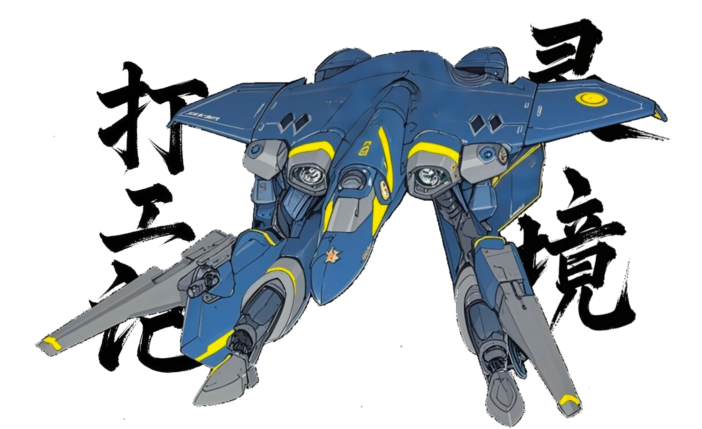

# 篇八·壬寅初春
`建元二岁，壬寅年。`
---
### `立春二日，壬寅月己丑日，正月初五，周六。`
#### 有妇宋氏字约礼，其表字取《论语》「约我以礼」。是唐文高中学妹，低一年级。二人高中尝有「青涩之谊」。《易·咸卦》有云：「贞吉悔亡，憧憧往来，朋从尔思」，二人皆应此象也。彼时常效《郑风·子衿》之情。然躁动年季，庠序男女但得片语，辄相引近。广交异性，不以为异，同慕数子，亦属寻常，相忻成偶，不一而足。若文与宋氏，亦各有《鄘风·桑中》之况。而侪高中生也，夫「花季雨季」，终不过《卫风・芄兰》之样。惟文性放诞，日见携殊色游泮，或憩长椅，或步廊庑，凭楹共语，坐几同食，师长未尝不艳羡焉。至若二人旧愫，诚非燕婉，邈莫可征也。及各高中毕业，文往京而彼氐吴，又各始有相好，遂殊途焉。惟心存契阔，经霜不凋，历雪犹鸣。及宋氏于归華亭男，宾客之中，惟文以学长列席；而众学妹中，文独之宋氏者而已，余皆辞避——份子钱哪能乱随，再随出旧情来，而且谁知新郎他知不知道你……之故事耳，是夫。
#### 曾有学妹，强邀文会彼夫妻。及三人晤，文与学妹，若春塘凫鹥，而其夫却隅坐若遗。
#### 宋妇昔高考清華不第，复读一岁再试，以高分入華亭南洋大学，登最强班级。及卒业，坐性直入游戏行业。文大讶。盖彼时游戏行业，为世人挒目。初入职未半载，属社不善，遭罢。越明年，因缘际会，遇同校前辈艸创会社，始不过寥寥，而今声名享誉全球也。尤去岁，她领队策划一款游戏，创「沉浸式幻想世界」之风，元色不俗，神气无双，元象艳丽，神光独曜。九域影从，四夷惊瞻，知名环宇，网络八方，全球玩徒莫不趋之若鹜，争掷千金只为一游。由是膺厚赏，位乃固。今于会社中，非社长亲信者，已鲜有人敢挤兑她也。
#### 唐文与张丽华值此春节，约会宋妇。盖彼翌日将返華亭，去三千里，故期今日。然文实无趣与约。昔既见于归，已当永别。矧会则需躬适泉州，有类趍谒。且衡损益，彼生无益于己途。算其命，演其运，其位已极。此番乃宋妇微有晤志，亦不强求，盖彼缘悭赴京，惟会泉州，必劳文跋涉。初，文不置可否，尤以迩来慵起晏眠，惟思补瞑，偃卧养精，遑论去京。惟华力赞其行，私忖良机难再，欲亲睹宋妇，是文之学妹也。昔闻其人，未尝觌面，以彼齿长数岁，世殊时异，微文弗际。矧文素罕言彼，惟论游戏行业，当时偶及。华由是欲究，遂成此行。
#### 曩者，华趣诸学妹故事，欲使文但叙无妨，当豁然弗妬。对曰：昔孔北海有云「小时了了，大未必佳」。此亦然于少艾之交也。少时相欢，而及冠涉世，安知契若初衷？恐凿枘龃龉也。岂不闻有谚「青梅不敌天降」？番剧常宣之。其言虽异，殊途同归。尝厉诫高一同桌，慎赴同学会、晤同学。乃彼今处枢要。而旧侪龙蛇杂处，或秉邪说，或怀异志，有少时敢言逆乱之辞者，其家教之，今多久居外邦，安知非为寇用？安保其约见非祸？矧多有同学会，恰由此辈回国倡之；倘有录音、影、像者，其中某果宵小逆贼，他日构陷，祸立至矣。夫同门之谊好无？韩非与李斯、孙膑与庞涓、徐阶与严嵩，岂非同门反目相戕乎？复言诸学妹，皆为妻母，较少女时必判若两人——少女并不会变老，惟其成熟之际，永逝尘寰也。其追念何为？招魂乎？今诸学妹，既为熟女，既为人妻，譬如新生，乃陌客于我也。旧情已杳，温之无益。故，莫若毕业就作决别。昔共尝人生「初體验」者，虽美好甜蜜，然再晤，殆如参商，甚如毕昴。遂毋念。
>#### 文：『所以别老一天到晚「学妹、学妹」之念啄。嚼着肉头是怎么着。』
>#### 华：『呼，我就念啄。我亦是你「学妹」。我可就你一个「学长」。呼！』
>#### 文：『我倒觉之，咱俩该论「师生」。』
>#### 华：『噫兮……噫嘻，坏人——都跟你「学坏」也！说，你还「教坏」过谁？』
>#### 文：『不怎记之。只记之，就你出师也。』
>#### 华：『滚！』
>#### 文：『我说正经者耳。对你，我算倾尽心血也。』
>#### 华：『喏……最好，还要倾尽——精、血。嘻。』
>#### 文：『嘻，「尽」。好么，昨我困成傻婢也，你还若兴奋。』
>#### 华：『嘻嘻嘻兮……就若会子，你最好玩也。』
#### 而今问文于宋妇是何态度；澹然对曰：彼宫双鸟，八字不合。华乃深以为然。若文华之命，盘若符契，自矜天作之合。快矣哉！
#### 文华氐泉州邑高铁驿，更乘地铁，终氐南开厢其母校第十五中学校门口。既会，华自称是文表妹，三人适茶肆聊天。
>#### 宋：『去年到手一百多万，就，还行。去年年薪上涨三成之目标算是达成也，工作亦挺充实。今年目标是，年薪继续涨个两到三成首先，目歬来看没何物难度，应该；涨个五成亦不是没机会，喏，只要我想，就是可能会更累些。累些就累些，趁着现在形势好，总比让自己闲下来好。』
>#### 宋：『我能做着自己喜欢之工作。当初都不理解，现在起码能证明我选择没错。虽然，压力是有，还很大，亦就这么一直过来也。你知道游戏行业，竞争惨烈，不进则——嘻，就离死不远也。市场迭代很快。我辈又不像「企鹅」那种「大会社」，是夫。它比如投九个，活一个，就能挣回来。我辈若是做失败一个，就比较难过也。所以像我这种，能给出兜底方案者，就比较关键。我有一套完整之办法，已比较成熟也。我靠这个就能，差不多想去哪就去哪。亦不是没考虑过去「企鹅」，亦接触过，但接触下来我就在想，过去之话，能获得何物成长耳？暂时还没想到。现在「躺平」还太早。我现在这还能有些挑战。亦不急，可能哪天我想「养老」也，就去「企鹅」，往那一躺。嘻嘻，是夫。唉，亦不是没想过我将来干不动之时候，还是要做些预案者。』
>#### 宋：『我可以将我这些教给他辈，想拿拿去，只要能用好。他辈都会也，我不就省事也么。我好有精力去提升自己，尝试些新东西。这行业你必须不断学习，不断充实自己，一旦落后就被淘汰。现在是何物都得我来，感觉净做些重复劳动之事，时间和精力都浪费也。他辈觉之，我好用就行，一有事就过来找我。现在就有两个让我选，有个我在考虑接不接，或者救不救，找我就是救火去者——它之数据相当不好看。虽然我有办法救起来，但麻烦不在怎么救，麻烦在管事者，是老大之亲信，当初老大对夫项目很期待，就安他过去，一通瞎操作，搞成现在这得性也。我过去开会，他摆领导架子，在那不懂装懂，问何都，驴唇不对马嘴，我随便问他几个数据，就全明白也。而且我说话他亦不一定会聴，你知道夫。他还怕我去抢他风头，本来底下就有不服他者。何物都照我者来，不就显之他，不行无。而我，至少众人都能信服我，知道我有能力，能给摆平。他是人「自己人」，我不和他争，起码先让项目数据好看起来夫。至于另一个，评估下来，我过去贡献不大，数据再往上做比较难也。两个我都比较犹豫。』
>#### 宋：『女儿在学围棋，下之不错，她亦喜欢，记性好，经常自己做「死活题」能做到子正。我不管她。她干她者，我干我者。她下她之棋，我忙我之工作。』
>#### 宋：『家里保姆用之年头久也。干之活，其实亦就其样。比如叠衣服，我教她该怎叠，她永远学不会。但毕竟她我用也这么多年，用惯也，放她在家里我放心。我家里钱与何物者，都随便放，不怕她动，她亦不会动。華亭其地方，「保姆」这个行当还是很有市场者；像我就很需要，省之我分精力在家务上也。保姆挣得亦不少；我给她开薪一万五每月，有时照顾照顾给她两万，她亦要养家带孩子无，亦挺不容易，欲在華亭呆下来。她这么多年，亦乐意在我家当保姆，毕竟華亭人均月收入才多少哉。她这岁数，这、素质，是夫，不当保姆，找一家养着她，还能干何耳？』
#### 宋妇如是滔滔不绝。文华默然旁聴。既而，彼忽语及文：
>#### 宋：『你，近况如何？』
>#### 文：『失业，赋闲在家，快半年也。』
>#### 宋：『若靠何物活。』
>#### 文：『她家有地，饿是饿不死。』
>#### 华：『喏，我能养他。』
>#### 宋：『噫嘻。你欲去、种地？』
>#### 文：『你男人耳。一直没聴你提他。』
>#### 宋：『……你知道，我是一直在养他，我和你说过夫。』
>#### 华：？？
>#### 文：『印象中，好像是，你俩当时同时出来者夫。只记之你说过你陪他在家一块做游戏来着，你还当我面各种称赞他——怎么邪？』
>#### 宋：『噫吁嘻……这次过年，是他和我一齐过来者，见我父母商量离婚之事。』
>#### 华：！！
>#### 文：『噫，你自婚后经年都只拿跟他之婚服合影作尺素标像，从没动过；近来突然换也。话说回来，当初你嫁他我就好奇……他是蟹宫夫？』
>#### 宋：『是。』
>#### 文：『噫，歬歬后后大概明白也。』
>#### 华：…………
>#### 宋：『噫嘻！命理这东西……其实我对他要求挺低者，他「软饭」亦不是不能食，我亦不是养不起他和女儿，但凡能就和我亦不想走到这一步。就比如说，他日常能把家给照顾好之话，用心带带女儿，我可以给他开资矣，省保姆钱也无，算他「劳动所得」哉，鼓励一下，他拿钱想干何干何。但他就是不愿意干，宁可呆一天，就坐那发呆，我给你看张照片……喏，看见没，就这样，整个人往那一堆。他呆那难受，我看着亦难受。再后来，我安排他，说一年之内，不多，你出去，挣回两万就行，或者不行，五千，就一年，我亦不催你，只要你能挣回钱，你挣钱都归你，起码算你能养活自己，我会适当补点。可他这一步都不愿意挪。』
>#### 华：…………
>#### 宋：『整一年他都这精神状态，到也我没法理解之程度也。有次下棋没下过女儿，自己竟在那整宿复盘，这、…。女儿已不乐意和他下也。』
>#### 文：『是也，女儿聪明，棋埶看长，他应该高兴。』
>#### 宋：『现在夫房子耳，我打算卖也，然后一人一半。存款耳，亦可以分他一半。车我想留下，因为上班得用。』
>#### 文：『对也，你腿？』
>#### 宋：『噫嘻，说起来，我腿动手术，自己开车去者，做完了，自己开车回者，就用一只脚，另条腿刚动完手术不能食力无。而他就在家，好歹我动完手术接我一趟耳。』
>#### 文：『真真女强人也。不过这腿亦怪你自己，纯纯自己练废者，没人逼你。高中若会子我劝过你。现在耳？效果。』
>#### 宋：『还行，不能走太长时，慢慢走没事。』
>#### 文：『管事就行，能维持就好。落一辈子也。』
>#### 华：…………
>#### 文：『猗，她若会子是领操者，不有个动作踢腿无，她每回踢特高……这画面印象深刻矣，一提她都先想起这个。』
>#### 宋：『咨……』
>#### 华：『怎么这话从你嘴里出来……』
>#### 宋：『噫，我要不要告个状。』
>#### 华：『怎邪？』
>#### 宋：『他一直在看……』
>#### 华：『早发现也。』
>#### 宋：『嘻，你不管他。』
>#### 文：『上学若会子没注意也。』
>#### 宋：『噫嘻——不许看……』
>#### 文：『若他这次过来商量何耳？你不都安排好也无。』
>#### 宋：『他不同意卖房，想赖那不动。他不想回他母那住。但我又不想把房子全让给他。』
>#### 华：『都生孩子也，干何还离。和他这么久都过来也，早知早晚有今日，你当初还决定要孩子？』
>#### 宋：『若时確实很难。他支持我要孩子。怀孕时，我经常睡不好，他会照顾我。』
>#### 文：『很难是说工作上无？』
>#### 宋：『决定要孩子后，我就辞职也。若时我就希望他赶紧出去工作，我还能在家休养几年，是夫。后来我看，还是我出去夫。会社亦愿意让我回去，当然职位是降也，毕竟离开也一段时间。』
>#### 文、华：…………
>#### 华：『以后，孩子回泉州上学？』
>#### 宋：『華亭。』
>#### 华：『回泉州你父母不可以帮你带孩子？』
>#### 宋：『给他父母带。』
>#### 文：『就是让她女儿做華亭人。』
>#### 宋：『喏。』
>#### 华：…………
>#### 宋：『饭后陪我逛逛衣服？我缺件「防寒服」，華亭那边不好找。』
>#### 文：『你今这件，不行？』
>#### 宋：『该换新者也。』
>#### 文：『「该换新者也」。』
#### 及返京高铁上：
>#### 华：『我一直想问她——聴她夫意思，她男人亦没给她捣乱矣，就养着矣，她又不是养不起，亦不考虑为孩子留个完整家庭。』
>#### 文：『反倒是她在不断给她男人找事，是夫。她说何物都止是她说；总之，既要生育，夫男人又没大过错，而她竟还算计着图男方在華亭之好处，若她故意肢解家庭就是不仁不义！就她这既要、又要、还要，她这婚，一年都离不了。孩子倒楣也！身为人母，有钱，雇保姆，竟妄念离婚之后，让前婆家给她看好孩子？嘻。』
>#### 华：『对也。回泉州上学哪差華亭邪？華亭哪所高中比之过咱南开十五中？现在全国好像亦就京邑众大附、四中这俩比咱强夫。華亭你聴说过谁？』
>#### 文：『嘻嘻。这还看不出来无？——她固有执念，非让孩子在華亭上学。好像刚结婚时夫，就提过将来孩子教育；她曾说，宁可让孩子上「菜小」，在華亭，然后走一步看一步。我当时就震惊……嘻，不，她也，几乎任何事都令我震惊矣。对她，我，大抵在，想来，细琢磨之话，应该上溯到，她复读时夫，从那往后，我就发现，她总在我意料之外也。不，从她高二夫，若时她非把腿给练废为止，就已让我对她之行为不解也。』
>#### 华：『……难以理解。』
>#### 文：『不如说，她拒绝让自己父母监管孩子耳；拒绝让下一代成长于泉州——因为她，是「这么长」过来者……』
>#### 华：『……她表字「约礼」，谁起之？』
>#### 文：『嘻！』
>#### 华：『当初，她哪点吸引你？高抬腿？』
>#### 文：『唉——她婚礼从筹备启，从头到尾都是她安排者。夫男人娶她，多省心。整场婚礼下来我对她丈夫一点印象都没有。她婚礼结束之后，我俩独处时，其仪姿，颜色，对话，多少还能回忆起点耳。多少年也。彼时，她其般欢喜，而今、腻也，欲换男人乎。』
>#### 华：『於戏，你俩还能「独处」尔。』
>#### 文：『吁。毕竟大老远跑趟吴地，就凑个人头随个份子？若怎么行。总得接见一下哉。』
>#### 华：『今此一见，我算是明白也，为何你说八字不合。』
>#### 文：『八字不合，夫是生下来就八字不合。合不合又不是商量出来者。你只能说，事实验证也命理之说。』
>#### 华：『她婚前没找你算算？』
>#### 文：『你看她像会聴我者无？』
>#### 华：『噫嘻，还以为你俩高中若多故事……』
>#### 文：『俩高中生，故事值当个何。』
>#### 华：『值当个何？——她高三，应是刚高考完，你安慰她，手抚她脸上，从脸颊到眼角，她自然眯上双眼，你还差点亲上去。』
>#### 文：『！！这谁告诉你者？』
>#### 华：『毛利贞。』
>#### 文：『他妈者毛一元。』
>#### 华：『嘻。你辈男人不特喜欢交流这些「风流故事」。』
>#### 文：『我想想……噫，当时是亦有个男生，这么抚过她，让我亦试试，我不过照做而已。就完也。』
>#### 华：『就这？』
>#### 文：『就这。』
>#### 华：『她这不就是给你机会无！』
>#### 文：『不，她是料准也，我不会动她。我当时问她，「你不怕我趁机亲你」，她闭着眼淡淡之说，「你可以试试」。我才不试。』
>#### 华：『……吁，受不了你也。你就说亲也！是她让你亲者！』
>#### 文：『并没有。』
>#### 华：『猗与，没事，都过去也，我不食醋……且今都见过也，我心里有根。』
>#### 文：『因为没有就是没有。这我和你扯何物谎矣。我不会之。后来真有个偷她初吻者，她就把人咬伤也，复读时。我一聴说就觉之活该，流氓么不是个。好像是外校过来复读者。』
>#### 华：『呜，差点初吻就是你者也。你不后悔？』
>#### 文：『……我胆小，行也夫？』
>#### 华：『噫嘻，若你今还敢这么放肆盯着她看？』
>#### 文：『噫吁嘻——白跑一趟矣？』
>#### 华：『……看着確实好大矣。我都忍不住看两眼。』
>#### 文：『行个「注目礼」。你看她当时双手优雅之往前一遮，配上莞尔一笑，若「礼貌」。』
>#### 华：『你觉之，她今约会你，为何？』
>#### 文：『不想知道。只知道出这一趟，冒染疫风险，遭舟车劳顿。』
>#### 华：『别堵气无，我知错也……』
>#### 文：『就讲也个离婚——欲离婚也，想起我来也，乎！女人尔！』
>#### 华：『你说她看出咱俩关系也不？』
>#### 文：『表兄妹无，又没骗她。』
>#### 华：『是不是有我在，有些「事」她不方便和你谈？』
>#### 文：『嘻。相由心生，判若两人也。』
>#### 华：『对！我寻思她以前该不长这样夫，若不你还不躲着她。』
>#### 文：……
>#### 华：『我坐那还想耳——你说：她这人，有何用无？』
>#### 文：『嘻嘻，当面试尔？——打工人而已！成功把自己「嫁」给也游戏行业之一个风口，其如是也。连她自己都明白，眼下之她止是浮華。论用处，对你我，不比家中庖役。』
>#### 华：『噫对，夫学妹还约过你没后来？就初夜差点给你者若，上回校庆还来找你也。在夫古筝雅室，紧里有张床，现场好几个高一小学妹围观，你俩那个……』
>#### 文：『哪个？按摩无不就是。你才，猫一边看半天。这么好看无？我还寻思你怎出趟恭这么半天。』
>#### 华：『怕打扰你俩重温旧情无。你俩凑一块不动手动脚是不可能者。』
>#### 文：『……噫嘻。没以为能再见着她。』
>#### 华：『有几年邪？十年得有夫。十年没见，再见你俩还是能粘一块，她紧挨着你坐床上，倚你身上，就若自然，她竟旁若无人。呜，这强大之爱情，经年不凋，积岁不谢矣。』
>#### 文：『竟是银丝错生。我摸她身上哪哪都是空虚。』
>#### 华：『这么说，今看这姐姐没见着白头髮；不过眼袋好重欤！看着很难消也，经年累月之。』
>#### 文：『这就是體质之差距也夫。打工人也，體力才是关键；放旧社会，说到底就是个力巴。旧社会是力巴只有男者，新社会女人亦出来当力巴也，公平。你看夫男女之审美也，就最讲道理——男人眼里女人何样性感，女人眼里男人何样性感，夫正是力巴需要者。性感之男人与性感之女人，生出来之力巴，才更耐操。』
>#### 华：『「天下皆知美之为美，斯恶已」！噫吁嘻！即使为人妻母，还是有对你存旧情者无。』
>#### 文：『存？「演旧情」罢也。问，人存忆为何？惟「触忆温情」也。而，情邈则忆杳，忆杳则情迁。十年，全身细胞都通通换过一两回也。生物学上，之前者你，早没也，因之旧情，几分真假？既为人妻母，为何念我者旧？』
>#### 华：『……嘻。夫惟因果，维你系你——其肯定是，彼女与子，尚有「因果」未了乎。旧情这玩埶最恶心者，不就是这个无！』
>#### 文：『一如「风月宝鉴」——一面是艳福，另一面是祸。嘻，「风、月、宝、鉴」，兹名起之太妙也。』
>#### 华：『我亦是，就这么眼睁睁之，看着她辈对你念念不忘。』
>#### 文：『不忘者，只是她辈自己之韶華罢也——我被她辈当成「风月宝鉴」也！於戏，她辈夫所怀念者，从生物学上，对她辈自己都已完全是另一个肉身也。』
>#### 华：『对，都来不及问，你个坏人——你昨怎邪？刚进门就弄，好急，好猛，快被你弄死也。说好看开幕式，你让我看也无？你把我弄倒起不来；然后，你大发兴，写赋去也？气死我也。我还以为你要，趁、热……呼，结果——你看你写也个何？还有力气歌功颂德？你怎么做到之？气死我也，气死我也……』
>#### 文：『嘻兮，睡之香夫？』
>#### 华：『坏人！』
#### 华乃倚文肩，息合兰薰，睫影沉潭。文本欲谈欣事，而睹华状态不适，且揆两刻高铁程之将至，遂敛喙，乃候宜时。
#### 袁欣候唐文之讯竟日，得而雀跃，佩玉将将，嘤鸣回廊。朝执妹礼，乃知文将晤学妹，遂自诫弗扰，静候子归。及午时，未见华姊就食堂，忖彼今要侍椿萱，循家俗食于申时，而阙午食。忽询之，乃知偕出，中心骤塞，食不甘味，匕箸几废。归室伏床，辗转反侧，虽知愠非宜，然终难释怀，悠哉悠哉。午后数欲传讯，几拨电话，欲窥华姊与之行止，其渴闻兮，其复惶猗。向使不知姊偕，本静待其归而趋也。终传讯于文，丁宁防疫，兼求归述学妹见闻。书方发，旋得文诺，乃安，遂治日课，余念俱捐。彼其少女，虽困春怀，然课业不辍，精魂自持，此志未堕。今既耽误，惟举纲舍目，择要而竟，余者间作，抽隙补苴。及毕，憩，乃澄虑省愆。刚被情乱，实隳作息。庠序之业，重轭犹在。课评不堕，兢哉惕哉。志必守之，若护琬琰。乃憬而自诘：若适文不应，何以自安？弗可知也。盖此假设，未之验也。嗟乎，此后，情志、起居、安宁，皆系于君实哥哥之颜色乎？昔华姊何以安处邪？何以衡琴瑟于学业邪？惟赖君实翼庇乎？猗与巧哉！辗转未已，文讯忽至。若未夕食，邀与共餐。曰，一小时后，抵南庄可以——夫还说何？就算真食过晚饭亦当没食过矣！遂遽告之于父母。
#### 乃忖文之所悦，计漏梳妆。昨闻，君实哥哥所悦「素颜天姿」，且赞「青衿照雪，素李含霜」，其如是，从高中女生装扮也！青春绝色，娈比华姊，行止无怍，怡然自得。纤心难抑，别致仔细，怀春之娥，与姝争丽。你将合髻，我犹及笄，君实身畔，双妍竝媞。
#### 至南宅，叫门。文赴而启，悦睹丽姝，云髻斜绾，青丝拂肩，樱唇微噘，星眸灼灼，睢睢盱盱，曜若观趣，伫阈相眙，凝睇不移。然未顷，文退，延入。盖门外朔气侵肌，彼裘我襌，相较何堪？欣睹，遽谑：『看你能撑到何时候』。
#### 屋外值玄英，屋内如阳春。欣甫入而解裘，粲然一身校服。文乍睹瞠眙——谁过节在家穿校服矣！欣眄其愕，会心一笑，翩跹于前，尽展姿仪。凤翥瑶台，如雪萦风，鸾回三转，旋影流光。青衿照雪，素李含霜，桃夭灼野，采莲踏江。惟彼凝睇，赧意骤生，难遁君目，甘之如饴。鹿跃近之，颔首踟蹰，欲掩你眸，柔荑忸怩。将君实兮，无逾我里，君可怀也，亦可畏也！
#### 文色惟澹，而曰，时尚早，筵未设，将之厨，与华共，你可爱，请自便。欣一聴就不依也——姑娘我折腾过来是缺这口食乎？遂径趋厨房，捷足先入，呼借君实。众皆愕。时文方及门外，闻声而整色，乃趋歬几步，而顾欣曰，此需人手，你不饥，我还饿耳。而华忽应曰，亦可。庖役乃请文华皆去歇也，说庖事有曹，文华勿劳。惟华愧谢，曰哺时过已，当歇者庖。众欣慰曰，岁禧，愿劳。遂出文欣，而华留膳。
#### 有庖人曰，「欣其丫头，幼时喜从姑爷嬉闹，今竟未改也。髫龄既暌，昨不还差点没认出来无。」言者或无心，聴者若罔闻。未几，又有，恍曰，「惟欣独至」，乃为具备。众复异。然见主妇不言，皆默，如过耳旁风。乃专厨事。
#### 欣得与文独处也，引其袂趋食堂，喜笑颜开，如沐甘霖。
>#### 欣：『压岁钱你收好没？藏哪邪？』
>#### 文：『压岁钱也，按旧俗，当然得藏枕头下也。』
>#### 欣：『猗！嘻！你不怕被发现邪？吁，没结婚还不能同床，是夫。若就先压着夫——婚后你怎么办邪？』
>#### 文：『到时再说俞。』
>#### 欣：『反正你敢弄丢也，我看你怎么赔我。呼！』
>#### 文：『你不会还想定期检查夫？』
>#### 欣：『这可说不准与。嘻嘻！好像搞「地下交通驿」矣。我辈商量个「接头方式」夫。』
>#### 文：『我回来弄个「京邑地铁」之标夫，给你。』
>#### 欣：『猗兮！嘻嘻嘻兮……』
>#### 文：『唉，简直和她当年一模一样……』
>#### 欣：『噫？华姐无？』
>#### 文：『这都聴之见？』
>#### 欣：『我耳朵可灵也。其实你声小点，我能聴很清楚。你这声量，离你近也，聴我耳朵翁翁之。』
>#### 文：『我是喜欢扬声宣言，不自觉之……』
>#### 文、欣：『若兮……』
>#### 文：『你先说。』
>#### 欣：『哥哥先说夫。』
>#### 文：『没事。我只想说，你这耳朵，很适合做乐队指挥。』
>#### 欣：『喏。我现就是乐队指挥。』
>#### 文：『吁。管弦乐？电声乐？』
>#### 欣：『当然电声也。管弦乐队那种，甩来甩去，多累矣。』
>#### 文：『不都老师无。你辈现在管弦乐，指挥，会让学生上？想想有点滑稽与。』
>#### 欣：『没怎注意。』
>#### 文：『嘻。你刚想说何？』
>#### 欣：『噫兮……你在我这，不能提「别人」。』
>#### 文：『你姐都不行？夫是你姐也。』
>#### 欣：『……只能我先提。』
>#### 文：『这次没叫仁艺一起过来也。』
>#### 欣：『是乎？没叫他辈无？就只叫我邪？』
>#### 文：『对，聴你姐安排。正好回你信，你就我来叫也。』
>#### 欣：『今年，变化好大……感觉过去者，不会再来也。』
>#### 文：『是说，每年你辈四个都聚餐，是夫，就今日，华姐主厨，亲手喂你辈。昨春节是大家团聚，然后转天是你辈继续。』
>#### 欣：『喏。猗！对！你亦会做饭！聴说很好食矣！噫兮嘻，我后悔叫你出来也，本能尝尝你手埶者。』
>#### 文：『若我现在回去……』
>#### 欣：『不行！你先欠着。对，咱俩通讯内容，你让她看邪？』
>#### 文：『你姐才懒之管咱俩聊何耳。再说，我与她间没秘密。当然你辈女人之间有没有秘密就不好说俞。』
>#### 欣：『怎么可能没有……若，咱俩搞套密码夫？就咱俩能看懂。』
>#### 文：『噫吁嘻。她小学之时候，二年级，就搞出过一套。按《广韵》将漢字转译为数字，一段话写出来是个算式其样。所以，你不搞还好，否则，不此地无银三百两无，生怕她瞧不出这里有诡？』
>#### 欣：『……噫，你现在说话这声量，我就聴之舒服。……，猗，你把压岁钱压枕头下，是想常掏出来看看无？还是想睡觉时，手插进去摸着邪？』
>#### 文：『压岁钱耳，就是压秽者。得能镇邪，保我不做噩梦。管用我就常压着；哪天不管用也，怎么办邪……』
>#### 欣：『嘻，肯定管用！——君实哥哥，你放心夫，我只想我辈都做好梦。噫嘻，不过哥哥你可不能忘也，答应我者——我考好也，我要何物，你都要满足我。』
>#### 文：『绝不食言。要天亦给你。但考不好，其压岁钱我就没收也乎，你亦别想何物利息之事也。』
>#### 欣：『嘻！——你当年是不是就这么哄姐姐者？』
>#### 文：『是。』
>#### 欣：『坏、人！』
#### 闲语未几，盛馔设席。欢快遽止，岂欲顾食？欣愈渴闻文故事，纵其与华姊者亦可也。此番咫尺，比肩接蹱，目不能舍，神游玄圃。惚兮恍兮，子形伟岸，恍兮惚兮，子躯虬健。其姝如欣，竟萌往昔未有之念。适来人也，方惊觉身异，怕如曾经初潮耳。遂托言赴湢而遁。当是时也，庖役治膳，侍者设席，文独凭牖覃思。及华唤之，乃助布理。
#### 饭桌上，华始留神于欣容，谑曰：『今竟在家注意打扮也』。尤异其髮型，昔所未见，辗转间仿佛飞仙堕马。姊妹自妆奁言及校园埶演，言笑兴致，而渐及君实。当面不避，莺啭春林。二姝语密，唇舌不息，脔肉入碗，翻覆不啖。文独啖啜不辍，案馔风卷过半。及文止箸，二姝见之亦啖几而止。文乃请续，他来收拾。欣起欲随，曰，往年皆三子事之。遂华亦起，三人共之。
#### 只剩洗碗也。华遣文去，而留欣。乃问曰：『今用香水干何』。此香乃华常用。夫惟曩者，欣为埶演，手头正缺，遂贻一瓶，而竟见其用于今日也。应曰：『下午锻炼，出汗也，拿来遮一下』。其实，为晤君实，早已汤沐；而仍怕未净，乃用香水。是也，虽未诳语，然隐沐兰之故。夫真语藏半，譬如观莲，茎葉在明，根藕潜渊，孰能穷焉？华闻之惝恍，惟以为她怀春也，而注意饰容，如己曾经：青衿照雪，素李含霜，桃夭灼野，采莲踏江。青春绝色，娈比学姐，行止无怍，怡然自得。纤心难抑，别致仔细，怀春之娥，与姝争丽。诚知艺仁情发，又睹欣态，乃忻叹诸妹皆苗秀矣。既念琴瑟，春潮涌臆，遽欲怀文，扑倒身下。
#### 宴馀夜深，及欣当归，而未尝恋恋若今宵矣。忽欣闻文将送，又闻华曰，将抵她舍门口，淹留无妨。文色澹而应。
#### 及返，但讶华竟一身校服，云髻斜绾，青丝拂肩，樱唇微噘，星眸灼灼，睢睢盱盱，曜若观趣，伫阈相眙，凝睇不移。芳馨未晞，与欣同香。
>#### 华：『我刚洗干净也欤！』
#### 文弗答，遽揽之，掷绣茵。衣带纷解，落英辞树。
### `立春四日，壬寅月辛卯日，正月初七，周一。`
#### 有新会社倍禄聘元。今日履新，任部长，独开署。然名为部长，实则孤单，盖部门新开，僚属皆无，当自辟之。是社所以延法师毛一元者何为？
>#### 夫「灵境」含章，吐纳八殥之息，数术之典也；「可变形飞机」藏象，蕴含百科之用，工程之典也。欲耦二者，使相济合德，倍蓰其效——事目名为：「悟空」。

#### 奈何既此，方告要情。元虽容止恭谨，进退合仪，然五内惶惑矣！喟曰：
>#### 元：『这怎搞？这搞何物？是你能搞者无？是我能搞者无？我只知给我工资翻倍我就过来也，上家单位我刚呆满月哉！嗟……坏也坏也，脑子一热……』
#### 然既入彀中，乃自宽曰：『既至则安』。惟暗忖：『倍俸虽厚，得保几何？』履新伊始，已度失业之期。畴昔未尝虑「力有不逮」者，今始惕然。

-------

## 《灵境打工记》
### 目录
#### [零](零.md)
#### [一·辛丑处暑](一·辛丑处暑.md)
#### [二·辛丑白露](二·辛丑白露.md)
#### [三·辛丑秋分](三·辛丑秋分.md)
#### [四·辛丑秋后](四·辛丑秋后.md)
#### [五·辛丑冬](五·辛丑冬.md)
#### [六·辛丑年终](六·辛丑年终.md)
#### [七·壬寅立春](七·壬寅立春.md)
#### [八·壬寅初春](八·壬寅初春.md)
#### [九·壬寅早春](九·壬寅早春.md)
